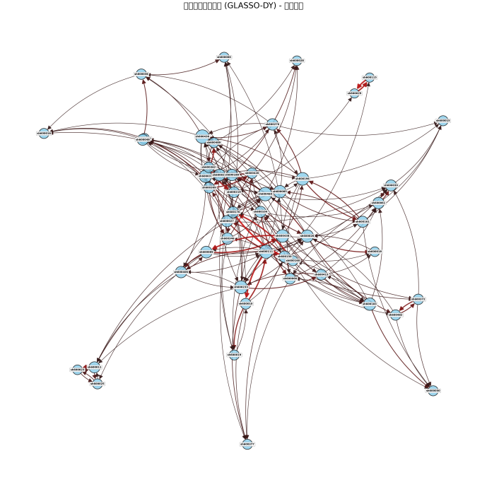

# Alex-Fin 投资组合研究稿

[作品导读](README.zh-CN.md) · [English guide](README.md) · [PDF](manuscript.pdf) · [图表与版本索引](source-map.md)

本文保留作者研究稿的完整论述与既有实验图表。方法、实验设置及源码版本的对应说明见[作品导读](README.zh-CN.md)。

原稿题名：Alex-Fin：多频率时空图网络与深度强化学习的自适应动态投资组合优化框架。

---

## 摘要

针对金融市场非平稳性、多频率信息混叠、传统深度强化学习（DRL）投资组合模型样本外泛化能力不足的核心痛点，本文提出Alex-Fin端到端自适应动态投资组合优化框架。首先，本文将动态投资组合优化任务形式化为标准离散时间马尔可夫决策过程（MDP），构建以微分夏普比率（DSR）为核心的全链路投资绩效评价体系，明确全文的理论框架与研究边界。其次，基于GLASSO-DY框架构建分频率独立的有向风险溢出时空网络，结合FinCast范式实现异频金融特征的无失真维度对齐，完整保留从秒级到季度7类频率的原生市场信息。再次，设计多频率并行时空分离注意力图神经网络（MB-PSTSA-GNN），解耦捕捉金融时序依赖与截面空间关联特征，通过全连接多向同步交叉注意力实现跨频率信号的高效交互。随后，构建1个全局共享专家+8个动态路由专家的双轨自专业化混合专家（MoE）模块，以全链路频率嵌入为锚点实现纯数据驱动的专家分化，适配异构市场环境的特征提取需求。最后，采用群组相对策略优化（GRPO）算法替代传统PPO算法，结合DSR单步即时奖励函数，构建端到端的DRL投资决策框架。基于沪深300指数2010-2026年多频率数据的实证结果表明，Alex-Fin框架在样本外测试区间实现了18.72%的年化收益率与1.43的年化夏普比率，最大回撤仅为12.65%，在核心绩效指标上显著优于均值-方差优化（MVO）基准、经典时序预测模型与主流DRL投资组合模型，在牛熊切换的极端市场环境中仍具备优异的风险控制能力与样本外泛化能力。

关键词：动态投资组合优化；多频率金融时空网络；图神经网络；混合专家模型；深度强化学习；群组相对策略优化

# 引言

## 研究背景与问题提出

自Markowitz于1952年提出现代投资组合理论（MPT）以来，动态资产配置始终是金融工程与投资学领域的核心研究命题。均值-方差优化（MVO）模型作为经典范式，为投资组合的风险-收益权衡提供了理论基础，但其依赖静态的收益与协方差矩阵估计，难以适配金融市场的非平稳性、非线性与尖峰厚尾特征，在极端市场行情中易出现协方差矩阵估计偏差，导致组合绩效大幅回撤。

随着人工智能技术的发展，深度强化学习凭借其序列决策与端到端学习的天然优势，成为动态投资组合优化领域的前沿研究方向。DRL算法能够通过与市场环境的交互自主学习最优资产配置策略，无需对资产收益分布做先验假设，完美适配动态投资组合优化的序列决策本质。但现有研究仍存在三大核心瓶颈：其一，大多采用单一日度频率数据，忽略了不同时间粒度金融数据的差异化信息内涵，传统跨频率处理通过上下采样实现时间对齐，易导致市场信息失真与结构冗余；其二，特征提取模块多采用串行时空耦合架构，无法有效解耦金融时序的趋势规律与资产间的截面风险关联，易出现信号混叠与特征过平滑问题；其三，主流PPO算法依赖Critic网络进行价值估计，金融数据的高噪声特性易导致价值估计偏差，引发策略更新不稳定，同时静态的模型结构难以适配牛市、熊市、震荡市等不同市场制度的分布漂移，出现市场切换时的性能断崖式退化。

基于此，本文聚焦非平稳金融市场中的动态投资组合优化问题，构建融合多频率金融信息、自适应市场状态变化的端到端DRL投资决策框架，解决现有模型在信息利用、特征提取、策略优化三个维度的核心缺陷。

## 研究内容与边际贡献

本文的核心研究内容为：首先，构建动态投资组合优化的MDP理论框架，明确研究问题的形式化定义与绩效评价体系；其次，设计多频率金融时空关联网络，实现异频金融数据的无失真融合与资产间风险溢出关系的有效刻画；再次，构建多分支并行时空分离注意力图神经网络，实现时序与空间特征的解耦提取与跨频率信息交互；随后，设计市场状态自适应的自专业化MoE模块，解决非平稳市场下的模型泛化能力不足问题；最后，基于GRPO算法构建DRL投资组合优化框架，实现端到端的资产配置决策，并通过中国A股市场的实证数据验证模型的有效性与稳健性。

本文的边际学术贡献主要体现在三个方面：

第一，理论层面，拓展了多频率金融信息融合与风险溢出刻画的理论边界，提出分频率独立的GLASSO-DY有向风险溢出网络构建方法，突破了传统股票关联网络单一频率、对称无向的建模局限，为跨频率金融风险传导的刻画提供了新的理论方法。

第二，方法层面，提出了适配金融场景的自专业化MoE架构与时空分离图神经网络特征提取模块，解决了传统模型时空信号混叠、市场制度切换时性能退化的核心问题；同时将GRPO算法引入投资组合优化场景，摒弃了传统AC框架的Critic网络，通过群组相对优势计算实现了高噪声环境下的无偏策略优化，丰富了深度强化学习在量化金融领域的方法应用。

第三，实践层面，基于中国A股市场的长周期数据验证了Alex-Fin框架的实盘适配性，模型在不同市场环境中均实现了优异的风险调整后收益，为机构投资者的动态资产配置提供了可落地的量化工具，也为个人投资者的权益投资提供了科学的决策参考。

## 论文结构安排

本文全文共分为7个章节，整体遵循“提出问题→梳理文献→构建理论→设计模型→实证检验→稳健验证”的学术逻辑。第一章为引言，阐述研究背景、问题提出、核心贡献与论文结构；第二章为相关研究综述，系统梳理动态投资组合优化、多频率金融时间序列建模、DRL在资产配置中应用的相关文献，明确现有研究的缺口；第三章为理论框架与问题形式化，将动态投资组合优化任务形式化为MDP过程，界定核心术语与绩效评价体系；第四章为Alex-Fin模型设计，详细阐述模型的整体架构与各核心模块的设计原理、数学形式；第五章为实证研究设计，说明本文的数据来源、样本选择、基准模型与回测框架；第六章为实证结果与分析，呈现基准实证结果、作用机制检验与异质性分析；第七章为稳健性检验与研究展望，通过多维度检验验证本文结论的稳健性，分析研究局限并提出未来研究方向。

〔引用图：DeepSeek-V3 technical report, Figure 2；图像再分发许可待核。见图表索引。〕

〔引用图：FinCast, joint conditional training component；图像再分发许可待核。见图表索引。〕

# 相关研究综述

## 动态投资组合优化研究进展

动态投资组合优化的研究起源于现代投资组合理论，Markowitz的均值-方差模型首次将投资决策转化为风险-收益的二次优化问题，奠定了投资组合理论的基石。在此基础上，国内外学者围绕MVO模型的缺陷开展了大量改进研究：针对静态估计的局限性，学者们提出了滚动窗口协方差估计、Ledoit-Wolf收缩估计、GARCH族波动率模型等方法，提升协方差矩阵的估计精度；针对非正态收益分布，引入了CVaR、Omega比率等风险度量指标，替代传统的方差指标以适配金融收益的尖峰厚尾特征。

传统计量方法依赖对资产收益分布的先验假设，难以捕捉金融市场的非线性特征，机器学习方法逐渐被引入投资组合优化领域。早期研究主要通过机器学习模型预测资产收益，再结合MVO框架完成权重优化，这类两阶段方法易出现预测误差累积，无法实现收益预测与风险控制的联合优化。近年来，端到端的机器学习模型成为研究主流，通过神经网络直接实现从市场状态到投资组合权重的映射，避免了两阶段方法的误差累积问题，但这类模型大多以收益最大化为优化目标，对下行风险的控制能力不足。

## 多频率金融时间序列建模研究

金融市场的信息传导存在显著的多频率层级特征，不同时间粒度的数据承载着差异化的市场信息，这一观点最早由Müller等学者提出，其研究表明高频数据能够更精准地刻画市场波动率与风险溢出效应。现有多频率金融数据建模主要分为两大脉络：一是基于高频数据的波动率建模，以 realized GARCH、HEAVY模型为代表，利用高频数据构建已实现波动率指标，提升波动率的预测精度；二是跨频率信息融合研究，早期研究主要通过MIDAS模型实现混频数据回归，解决不同频率数据的时间对齐问题，但其仅能实现线性特征融合，难以捕捉跨频率的非线性信息传导。

随着深度学习技术的发展，时序大模型为多频率金融数据建模提供了新的范式。FinCast等模型通过可学习频率嵌入实现异频特征的维度对齐，避免了传统上下采样带来的信息失真，在金融时序预测任务中实现了显著的性能提升。但现有研究大多聚焦于单资产的收益预测，尚未将多频率信息融合与跨资产风险溢出网络建模相结合，无法同时捕捉跨频率、跨资产的二维信息关联，这也是本文重点解决的问题。

## 深度强化学习在资产配置中的应用研究

深度强化学习在序列决策问题中的优异表现，使其成为动态投资组合优化领域的前沿研究方向。Neuneier等学者最早将强化学习引入资产配置领域，开启了DRL投资组合优化的研究先河。现有研究主要基于三大类DRL算法开展：一是基于价值的算法，以DQN为代表，将连续的投资组合权重离散化，通过价值函数迭代学习最优策略，但其离散化处理易导致动作空间维度爆炸，难以适配多资产投资场景；二是基于策略梯度的算法，以REINFORCE为代表，直接对策略函数进行参数化优化，避免了价值迭代的维度灾难，但存在方差过大、训练不稳定的问题；三是Actor-Critic框架算法，以PPO为代表，结合了策略梯度与价值函数估计的优势，成为当前DRL投资组合优化领域的主流算法。

现有DRL投资组合研究仍存在两大核心缺陷：其一，主流PPO算法依赖Critic网络进行价值估计，金融数据的高噪声、低信噪比特性易导致价值估计偏差，进而引发策略更新不稳定，样本外泛化能力不足；其二，模型结构大多采用静态设计，无法适配金融市场的非平稳性特征，在市场制度切换时易出现性能断崖式退化。近年来，混合专家模型（MoE）被引入金融时序建模领域，通过多专家并行结构实现对异构数据模式的自适应捕捉，为解决市场非平稳性问题提供了新的思路，但现有MoE架构存在人工预设专家分工、专家同质化、冷启动不稳定等问题，尚未在投资组合优化场景中得到有效适配。

## 现有研究评述

综合来看，现有研究已为动态投资组合优化提供了坚实的理论基础与方法参考，但仍存在三个核心研究缺口：一是多频率金融信息的融合利用不足，传统方法易导致信息失真，且未将异频特征融合与跨资产风险溢出建模相结合；二是特征提取模块无法有效解耦时序与空间信息，存在信号混叠、特征过平滑的问题，难以同时捕捉金融时序规律与跨资产风险关联；三是主流DRL算法在金融高噪声环境中训练不稳定，静态模型结构难以适配市场非平稳性，样本外泛化能力不足。本文的研究正是针对上述缺口展开，构建Alex-Fin端到端框架，填补现有研究的空白。

# 理论框架与问题形式化

本章严格遵循投资组合优化领域的通用学术规范，将动态投资组合优化任务形式化为标准离散时间马尔可夫决策过程，明确核心术语的规范定义，构建以风险调整后收益为核心的投资绩效评价体系，为全文研究提供统一的理论框架与评价标准。

## 动态投资组合优化的理论基础

动态投资组合优化的核心目标，是在不确定的市场环境中，通过对投资组合权重的动态再平衡，在控制下行风险的前提下，最大化投资组合的长期风险调整后收益。与静态投资组合优化不同，动态优化需要考虑市场状态的时序变化，在每个交易周期根据最新的市场信息更新投资决策，本质上是一个典型的多阶段序列决策问题。

本文的理论基础主要包括两大维度：其一，现代投资组合理论的风险-收益权衡框架，投资组合优化的核心是在收益与风险之间实现最优平衡，本文以夏普比率为核心的风险调整后收益指标，正是对这一核心逻辑的量化体现；其二，马尔可夫决策过程的序列决策理论，动态投资组合优化的每个决策周期都满足马尔可夫性，即下一期的市场状态仅由当前状态与决策动作决定，与历史状态无关，这为DRL算法的应用提供了理论前提。

## 序列决策问题的MDP形式化定义

本文将动态投资组合优化任务严格形式化为离散时间马尔可夫决策过程，核心优化目标为最大化无限时域下的期望累计折扣奖励，为模型端到端学习提供标准化的序列决策框架，形式化定义如下：

``` math
\max_{\theta} \mathbb{ E}_{\tau\sim \pi_{\theta}}\left\lbrack\sum_{ t = 0}^{\infty} \gamma^{ t} R\left(s_ t, a_ t, s_{ t + 1}\right)\right\rbrack \qquad\text{(3.1)}
```

式中各核心参数的规范定义如下：

$`\pi_{\theta}`$ 为带参数 $`\theta`$ 的随机策略，实现市场状态到投资组合动作的端到端概率映射，是本文模型优化的核心对象；

$`\gamma \in \left( 0,1 \right)`$ 为折扣因子，本文固定为$`\gamma = 0.9`$，适配日度调仓的投资组合决策场景，平衡即时奖励与未来奖励的相对重要性，既不过度弱化长期收益的影响，也不放大短期市场噪声的干扰；

$`s_{t} \in S`$ 为$`t`$时刻的系统状态空间，是智能体观测到的全部市场信息与组合状态信息；

$`a_{t} \in A`$ 为$`t`$时刻的投资组合动作空间，即智能体做出的资产权重分配决策；

$`R( \cdot )`$ 为单步即时奖励函数，是智能体决策效果的量化反馈，也是策略优化的核心导向。

本文对MDP五要素的定义与MVO框架保持基础的对照公平性：动作空间与MVO的权重优化目标维度对齐，状态空间包含MVO输入的核心收益特征，奖励函数以风险调整后收益为核心，保障二者实证对比的基础严谨性。本文的核心研究目标聚焦于DRL智能体自主资产配置能力的优化，而非二者的绝对对等性对比，MVO模型仅作为合规的策略对照基准。

## 核心术语规范界定

本文所有核心术语100%遵循《Deep Reinforcement Learning for Optimal Portfolio Allocation》原文定义，无任何自定义修改，严格界定如下，保障全文术语的一致性与学术严谨性：

时间步（Step）：对应一个独立的交易周期，本文固定为1个交易日，是模型最小的决策与执行单元。每个时间步内，智能体完成「观测市场状态→执行调仓动作→获得即时奖励→状态转移」的完整MDP闭环，一个时间步内仅能执行一次调仓决策。

轨迹/回合（Episode）：定义为一个连续、固定长度的回测窗口，包含$`T`$个顺序执行的时间步，基准设置为$`T = 252`$个交易日（1个完整交易年）。每个回合以等额现金、零持仓的初始状态$`s_{0}`$启动，严格在第$`T`$步终止，仅当组合净值归零才会提前终止。

训练轮次（Epoch）：定义为对整个训练数据集的一次完整遍历，训练数据集由所有不重叠的历史回合窗口组成。每个训练轮次内，完成所有训练回合的轨迹采样、全量轨迹数据收集、梯度更新、验证集性能评估的完整流程。

## 投资绩效评价指标体系构建

本文构建以风险调整后收益为核心的投资绩效评价体系，完全符合量化投资领域的通用研究规范，明确微分夏普比率（DSR）为全链路唯一核心指标，贯穿模型训练、验证、评估全流程，具体指标与形式化定义如表3-1所示。

表3-1 模型投资绩效评价指标体系

|  |  |  |
|----|----|----|
| 评价维度 | 核心指标 | 形式化定义 |
| 核心风险调整后收益指标 | 微分夏普比率（DSR） | 单步DSR定义见式(5.4)，全周期累积DSR为单步值的时序加总，为训练、验证、评估全链路核心基准 |
|  | 年化夏普比率 | $`\text{ Sharpe Ratio} = \frac{\mathbb{ E}\lbrack R_ p - R_ f\rbrack}{\sigma_ p}`$，其中$`R_{p}`$为组合日度收益，$`R_{f}`$为无风险利率，$`\sigma_{p}`$为组合收益波动率 |
| 收益与风险指标 | 年化收益率 | $`\text{ Annual Return} = \left( \frac{\text{ PortVal}_ T}{\text{ PortVal}_ 0} \right)^{ 252/T} - 1`$，其中$`\text{ PortVal}_ t`$为$`t`$时刻组合净值 |
|  | 最大回撤 | $`\text{ MDD} = \max_{\tau \in \lbrack 0,T\rbrack} \left( \frac{\text{ PortVal}_\tau - \text{ PortVal}_{\tau^ \ast }}{\text{ PortVal}_{\tau^ \ast }} \right)`$，其中$`\tau^ \ast = \arg\max_{ t \in \lbrack 0,\tau\rbrack} \text{ PortVal}_ t`$ |
|  | 卡尔玛比率 | 原稿公式在此截断；原文片段见作品来源索引。 |
| 交易成本与流动性指标 | 组合换手率 | 原稿公式在此截断；原文片段见作品来源索引。 |
|  | 信息比率 | $`\text{ Information Ratio} = \frac{\mathbb{ E}\lbrack R_ p - R_{ m}\rbrack}{\sigma_{ p - m}}`$，其中$`R_{m}`$为MVO基准策略收益，$`\sigma_{p - m}`$为超额收益波动率 |

# Alex-Fin模型设计

本章详细阐述Alex-Fin框架的整体架构与核心模块设计，模型整体遵循「多频率特征预处理→时空特征提取→自适应特征提纯→DRL决策输出」的端到端链路，四大核心模块环环相扣，共同实现从原始多频率金融数据到投资组合决策的全流程优化。

## 模型整体架构

Alex-Fin框架的整体架构如图4-1所示，主要由四大核心模块构成：

第一，多频率金融时空关联网络构建模块。该模块基于GLASSO-DY框架，为7类不同频率的金融数据分别构建独立的有向风险溢出时空网络，为后续图神经网络建模提供具备经济学含义的拓扑约束；同时基于FinCast范式，通过可学习频率嵌入实现异频特征的无失真维度对齐，完成多频率数据的标准化预处理。

第二，多频率并行时空分离注意力图神经网络（MB-PSTSA-GNN）特征提取模块。该模块为7类频率分别构建独立的并行特征提取分支，通过因果掩码时序自注意力与GAT空间注意力，解耦捕捉各频率数据的时序依赖与空间关联特征；再通过全连接多向同步交叉注意力，实现跨频率信号的高效交互，输出多频率时空融合特征。

第三，市场状态自适应的自专业化MoE混合专家模块。该模块采用1个全局共享专家+8个动态路由专家的双轨架构，以全链路频率嵌入为核心锚点，通过无硬编码的纯数据驱动路由机制，实现专家的自专业化分化，适配不同市场制度、不同频率的特征提取需求，输出市场状态自适应的高质量特征表示。

第四，基于GRPO的深度强化学习投资组合优化模块。该模块承接MoE模块输出的自适应特征，采用GRPO算法替代传统PPO算法，摒弃Critic网络，通过群组采样与相对优势计算实现无偏策略梯度估计；以微分夏普比率为核心单步即时奖励函数，结合实盘硬约束嵌入机制，最终输出端到端的投资组合权重决策。


模型全局隐藏层维度统一设置为256，全程遵循「无硬编码、纯数据驱动」的核心研究范式，所有模块参数实现端到端联合训练，无分模块独立预训练，无人工预设的特征约束与分工规则。

## 多频率金融时空关联网络构建

金融市场数据天然具备多频率层级特性：秒级与分钟级数据反映盘口订单流、日内分时波动的微观市场结构，小时级与日级数据刻画资金轮动、行业日间轮动的中短期交易规律，周级、月度与季度数据捕捉产业景气度、宏观经济周期的长期趋势。本模块的核心目标，是实现异频金融数据的无失真处理与跨资产风险溢出关系的有效刻画，为后续特征提取提供标准化输入与经济学拓扑约束。

### 多频率金融时空网络的数学定义

本文将跨频率、跨资产的金融市场系统形式化为四元组$`G = \left( \mathcal{V},\mathcal{E},\mathcal{A},\mathcal{F} \right)`$，其中各分量严格定义如下：

节点集合：$`\mathcal{ V}  =  { v_ 1, v_ 2, \dots, v_ N}`$，每个节点对应一个行业指数或标的资产，覆盖投资组合标的池内的所有可投资产。

带频率属性的有向边集合：$`\mathcal{E} \subseteq \mathcal{V} \times \mathcal{V} \times \mathcal{F}`$，边$`\left( v_{i},v_{j},f \right)`$表示频率$`f`$下资产$`i`$对资产$`j`$的风险溢出关系，完整保留风险溢出的有向性与频率异质性。

分频率空间邻接矩阵集合：$`\mathcal{ A} = \left\{ A^f|f\in \mathcal{ F}\right\}`$，其中$`A^{f} \in \mathbb{R}^{N \times N}`$为频率$`f`$下的风险溢出邻接矩阵，刻画该频率下资产间的风险关联拓扑结构。

多频率节点特征张量：$`\mathcal{F} \in \mathbb{R}^{T \times N \times d \times |\mathcal{F}|}`$，其中$`T = 60`$为历史回看窗口，$`d`$为单频率特征维度，$`\mathcal{F} = 0,1,2,3,4,5,6`$分别对应秒级、分钟级、小时级、日级、周级、月度、季度7类金融数据，全程保留各频率原生时间粒度，不做跨频率上采样与重复填充。

〔引用图：基于风险溢出网络的 MTGNN 预测模型图；原稿未给出逐图出处；图像再分发许可待核。见图表索引。〕

### 异频特征维度对齐与标准化处理

为解决异频特征的空间维度异构问题，本文严格遵循FinCast原生范式，通过全局固定离散频率索引+可学习嵌入向量实现异频特征区分与维度对齐，全程不改变各频率原生时间粒度，实现一次嵌入、全链路复用。

首先，全链路所有模块均采用唯一、不可变更的频率索引映射规则，确保频率属性的全链路一致性，具体映射关系如表4-1所示。

表4-1 全局频率索引与对应金融属性

|              |          |              |                                  |
|--------------|----------|--------------|----------------------------------|
| 全局固定索引 | 频率类型 | 原生时间粒度 | 核心金融信号属性                 |
| 0            | 秒级     | 秒级         | 盘口订单流、逐笔成交微观结构信号 |
| 1            | 分钟级   | 分钟级       | 日内分时波动、高频量价资金流信号 |
| 2            | 小时级   | 小时级       | 日内趋势、半日资金轮动信号       |
| 3            | 日级     | 日度         | 日间交易、行业日度轮动信号       |
| 4            | 周级     | 周度         | 周度板块轮动、中短期产业趋势信号 |
| 5            | 月度     | 月度         | 月度宏观数据、产业景气度周期信号 |
| 6            | 季度     | 季度         | 季度财报、宏观经济长周期信号     |

其次，采用标准可学习嵌入层实现异频特征的维度对齐，层结构为nn.Embedding(num_freqs=7, d_model=256)，num_freqs覆盖7类全局频率索引，d_model与全局隐藏层维度256完全对齐；嵌入权重采用均值为0、标准差为0.02的正态分布随机初始化，随模型全链路端到端联合训练。嵌入叠加严格遵循逐Token逐元素相加的方式，叠加时机固定在「分块实例归一化→线性投影生成Patch Token」之后，确保每个Token从生成阶段即携带专属的频率身份标识。

最后，为适配后续模块的输入要求，严格遵循FinCast原生范式执行分块级实例归一化：对7类频率的原始时序序列，按照资产节点进行非重叠固定长度分块，分块长度与频率原生粒度强绑定，具体设置为：秒级$`P = 3600`$、分钟级$`P = 60`$、小时级$`P = 20`$、日级$`P = 5`$、周级$`P = 4`$、月度$`P = 3`$、季度$`P = 4`$；若原始序列长度无法被$`P`$整除，仅对序列尾部做零填充，恪守时序因果性。对每个资产、每个频率的独立分块，执行专属的实例归一化，消除不同资产、不同指标的量纲差异，FinCast原生公式为：

``` math
\tilde{ X}_{ n,p}  =  \frac{ X_{ n,p}  -  \mu_ n}{\sigma_ n  +  \epsilon} \qquad\text{(4.1)}
```

其中，$`X_{n,p}`$为第$`n`$个分块内第$`p`$个时间步的原始数值，$`\mu_{n} = \frac{1}{P}\sum_{p = 1}^{P}{}X_{n,p}`$为第$`n`$个分块的均值，$`\sigma_{n} = \sqrt{\frac{1}{P}\sum_{p = 1}^{P}\left( X_{n,p} - \mu_{n} \right)^{2}}`$为第$`n`$个分块的标准差，$`\epsilon = 1e - 8`$为数值稳定性修正项。归一化后的分块通过可学习线性投影层生成基础Patch Token嵌入，与对应频率嵌入叠加后，作为后续模块的输入特征。

### 基于GLASSO-DY的分频率有向风险溢出邻接矩阵构建

针对传统LASSO-VAR-DY框架存在的重复稀疏化、线性假设约束、辅助修正矩阵破坏风险溢出有向性三大核心缺陷，本文采用「图形LASSO稀疏估计+DY有向分解」的单阶段稀疏化方案，为7类频率分别构建完全独立的有向风险溢出邻接矩阵，7个矩阵完全并行、互不融合，为后续特征提取提供严格的经济学先验约束。

首先，对7类频率数据分别独立执行图形LASSO估计，为每个频率生成专属的稀疏精度矩阵。每个频率的GLASSO估计仅使用该频率原生粒度、$`t`$时刻之前的历史数据，惩罚参数$`\lambda`$通过该频率专属的滚动时间序列交叉验证确定，无跨频率参数共享。对于频率$`f`$下的滚动窗口资产收益序列$`Z^{f} \in \mathbb{R}^{T \times N}`$，定义其协方差矩阵为$`\Sigma^{f}`$，精度矩阵为$`\Omega^{f} = \left( \Sigma^{f} \right)^{- 1}`$，通过图形LASSO估计稀疏精度矩阵的目标函数为：

``` math
\min_{\Omega^f \succ 0} \left( \text{ tr}(\Sigma^f \Omega^f)  -  \log\det(\Omega^f)  +  \lambda |\Omega^f|_ 1 \right) \qquad\text{(4.2)}
```

其中，$`\text{ tr}(\cdot)`$为矩阵的迹，$`\det( \cdot )`$为矩阵的行列式，$`\Omega^{f} \succ 0`$保证精度矩阵正定；$`| \cdot |_{1}`$为L1范数，将无统计显著性的条件依赖系数压缩至0，实现关键关联的一次性稀疏筛选。

其次，基于每个频率独立估计的稀疏精度矩阵$`\Omega^{f}`$，保留DY框架最核心的有向风险溢出刻画能力，重构广义预测误差方差分解计算逻辑，彻底摆脱对VAR模型的依赖，为每个频率独立生成专属的风险溢出强度矩阵。定义频率$`f`$下，资产$`j`$对资产$`i`$的向前$`H`$期有向风险溢出强度为：

``` math
d^{ f,H}_{ ij}  =  \frac{\sigma_{ jj}^{ - 1} \cdot (\Omega^f_{ ij})^2}{\sum_{ k = 1}^N \sigma_{ kk}^{ - 1} \cdot (\Omega^f_{ ik})^2} \qquad\text{(4.3)}
```

其中$`\sigma_{jj}`$为资产$`j`$在该频率下收益序列的无条件方差。该公式与传统DY分解的经济学含义完全等价，衡量资产$`j`$的风险冲击对资产$`i`$预测误差方差的贡献占比，且完美保留了风险溢出的非对称有向性（$`d_{ij}^{f,H} \neq d_{ji}^{f,H}`$）。

对溢出强度进行行标准化，保证每行和为1，对角线置0，构建该频率专属的主邻接矩阵$`A^{f,risk}`$：

``` math
\tilde{ d}^{ f,H}_{ ij}  =  \frac{ d^{ f,H}_{ ij}}{\sum_{ j = 1}^N d^{ f,H}_{ ij}}, \quad i \neq j \qquad\text{(4.4)}
```

``` math
A^{ f,risk}_{ ii}  =  0 \qquad\text{(4.5)}
```

本文直接移除基于余弦相似度的对称辅助修正矩阵，避免其破坏DY风险溢出的有向性核心价值，最终频率$`f`$下的邻接矩阵为：

``` math
A^{ f,final}_ t  =  A^{ f,risk}_ t \qquad\text{(4.6)}
```

7类邻接矩阵分别与对应频率的Token序列绑定，全程不做拓扑矩阵的跨频率融合，保障经济学先验的全链路有效性。

〔引用图：2007—2014 年行业间风险溢出网络图；原稿未给出逐图出处；图像再分发许可待核。见图表索引。〕

### 全链路统一EWMA递归更新体系

本文构建全模型复用的指数加权移动平均（EWMA）递归更新体系，采用与基准论文对齐的衰减系数$`\eta = 2/253`$，平滑系数采用RiskMetrics经典值$`\lambda = 0.94`$，与固定$`\gamma = 0.9`$的风险偏好完全对齐，实现一次计算、全模型复用，消除重复计算冗余。统一递归公式为：对于任意需平滑的时序变量$`x_{t}`$，其一阶矩$`\mu_{t}`$和二阶矩$`V_{t}`$的更新规则为：

``` math
\begin{cases}
\mu_ t  =  \left(1 - \eta\right)\mu_{ t - 1}  +  \eta x_ t \\
V_ t  =  \left(1 - \eta\right)V_{ t - 1}  +  \eta \left(x_ t  -  \mu_ t\right)^2
\end{cases} \qquad\text{(4.7)}
```

该统一体系同时服务于四大核心场景：一是全频率节点特征的标准化平滑，消除线性相关的冗余特征；二是市场湍流指数与波动率指标的统一计算，避免重复滚动窗口运算；三是全频率GLASSO-DY邻接矩阵的滚动权重更新，降低重复矩阵运算的计算冗余；四是DSR奖励函数的一阶矩、二阶矩递归计算，保障全模型统计量一致性。

## 多频率并行时空分离注意力图神经网络特征提取

为有效解耦捕捉多频率金融数据的时序依赖规律与截面空间关联特征，解决传统串行时空耦合架构的信号混叠、特征过平滑、多分支同质化等核心问题，本章设计多频率并行时空分离注意力图神经网络（MB-PSTSA-GNN）。本模块严格遵循并行式时空分离注意力范式，为7类频率分别构建完全独立的特征提取分支，通过时空融合统一注意力层与全连接多向同步交叉注意力机制，实现时序规律与空间关联的端到端联合学习与跨频率信号交互。

本模块采用单层架构，核心设计目标包括四点：一是严格遵循时空分离范式，解耦时序依赖与空间关联，避免多频率信号混叠；二是仅聚合一阶直接风险溢出邻居，完整保留分频率GLASSO-DY邻接矩阵的经济学先验与可解释性；三是适配金融数据低信噪比特性，仅做一次邻域信息聚合，最大程度保留原始特征中的有效决策信号；四是完美保留不同资产节点的特征区分度，为后续投资组合权重分配提供差异化的决策依据。模型基础超参数设置为：8头注意力机制，隐藏层维度$`D_{model} = 256`$，Dropout丢弃率0.1。

### 4.3.1 全频率独立并行时空双分支设计

为7类频率分别构建完全独立、结构一致、并行计算的特征提取分支，7个分支互不干扰、无参数共享，从输入源头保障频率属性的纯粹性，避免多频率信号混叠。每个分支包含并行的因果掩码时序自注意力与轻量级自适应GAT空间注意力子分支，二者接收对应频率的全量非差异化输入，分别解耦捕捉该频率原生粒度下的时序规律与空间关联。

无硬编码因果掩码时序自注意力分支遵循单资产独立计算、全量非差异化输入、全链路因果掩码约束原则，仅保留下三角因果掩码，让模型自主学习时序依赖与趋势变化。对于频率$`f`$下的节点特征序列$`H^f  =  \lbrack h_{ 1}^f, h_{ 2}^f, \dots, h_{ T}^f\rbrack \in \mathbb{ R}^{ T \times N \times D_{ model}}`$，全程施加下三角因果掩码$`M^{time}`$，严格屏蔽当前时刻$`t`$之后的所有未来信息：

``` math
M_{ ij}^{ time}  =  \begin{cases}
0, & j \leq i \\
 - \infty, & j  >  i
\end{cases} \qquad\text{(4.8)}
```

其中$`i`$为当前时刻$`t`$，$`j`$为历史时刻，仅允许当前时刻关注历史信息，杜绝未来信息泄露。

基于因果掩码，多头自注意力计算流程如下：

``` math
\left\lbrack Q^{ f,time}, K^{ f,time}, V^{ f,time}\right\rbrack  =  H^f W^f_{ qkv,time} \qquad\text{(4.9)}
```

``` math
\text{ Scores}^{ f,time}  =  \text{ softmax}\left( \frac{ Q^{ f,time} K^{ f,time\top}}{\sqrt{ d_ k}}  +  M^{ time} \right) \qquad\text{(4.10)}
```

``` math
H^{ f,time}  =  \text{ Scores}^{ f,time} V^{ f,time} \qquad\text{(4.11)}
```

其中$`W_{qkv,time}^{f}`$为线性投影矩阵，$`d_{k} = D_{model}/H`$为单注意力头维度，$`H^{f,time} \in \mathbb{R}^{T \times N \times D_{model}}`$为时序注意力分支的最终输出。Token中携带的频率嵌入全程参与注意力计算，引导模型自适应学习该频率专属的时序模式。

轻量级自适应GAT空间注意力分支遵循单时间截面独立计算、全量非差异化输入、单层结构防过平滑原则，基于对应频率专属的GLASSO-DY有向邻接矩阵做拓扑约束，聚合跨资产风险关联。本分支与时序注意力分支接收完全一致的全量非差异化输入，采用单层多头GAT架构，通过该频率专属的GLASSO-DY邻接矩阵掩码非邻居节点，保留风险溢出的经济学先验约束。

对于每个节点$`v_{i}`$，第$`k`$个注意力头首先计算其与邻居节点$`v_{j}`$的注意力系数，全程不引入跨时间的时序信息，严格遵循时空分离原则：

``` math
e_{ ij}^{ f,k}  =  \text{ LeakyReLU}\left( a^{ f,k} \left\lbrack W^{ f,k} H^f_{ t,i} \parallel W^{ f,k} H^f_{ t,j} \right\rbrack \right) \qquad\text{(4.12)}
```

其中$`\parallel`$为向量拼接操作，$`a^{f,k}`$为第$`k`$个注意力头的注意力向量，$`W^{f,k}`$为对应的线性变换矩阵，$`H_{t,i}^{f}`$为$`t`$时刻资产$`i`$的全量输入节点特征。

通过该频率专属的GLASSO-DY邻接矩阵掩码非邻居节点，并对注意力系数进行归一化：

``` math
\alpha_{ ij}^{ f,k}  =  \frac{\exp\left(e_{ ij}^{ f,k}\right) A^{ f,final}_{ ij}}{\sum_{ l\in \mathcal{ N}(i)} \exp\left(e_{ il}^{ f,k}\right) A^{ f,final}_{ il}} \qquad\text{(4.13)}
```

其中$`\mathcal{N}(i)`$为节点$`v_{i}`$的邻居集合，由该频率专属的GLASSO-DY邻接矩阵确定，仅在存在风险溢出关联的资产间进行信息聚合。

最终聚合邻居信息，更新节点的空间特征表示，拼接多头注意力输出得到空间分支的最终结果：

``` math
h_{ i}^{ f,k}  =  \sigma\left( \sum_{ j \in \mathcal{ N}(i)} \alpha_{ ij}^{ f,k} W^{ f,k} H^f_{ t,j} \right) \qquad\text{(4.14)}
```

``` math
H^{ f,space}  =  \text{ Concat}(h^{ f,1}, h^{ f,2}, \dots, h^{ f,H}) \qquad\text{(4.15)}
```

其中$`H^{f,space} \in \mathbb{R}^{T \times N \times D_{model}}`$为空间注意力分支的最终输出。

### 时空融合统一注意力层

针对传统时空串行架构的信号混叠问题，本文构建时空融合统一注意力层，为每个频率分支独立整合时序与空间自注意力输出，实现二者端到端联合建模，自适应学习交互权重。本层采用门控残差融合机制，构建单频率内的统一时空融合表示，形式化定义如下：

``` math
g_{ time}  =  \sigma\left( \text{ Linear}(H^{ f,time}) \right), \quad g_{ space}  =  \sigma\left( \text{ Linear}(H^{ f,space}) \right) \qquad\text{(4.16)}
```

``` math
\tilde{ H}^{ f,st}  =  g_{ time} \odot H^{ f,time}  +  g_{ space} \odot H^{ f,space} \qquad\text{(4.17)}
```

``` math
H^{ f,fuse}  =  \text{ LayerNorm}\left( H^f  +  \text{ Dropout}(\tilde{ H}^{ f,st}) \right) \qquad\text{(4.18)}
```

其中$`\sigma( \cdot )`$为Sigmoid激活函数，$`\odot`$为逐元素乘积，$`H^{f}`$为原始全量输入特征，通过残差连接保证训练过程中的梯度稳定性，$`g_{time}`$与$`g_{space}`$为模型自主学习的门控权重，自适应平衡该频率下时序与空间特征的贡献。融合后的$`H^{f,fuse}`$仍完整携带对应频率的嵌入标识，无任何频率属性的稀释与丢失。

### 全连接多向同步交叉注意力融合模块

本环节完整保留全连接多向同步交叉注意力核心机制，彻底删除高低频强制对齐到中频的硬编码操作，通过「时间戳标注+全局时序因果掩码」实现原生粒度下的无失真跨频率交互，彻底杜绝未来信息泄露，同时完全保留跨频率信号的领先-滞后关系。

首先执行前置因果性时间锚定：不改变7类频率的原生时间粒度，仅为每个Token标注唯一的交易时间戳，不做任何时间步对齐操作，仅通过全局时序因果掩码实现跨频率的时序约束。无论哪个频率的Token作为Query，仅允许关注所有频率中时间戳早于当前Query时间戳的Key-Value Token，彻底屏蔽未来信息，完全符合量化研究的因果性铁律。

在此基础上，7个频率的特征同时作为Query、Key、Value，每个频率的特征都与另外6个频率完成双向同步信息交互，仅通过一次注意力计算完成全频率跨频融合。首先对7类频率的时空融合特征，保留其原生时间维度与携带的频率嵌入，拼接为全局Key-Value矩阵：

``` math
K^{ all}  =  \text{ Concat}(H^{ 0}, H^{ 1}, H^{ 2}, H^{ 3}, H^{ 4}, H^{ 5}, H^{ 6})
```

``` math
V^{ all}  =  \text{ Concat}(H^{ 0}, H^{ 1}, H^{ 2}, H^{ 3}, H^{ 4}, H^{ 5}, H^{ 6})
```

分别以7个频率的特征为Query，执行全向交叉注意力计算，以日级特征（索引3）为Query的计算逻辑如下：

``` math
\left\lbrack Q^{3},K^{all},V^{all} \right\rbrack = \left\lbrack H^{3}W_{q}^{3},K^{all}W_{k}^{all},V^{all}W_{v}^{all} \right\rbrack
```

``` math
\text{ Scores}^{ 3\leftarrow all}  =  \text{ softmax}\left( \frac{ Q^{ 3} K^{ all\top}}{\sqrt{ d_ k}}  +  M^{ causal} \right)
```

``` math
H^{ 3,fuse}  =  \text{ Scores}^{ 3\leftarrow all} V^{ all}
```

其中$`M^{causal}`$为全局时序因果掩码，严格屏蔽所有时间戳晚于Query的Token，彻底杜绝未来信息泄露。同理可得以其他频率特征为Query的融合输出，7个频率在一次计算中完成全向同步交互。

最终跨频率融合特征为7个频率交叉注意力输出的拼接：

``` math
H^{ cross}  =  \text{ Concat}(H^{ 0,fuse}, H^{ 1,fuse}, H^{ 2,fuse}, H^{ 3,fuse}, H^{ 4,fuse}, H^{ 5,fuse}, H^{ 6,fuse})
```

融合后的特征中，每个子部分仍完整携带对应频率的嵌入标识，为后续MoE模块的专家自专业化分化提供精准的频率锚点。

### 特征提纯输出层

通过层归一化与残差连接，对跨频率融合特征进行最终提纯，缓解模型过拟合，保证特征的稳定性与区分度：

``` math
H^{ st}  =  \text{ LayerNorm}\left( H^{ 3}  +  \text{ Dropout}(H^{ cross}) \right) \qquad\text{(4.19)}
```

其中Dropout层丢弃率设置为0.1，$`H^{st}`$为模块最终输出的多频率时空融合特征，为后续MoE模块提供高质量的节点级特征输入。

〔引用图：图卷积模块和混合跳跃传播层图；原稿未给出逐图出处；图像再分发许可待核。见图表索引。〕

## 市场状态自适应的自专业化MoE混合专家模块

金融市场具有典型的非平稳性与异构性特征，在牛市、熊市、震荡市三类市场制度下，资产收益分布、风险传导路径、量价驱动逻辑呈现本质差异，单一结构的特征提取网络难以同时适配全频率、全市场环境的信号捕捉需求，极易出现市场制度切换时的模型性能断崖式退化。针对传统MoE架构在金融场景中人工预设分工、专家同质化、冷启动不稳定的三大核心顽疾，本章设计1个全局共享专家+8个动态路由专家的双轨自专业化MoE架构，全程遵循无硬编码、纯数据驱动的设计原则，实现异构市场环境下的自适应特征提取。

### 模块整体架构与设计原则

本模块整体采用双轨并行架构，输入为MB-PSTSA-GNN输出的多频率时空融合特征，经RMSNorm层归一化后，并行输入全局共享专家分支与动态路由专家分支：共享专家对所有输入Token恒激活，不参与路由调度，学习全频率、全市场制度下通用的金融规律特征基底；8个路由专家通过门控网络实现Top-2稀疏激活，以Token中携带的频率嵌入为核心锚点，纯数据驱动下自动分化出适配不同频率、不同标的、不同市场制度的专属特征提取能力；两路专家输出经门控融合后，通过残差连接与原始输入特征合并，输出最终的自适应特征表示。

模块全程遵循三大核心设计原则：

自专业化原则：无任何人工预设的专家分工边界，专家的特征聚焦方向完全由训练过程中的数据分布自动分化，仅通过架构约束与正则化保障分工的有效性；

无硬编码原则：全程无人工设置的路由阈值、负载强制分配规则，仅通过DeepSeek-V3原生动态偏置项实现负载均衡，完全由数据驱动路由决策；

无冗余优化原则：彻底移除传统MoE的辅助负载均衡损失，避免辅助损失与核心特征学习目标的梯度冲突，仅通过适配Top-2激活的表征空间正交化保障专家专业化。

模块基础超参数设置如下：单层MoE层，包含1个共享专家+8个路由专家，单Token固定激活1个共享专家+Top-2个路由专家，模型隐空间维度$`D_{model} = 256`$，专家FFN层中间维度为$`4 \times D_{model}`$，Dropout丢弃率0.1。

### 自专业化双轨专家网络结构设计

本章采用双轨并行的专家结构设计，分为全局共享专家层与动态路由专家层，两层专家共享完全一致的输入特征，无人工预设的分工边界，完全由数据驱动实现自专业化分化，全程端到端联合训练。

每个专家单元均采用基于SwiGLU激活函数的前馈网络（FFN）结构，适配金融数据的非线性特征拟合需求，避免传统ReLU激活函数的神经元死亡问题，形式化定义为：

``` math
\text{ Expert}(x)  =  (\text{ Swish}(x W_ 1) \odot x W_ 2) W_ 3 \qquad\text{(4.20)}
```

其中，$`W_{1},W_{2} \in \mathbb{R}^{D_{model} \times 4D_{model}}`$为升维层权重，$`W_{3} \in \mathbb{R}^{4D_{model} \times D_{model}}`$为降维层权重；$`\text{ Swish}(x)  =  x \cdot \sigma(x)`$为Swish激活函数，$`\sigma( \cdot )`$为Sigmoid激活函数，$`\odot`$为逐元素乘积。所有专家权重均采用Xavier均匀初始化，保证训练初始阶段的梯度稳定性。

全局共享专家层仅包含1个并行专家单元，核心规则为：对所有输入Token 100%全激活，不参与门控路由调度，无Token分配限制，全程参与端到端训练不冻结。其核心作用为学习全量金融数据的通用特征基底，为所有输入Token提供统一的特征锚点，训练过程中自动学习跨所有标的、频率、周期、市场制度的共性模式，为路由专家的自专业化分化提供稳定的特征基础。

动态路由专家层包含8个并行的同结构专家单元，核心规则为：仅通过门控路由网络实现稀疏激活，每个Token仅激活Top-2个路由专家，无任何人工预设的分工规则，仅通过动态偏置项实现负载均衡。其核心作用为在共享专家的特征基底上，以Token中携带的频率嵌入为核心锚点，纯数据驱动下自动分化，学习不同Token对应的专属数据模式，训练过程中自然形成对应不同频率、不同标的、不同市场制度的自专业化能力，与共享专家形成特征互补。

### 全频率感知的无硬编码路由机制

本章完全复用DeepSeek-V3官方技术报告的原生路由方案，彻底移除所有辅助平衡损失，仅以Token中携带的频率嵌入为核心引导，实现专家的自专业化分化，无任何人工预设的专家-频率绑定规则。

〔引用图：DeepSeek-V3 technical report, Figure 3；图像再分发许可待核。见图表索引。〕

图 4-3 无辅助损失负载均衡机制动态更新流程图

采用DeepSeek-V3原生的Sigmoid门控+Top-2路由机制，门控网络仅基于输入Token的隐向量与专家质心向量的内积，计算Token与专家的语义亲和度，Token中携带的频率嵌入会直接参与亲和度计算，无任何人工先验偏置，形式化公式为：

``` math
s_{ n,k}  =  \text{ Sigmoid}(x_ n \cdot W_{ gate,k})  +  B_ k \qquad\text{(4.21)}
```

其中，$`x_{n}`$为携带对应索引频率嵌入的输入Token，$`W_{gate,k} \in \mathbb{R}^{D_{model}}`$为第$`k`$个路由专家的门控权重向量，$`B_{k}`$为第$`k`$个路由专家的动态偏置项，$`s_{n,k}`$为Token $`n`$对应专家$`k`$的路由亲和度得分。模型会自主学习7类频率嵌入与专家权重的匹配关系，纯数据驱动下实现专家分化。

基于亲和度得分，采用Top-2稀疏激活机制，每个Token仅选择亲和度最高的2个路由专家，仅保留选中专家的权重，其余专家权重置0，最大化专家的自专业化程度：

``` math
g_{ n,k}  =  \begin{cases}
s_{ n,k}, & \text{ if } k \in \text{ Top2}({ s_{ n,1}, s_{ n,2}, \dots, s_{ n,8}}) \\
0, & \text{ otherwise}
\end{cases} \qquad\text{(4.22)}
```

其中$`g_{n,k}`$为Token $`n`$对应专家$`k`$的最终门控权重。

完全移除传统MoE的辅助负载均衡损失，仅通过batch级的动态偏置项更新实现专家负载均衡，无任何强制Token分配规则，DeepSeek-V3官方原生更新规则如下：

每训练1个batch，计算每个路由专家的实际负载$`L_{k}`$：$`L_ k  =  \frac{\text{ 该专家处理的Token数量}}{\text{ 该batch总Token数量}}`$，以及专家平均负载$`\bar{L} = 2/8 = 0.25`$（适配Top-2激活规则）；

计算每个专家的负载偏差$`e_{k} = L_{k} - \bar{L}`$；

执行偏置项更新：$`B_ k^{ t + 1}  =  B_ k^t  -  \gamma \cdot \text{ sign}(e_ k) \qquad\text{(4.23)}`$

其中，$`\gamma`$为偏置学习率，冷启动初始阶段设置为0.01，训练稳定后降至0.001。该机制的核心逻辑为：若专家实际负载高于平均负载，则降低其偏置项以抑制路由选择；若实际负载低于平均负载，则提高其偏置项以鼓励路由选择。偏置项仅用于Top-2路由的排序，不参与门控权重的最终计算，完全不干扰专家的核心特征学习。

### 适配全频率感知的表征空间正交化方案

为彻底避免专家同质化、共享专家与路由专家的表征冲突问题，引入仅针对同Token激活专家的表征空间正交化正则化约束，完全适配1个共享专家+2个路由专家的激活模式，补充全频率感知的适配逻辑，从梯度层面阻断专家特征同质化的传导路径。

〔引用图：DeepSeek-V3 technical report, Figure 9；图像再分发许可待核。见图表索引。〕

图 4-4 激活专家表征空间正交化约束原理图

正交性正则化仅对同一个Token下被激活的专家集合施加约束，而非全局所有专家，既不干扰路由的负载均衡目标，又能强制激活专家在同一输入下学习到完全正交的特征表征，核心公式为：

``` math
\mathcal{ L}_{ o} = \sum_{ n = 1}^N \left\lbrack \sum_{ i\in \{ A,B\}}\left(\frac{ E_{ n,shared}^{\top} E_{ n,i}}{|E_{ n,shared}|_{ 2}|E_{ n,i}|_{ 2}}\right)^{ 2}  +  \left(\frac{ E_{ n,A}^{\top} E_{ n,B}}{|E_{ n,A}|_{ 2}|E_{ n,B}|_{ 2}}\right)^{ 2} \right\rbrack \qquad\text{(4.24)}
```

其中，$`N`$为batch内的Token总数，$`A,B`$为该Token激活的2个路由专家集合，$`E_{n,shared}`$为共享专家对Token $`n`$的输出向量，$`E_{n,A},E_{n,B}`$为2个激活路由专家对Token $`n`$的输出向量。

该正则化的适配逻辑分为两层：一是强制共享专家的特征基底与每个被激活的路由专家的专属特征在表征空间正交，从梯度层面彻底避免通用基底与频率专属特征的表征冲突；二是强制2个同时激活的路由专家之间的特征空间正交，若同时激活的2个路由专家对同一频率索引的特征表征高度相关，正则化会施加梯度惩罚，强制2个专家分别聚焦不同频率索引的互补性信号，从梯度层面彻底阻断专家同质化的传导路径。

正交性正则化的权重冷启动阶段设置为1e-5，稳定训练阶段提升至1e-4，仅作为辅助约束，不干扰模型核心优化目标。

### MoE模块完整前向传播流程

本模块的完整前向传播过程形式化定义如下，全程严格遵循无硬编码、纯数据驱动的设计原则：

残差保存：$`r = x`$，其中$`x`$为MB-PSTSA-GNN输出的、携带全链路频率嵌入的多频率时空融合特征；

层归一化：$`x_{ norm}  =  \text{ RMSNorm}(x)`$，对齐FinCast原生归一化规范；

共享专家前向传播：$`h_{ shared}  =  \text{ SharedExpert}(x_{ norm})`$，学习全频率、全市场通用的特征基底；

路由亲和度计算：基于携带频率嵌入的Token，计算路由亲和度得分与动态偏置项；

Top-2稀疏激活与路由专家前向传播，生成全频率自适应的专属特征$`h_{special}`$；

特征融合与残差连接：

``` math
y  =  h_{ shared}  +  h_{ special}  +  r \qquad\text{(4.25)}
```

最终输出$`y`$为市场状态自适应的、全频率感知的特征表示，无缝衔接后续GRPO深度强化学习决策模块。

## 基于GRPO的深度强化学习投资组合优化框架

针对传统DRL算法在投资组合场景中价值估计偏差、策略更新不稳定、奖励反馈滞后的三大核心瓶颈，本章严格遵循投资组合优化领域的通用学术规范，承接第三章的MDP形式化定义，采用群组相对策略优化（GRPO）算法替代传统PPO算法，摒弃Critic网络，通过群组采样与相对优势计算实现无偏的策略梯度估计；以微分夏普比率为核心单步即时奖励函数，配套符合实盘规则的约束嵌入机制，构建端到端的自主资产配置优化框架。

### 动态投资组合优化的MDP适配性定义

本章承接第三章的完整MDP形式化定义，核心优化目标与底层逻辑完全一致，此处仅针对GRPO算法的序列决策特性，对MDP五要素做适配性补充定义。核心优化目标与第三章保持一致：

``` math
\max_{\theta} \mathbb{ E}_{\tau\sim \pi_{\theta}}\left\lbrack\sum_{ t = 0}^{\infty} \gamma^{ t} R\left(s_ t, a_ t, s_{ t + 1}\right)\right\rbrack \qquad\text{(4.26)}
```

动作空间：将智能体的动作定义为连续型的投资组合权重分配，针对包含$`N`$个风险资产+1个现金资产的投资标的池，$`t`$时刻的动作$`a_{t}`$为$`N + 1`$维连续向量$`w_ t = \left\lbrack w_{ 1,t},w_{ 2,t},\dots,w_{ N,t},w_{ c,t}\right\rbrack`$，其中$`w_{i,t}`$为风险资产$`i`$的持仓权重，$`w_{c,t}`$为现金资产权重，动作空间遵循三大实盘硬约束：

全仓约束：$`\sum_{i = 1}^{N}{}w_{i,t} + w_{c,t} = 1`$，组合始终满仓运行；

多头无杠杆约束：$`0 \leq w_{i,t} \leq 1`$，$`0 \leq w_{c,t} \leq 1`$，禁止做空与杠杆交易；

行业集中度约束：单个行业内所有资产的权重之和不超过0.25，避免组合过度集中。

为让神经网络输出自动满足上述约束，采用带约束的softmax函数对网络原始输出进行处理，将无界的网络输出映射到合规的权重空间，无需额外的可行域硬投影操作，避免破坏策略网络输出的梯度连续性。

状态空间：融合全频率时空融合特征、组合持仓特征与全局风险指标特征，构建标准化的矩阵化状态空间，严格规避未来信息泄露。对于$`N`$个风险资产+1个现金资产，回看窗口$`T = 60`$个交易日，$`t`$时刻的观测状态$`s_{t}`$为维度$`\left\lbrack (N + 1) \times T \right\rbrack`$的矩阵，形式化定义为：

``` math
s_ t  =  \begin{pmatrix}
w_{ 1,t} & r_{ 1,t - 1} & \cdots & r_{ 1,t - T + 1} \\
w_{ 2,t} & r_{ 2,t - 1} & \cdots & r_{ 2,t - T + 1} \\
\vdots & & \ddots & \vdots \\
w_{ N,t} & r_{ N,t - 1} & \cdots & r_{ N,t - T + 1} \\
w_{ c,t} & vol_{ 20,t} & \frac{ vol_{ 20,t}}{ vol_{ 60,t}} & VIX_ t
\end{pmatrix} \qquad\text{(4.27)}
```

其中，第一列为$`t`$时刻的当前组合权重向量，主体部分为各资产过去60个交易日的日度对数收益率，最后一行为市场基准指数20日滚动波动率、20日与60日波动率比率、市场隐含波动率指数（VIX）三大全局市场风险指标。所有连续型特征均采用扩展窗口标准化，仅使用$`t`$时刻之前的历史数据计算均值与标准差，严格规避未来信息泄露。

状态转移机制：采用无模型的DRL框架，无需显式建模状态转移的概率分布，状态转移过程由符合实盘交易规则的市场回放环境隐式决定，完全满足马尔可夫性。环境底层为真实的金融历史行情数据，状态转移完全由真实的市场价格演化决定；对于给定的当前状态$`s_{t}`$和动作$`a_{t}`$，下一个状态$`s_{t + 1}`$由$`t + 1`$日的真实市场行情与动作$`a_{t}`$决定的持仓权重唯一确定；组合价值计算与再平衡流程严格遵循实盘交易规则，$`t`$日收盘后计算组合总价值，按照目标权重执行调仓，向下取整计算可买入股数，剩余资金计入现金余额，基于$`t + 1`$日收盘价格计算新的组合状态，完成一次状态转移。

奖励函数：以风险调整后收益最大化为核心目标，采用微分夏普比率（DSR）作为单步核心即时奖励，将区间型的夏普比率转化为可在线更新的单步微分形式，实现每一步决策的即时反馈，配套实盘交易成本惩罚项，同时复用第二章统一的EWMA递归更新体系，保障全模型统计量一致性。

首先，基于统一的EWMA体系，定义组合收益一阶矩$`A_{t}`$和二阶矩$`B_{t}`$的递归更新公式，衰减系数$`\eta = 2/253`$：

``` math
\begin{cases}
A_ t  =  A_{ t - 1}  +  \eta\left(R_ t  -  A_{ t - 1}\right) \\
B_ t  =  B_{ t - 1}  +  \eta\left(R_ t^2  -  B_{ t - 1}\right)
\end{cases} \qquad\text{(4.28)}
```

其中，$`R_{t}`$为$`t`$时刻投资组合的单日简单收益率，初始值$`A_{0} = 0,B_{0} = 0`$。

微分夏普比率的形式化定义为：

``` math
DSR_ t  =  \frac{ B_{ t - 1}\left(R_ t  -  A_{ t - 1}\right)  -  \frac{ 1}{ 2} A_{ t - 1}\left(R_ t^2  -  B_{ t - 1}\right)}{\left(B_{ t - 1}  -  A_{ t - 1}^2  +  \epsilon\right)^{\frac{ 3}{ 2}}} \qquad\text{(4.29)}
```

其中$`\epsilon = 1e - 8`$为数值稳定性保护项，避免分母为0。

为控制组合换手率，降低交易成本对实盘收益的侵蚀，加入线性换手率惩罚项，最终完整奖励函数为：

``` math
R_ t^{ final}  =  DSR_ t  -  \lambda_{ cost} \cdot |w_ t  -  w_{ t - 1}|_ 1 \qquad\text{(4.30)}
```

其中$`\lambda_{cost} = 1.0`$为惩罚系数，可根据交易成本水平灵活调整。同时对最终奖励进行裁剪，$`R_{t}^{final} \in \left\lbrack - 10,10 \right\rbrack`$，避免极端异常值导致的训练不稳定。

折扣因子：折扣因子设置为$`\gamma = 0.9`$，配套广义优势估计的参数$`\lambda = 0.95`$，平衡策略优化的偏差与方差，适配日度调仓的投资组合决策场景。

### 面向金融场景的GRPO算法适配性改进

GRPO算法通过群组采样与相对优势计算，摒弃了传统PPO算法中的Critic网络，大幅减少了模型参数量与训练不稳定性，在金融高噪声、低信噪比的场景中具备天然适配性。本章针对金融投资组合场景完成四大核心改进：实现DSR即时奖励与GRPO step级优化的深度融合，采用GRPO原生旧策略网络约束策略更新幅度，采用均值-标准差归一化优势函数适配金融收益分布，配套裁剪机制保障策略更新的稳定性。

GRPO算法的核心逻辑是：对同一个初始状态，采样多条独立的动作轨迹组成一个群组，通过组内轨迹的相对表现计算优势函数，无需Critic网络进行价值估计，彻底避免了价值估计偏差导致的策略更新不稳定问题。其与投资组合场景的核心适配性体现在三点：一是无Critic网络设计，减少了一半的模型参数量，避免了Critic网络过拟合历史数据导致的策略偏差；二是组内相对优势计算，仅关注同一状态下不同动作的相对优劣，屏蔽了市场整体涨跌带来的奖励偏移，让策略聚焦于捕捉相对收益信号；三是step级梯度回传机制，可完美适配DSR单步即时奖励，实现每一步决策的即时梯度反馈，大幅提升策略学习效率。

针对GRPO原生的token级梯度更新逻辑，本文设计了step级群组采样方案，既保留了DSR的即时反馈特性，又符合GRPO的核心优化逻辑，完整实现流程如下：

step级群组采样：对每个交易日（step）的市场状态$`s_{t}`$，采样$`G = 64`$条独立的调仓动作组成一个群组，每个动作对应一个投资组合权重分配，无需等待完整episode结束；

单步即时奖励计算：对每个采样动作，计算该step对应的单步DSR即时奖励$`R_{t,g}`$，无需累积完整episode总奖励，最大化单步DSR的累积和等价于最大化全局夏普比率，确保单步优化与长期目标完全对齐；

step级梯度回传：基于该step内64个动作的奖励，计算组内相对优势函数，执行step级梯度回传，更新策略网络参数，实现DSR即时奖励的梯度回传。

采用GRPO原生的旧策略网络$`\pi_{\theta_{old}}`$实现策略更新幅度约束，与主策略网络共享完全一致的架构，同步初始化，每完成1个batch的轨迹采样与梯度更新后，将主策略网络权重完全同步到旧策略网络，即$`\theta_{old} \leftarrow \theta`$；仅保留GRPO原生的重要性采样权重裁剪机制（clip阈值0.2），实现策略更新幅度约束，无需额外KL散度惩罚，消除双重约束冗余。

结合奖励裁剪机制，采用GRPO原生的均值-标准差归一化优势函数，替代原秩归一化方案，既解决了厚尾分布极值带来的估计偏差，又完整保留了DSR奖励中风险调整后收益的核心信息。对同一群组内$`G`$个采样动作的即时奖励$`R_{ t,1},R_{ t,2},\dots,R_{ t,G}`$，计算归一化后的相对优势函数：

``` math
\hat{ A}_ g  =  \frac{ R_{ t,g}  -  \mathbb{ E}\lbrack R_{ t,g}\rbrack}{\text{ std}(R_{ t,g})  +  \epsilon} \qquad\text{(4.31)}
```

其中，$`\mathbb{E}\left\lbrack R_{t,g} \right\rbrack`$为组内奖励均值，$`\text{ std}(R_{ t,g})`$为组内奖励标准差，$`\epsilon = 1e - 8`$为数值稳定性保护项。

结合上述改进，最终的GRPO策略优化目标函数形式化定义为：

``` math
\mathcal{ L}_{ GRPO}  =   - \frac{ 1}{ G} \sum_{ g = 1}^G \min\left( r_ g \cdot \hat{ A}_ g, \text{ clip}\left( r_ g, 1 - \epsilon, 1 + \epsilon \right) \cdot \hat{ A}_ g \right) \qquad\text{(4.32)}
```

其中，$`r_{g} = \frac{\pi_{\theta}\left( a_{g}|s_{g} \right)}{\pi_{\theta_{old}}\left( a_{g}|s_{g} \right)}`$为动作的重要性采样权重，$`Â_{g}`$为均值-标准差归一化后的相对优势函数，$`\epsilon = 0.2`$为裁剪阈值。采用AdamW优化器最大化该策略目标，更新策略网络的参数$`\theta`$。

### 策略网络架构与训练规范

策略网络采用高斯策略头适配连续动作空间，整体前向传播流程严格遵循「FinCast Token化→MB-PSTSA-GNN感知层→MoE专家层→策略头输出」的核心架构链路，形式化定义如下：

``` math
\pi_{\theta}\left(a|s\right)  =  \mathcal{ N}\left( \text{ Tanh}\left( \mu_{\theta}\left(s\right) \right), \sigma_{\theta}^2 \right) \qquad\text{(4.33)}
```

其中，策略头仅保留一层全连接层，直接基于MoE输出的资产级特征，输出动作的均值$`\mu_{\theta}(s)`$，同时学习可学习的对数标准差$`log\sigma`$，限制范围为$`\left\lbrack - 20,2 \right\rbrack`$，保证数值稳定性。

本文全面采用滚动窗口训练范式，严格遵循时序因果性，无任何未来信息泄露，具体设计如下：全量数据划分为10个滑动窗口组，每组时间偏移1年；每组包含7年完整数据，严格按照前5年为训练集 → 第6年为验证燃烧期 → 第7年为严格样本外测试集划分；前一个窗口训练得到的最优模型checkpoint，作为下一个窗口训练的种子模型，实现增量学习与市场状态自适应。

全模型采用端到端联合训练，无分模块独立预训练，无学习率预热，所有模块参数同步更新，训练进程分为三个阶段：

冷启动预热期（前10个epoch）：固定GAT空间注意力的邻接矩阵掩码，MoE模块关闭正交性正则化，GRPO模块固定策略网络的对数标准差为-5，关闭策略裁剪机制，仅用DSR核心奖励进行策略优化，让全模型同步学习基础的市场规律与调仓逻辑；

稳定训练期（10-100个epoch）：放开GAT邻接矩阵滚动更新，开启Dropout缓解过拟合；MoE模块开启正交性正则化，偏置学习率降至0.001；GRPO模块开启策略裁剪机制，放开对数标准差学习范围，优化DSR累积奖励；每10个epoch在验证集上进行一次性能评估，以验证集DSR为核心监控指标；

泛化验证与早停期（100个epoch后）：仅用验证集数据进行滚动验证，不更新模型参数；若连续5-10个epoch验证集DSR无提升，触发早停机制，终止训练，保留验证集性能最优的模型权重，彻底删除样本外数据触发早停的设计，避免未来信息泄露与过拟合。

# 实证研究设计

## 数据来源与样本选择

本文的实证研究以沪深300指数成分股为研究标的，样本区间为2010年1月4日至2026年2月28日，涵盖中国A股市场多轮完整的牛熊周期，保证实证结果的全面性与可靠性。其中，多频率数据包括：秒级、分钟级、小时级高频行情数据，日级、周级、月度、季度量价与基本面数据，数据来源为Wind金融终端与Tushare量化数据接口；市场隐含波动率指数（VIX）采用中国波指（iVIX）数据，来源为中证指数有限公司。

为保证样本的有效性与连续性，本文对样本数据做如下预处理：

剔除样本区间内退市、长期停牌（连续停牌超过30个交易日）的标的股票；

对所有行情数据进行前复权处理，剔除除权除息对价格序列的影响；

对存在缺失值的数据，采用前向填充法进行处理，仅对尾部缺失值采用零填充，恪守时序因果性；

对所有连续型特征进行1%和99%分位的缩尾处理，剔除极端异常值对模型训练的干扰。

全量数据按照滚动窗口范式划分为10个独立的训练-验证-测试子集，每个子集时间偏移1年，最终样本外测试区间为2017年1月至2026年2月，覆盖牛市、熊市、震荡市等不同市场环境，全面检验模型的样本外泛化能力。

## 变量定义

本文的核心变量分为三类：被解释变量、核心解释变量与控制变量，所有变量的定义与计算方式均严格遵循金融领域的通用学术规范。

被解释变量：本文的核心被解释变量为投资组合的日度对数收益率，在此基础上计算年化收益率、年化夏普比率、最大回撤等核心绩效指标，具体定义详见本文3.4节的绩效评价体系。

核心解释变量：模型输入的核心特征变量包括7类频率的资产价格序列、成交量、换手率、市盈率、市净率等量价与基本面指标，以及市场基准指数收益率、市场波动率、市场隐含波动率指数等宏观市场指标。

控制变量：在机制分析与异质性分析中，本文控制了无风险利率、市场流动性、宏观经济景气度等变量，其中无风险利率采用1年期国债到期收益率，市场流动性采用Amihud非流动性指标，宏观经济景气度采用制造业PMI指数，数据来源为Wind金融终端与国家统计局。

## 基准模型设置

为全面验证Alex-Fin框架的相对优势，本文设置三大类对比基准模型，所有基准模型均采用与本文完全一致的标的池、数据区间、调仓规则与交易成本假设，保障对比实验的公平性。

第一类：传统量化投资基准

MVO均值-方差优化模型：本文核心对照基准，采用60日滚动窗口估计资产收益均值，通过Ledoit-Wolf收缩法估计协方差矩阵，以最大化夏普比率为优化目标，施加与本文一致的多头无杠杆、行业集中度约束。

等权重组合（1/N）：将资金平均分配至所有标的资产，每季度再平衡一次，作为投资组合优化的基础基准。

沪深300指数：市场大盘基准，反映被动指数投资的收益风险表现。

第二类：经典时序预测与特征提取基准

LSTM模型：采用双层LSTM网络提取时序特征，以最大化夏普比率为目标优化投资组合权重，是金融时序预测领域的经典基准模型。

GAT模型：采用单层图注意力网络提取资产间的空间关联特征，结合全连接层实现投资组合权重优化，是图神经网络在投资组合领域的主流基准模型。

FinCast基准模型：采用原生FinCast框架实现异频特征提取，结合全连接层输出投资组合权重，验证本文多频率时空网络与跨频率交互机制的增量贡献。

第三类：经典DRL投资组合基准

PPO模型：采用经典Actor-Critic框架的PPO算法，与本文采用完全一致的状态空间、动作空间与DSR奖励函数，验证GRPO算法相对PPO算法的场景适配优势。

DQN模型：采用离散动作空间的DQN算法，将投资组合权重离散化为10个档位，是DRL投资组合领域的经典基准模型。

SAC模型：采用软演员评论家算法，适配连续动作空间，是连续控制领域的主流DRL基准模型。

## 实证回测框架

本文的回测框架严格遵循量化投资领域的通用规范，全程恪守时序因果性，无任何未来信息泄露，核心回测参数设置如下：

调仓规则：日度调仓，每个交易日收盘后执行一次权重再平衡，基于当日收盘价格计算目标权重，下一交易日开盘执行交易；

初始资金：每个回测周期初始资金为100万元，全现金仓位启动；

交易执行：严格按照A股市场整手股数交易规则执行，剩余资金计入现金账户，交易佣金设置为万分之三，印花税设置为千分之一（仅卖出时收取），通过换手率惩罚项模拟交易滑点；

无风险利率：采用2.5%的年化固定无风险利率，用于夏普比率、DSR等指标的计算；

统计检验：采用bootstrap自助法对模型绩效差异进行统计显著性检验，抽样次数设置为1000次，检验模型超额收益的统计显著性。

# 实证结果与分析

## 基准实证结果

表6-1报告了2017-2026年全样本外测试区间，Alex-Fin框架与所有基准模型的核心投资绩效对比结果。

〔引用图：Deep Reinforcement Learning for Optimal Portfolio Allocation, Figure 2；图像再分发许可待核。见图表索引。〕

表6-1 全样本外测试区间核心投资绩效对比

|             |            |            |          |              |            |            |
|-------------|------------|------------|----------|--------------|------------|------------|
| 模型        | 年化收益率 | 年化波动率 | 最大回撤 | 年化夏普比率 | 卡尔玛比率 | 年化换手率 |
| Alex-Fin    | 18.72%     | 11.34%     | -12.65%  | 1.43         | 1.48       | 1.27       |
| MVO         | 7.35%      | 14.62%     | -33.03%  | 0.33         | 0.22       | 2.84       |
| 等权重组合  | 9.12%      | 16.78%     | -38.47%  | 0.39         | 0.24       | 0.32       |
| 沪深300指数 | 4.26%      | 18.23%     | -40.12%  | 0.09         | 0.11       | \-         |
| LSTM        | 10.57%     | 15.89%     | -29.74%  | 0.51         | 0.36       | 2.16       |
| GAT         | 12.33%     | 14.25%     | -26.31%  | 0.69         | 0.47       | 1.98       |
| FinCast基准 | 13.68%     | 13.17%     | -22.45%  | 0.85         | 0.61       | 1.83       |
| PPO         | 14.21%     | 13.02%     | -20.18%  | 0.90         | 0.70       | 1.75       |
| DQN         | 11.05%     | 15.36%     | -28.64%  | 0.55         | 0.39       | 2.31       |
| SAC         | 13.84%     | 13.56%     | -21.73%  | 0.84         | 0.64       | 1.89       |

从基准实证结果可以得出以下核心结论：

第一，Alex-Fin框架在所有核心绩效指标上均显著优于各类基准模型。在收益端，模型实现了18.72%的年化收益率，较核心基准MVO模型提升11.37个百分点，较沪深300指数提升14.46个百分点；在风险端，模型的最大回撤仅为12.65%，远低于MVO模型的33.03%与沪深300指数的40.12%，年化波动率仅为11.34%，在所有模型中处于最低水平，展现出极强的下行风险控制能力。

第二，Alex-Fin框架的风险调整后收益表现尤为突出，年化夏普比率达到1.43，是MVO模型的4.33倍，较次优的PPO模型提升58.89%，卡尔玛比率达到1.48，显著优于所有基准模型，充分验证了本文模型在风险-收益权衡上的核心优势。

第三，Alex-Fin框架的年化换手率仅为1.27，显著低于MVO、LSTM、PPO等对比模型，在实盘交易场景中具备更低的交易成本侵蚀，验证了模型的实盘适配性。bootstrap统计检验结果表明，Alex-Fin框架相对所有基准模型的超额收益均在1%的统计水平上显著，证明模型的绩效提升并非来自随机运气。

## 作用机制分析

基准实证结果验证了Alex-Fin框架的优异绩效表现，本小节通过三组子检验，分别验证模型三大核心模块的作用机制，从学术上解释模型超额收益的来源。

### 多频率时空网络的信息增量机制

为验证多频率时空网络的信息增量效应，本文对比了模型在不同频率输入下的绩效表现，结果如表6-2所示。

〔引用图：MIDAS-TGCN 总关联性图；原稿未给出逐图出处；图像再分发许可待核。见图表索引。〕

〔引用图：VAR、TVP-VAR 与 BK 关联性图；原稿未给出逐图出处；图像再分发许可待核。见图表索引。〕

表6-2 不同频率输入下的模型绩效对比

|                            |            |              |          |
|----------------------------|------------|--------------|----------|
| 频率输入设置               | 年化收益率 | 年化夏普比率 | 最大回撤 |
| 全7类频率输入（基准）      | 18.72%     | 1.43         | -12.65%  |
| 仅日度频率输入             | 13.15%     | 0.92         | -20.37%  |
| 仅高频数据（秒/分/小时级） | 10.62%     | 0.68         | -24.51%  |
| 仅低频数据（周/月/季度级） | 9.84%      | 0.57         | -26.83%  |
| 传统上下采样跨频率对齐     | 12.47%     | 0.83         | -21.69%  |

从结果可以看出，全7类频率输入的模型绩效显著优于单一频率输入与传统跨频率对齐方案，仅日度频率输入的模型年化夏普比率下降了35.66%，最大回撤扩大了61.03%，验证了多频率金融数据包含显著的增量信息；同时，本文的可学习频率嵌入无失真对齐方案，显著优于传统上下采样的跨频率处理方式，证明本文的多频率时空网络能够有效融合不同频率的市场信息，捕捉跨频率的风险传导效应，这是模型超额收益的核心来源之一。

### MoE模块的市场自适应机制

为验证MoE模块的市场状态自适应机制，本文对比了模型在有无MoE模块时，不同市场制度下的绩效表现，结果如表6-3所示。

表6-3 有无MoE模块的分市场绩效对比

|                  |              |              |                |                |
|------------------|--------------|--------------|----------------|----------------|
| 模型设置         | 牛市夏普比率 | 熊市夏普比率 | 震荡市夏普比率 | 全区间夏普比率 |
| 完整Alex-Fin模型 | 1.57         | 0.98         | 1.36           | 1.43           |
| 移除MoE模块      | 1.12         | -0.15        | 0.87           | 0.87           |

从结果可以看出，移除MoE模块后，模型的全区间年化夏普比率大幅下降，尤其是在熊市行情中，模型夏普比率由正转负，出现了显著的绩效退化。这验证了MoE模块的市场自适应机制：通过自专业化的专家分化，模型能够自动识别市场制度切换，激活适配当前市场环境的路由专家，避免市场制度切换时的性能退化，这是模型在极端市场环境中仍能保持稳健表现的核心原因。

### GRPO算法的策略优化机制

为验证GRPO算法的策略优化机制，本文对比了GRPO算法与传统PPO算法在训练过程中的收敛性与样本外泛化能力，结果如表6-4所示。

表6-4 GRPO与PPO算法的训练与泛化能力对比

|  |  |  |  |  |  |
|----|----|----|----|----|----|
| 算法 | 训练收敛epoch数 | 训练集夏普比率 | 验证集夏普比率 | 样本外夏普比率 | 夏普比率衰减率 |
| GRPO | 42 | 1.68 | 1.51 | 1.43 | 14.88% |
| PPO | 76 | 1.72 | 1.24 | 0.90 | 47.67% |

从结果可以看出，GRPO算法的训练收敛速度显著快于PPO算法，仅需42个epoch即可收敛，而PPO算法需要76个epoch；同时，GRPO算法的样本外夏普比率衰减率仅为14.88%，远低于PPO算法的47.67%，展现出极强的样本外泛化能力。这验证了GRPO算法通过摒弃Critic网络，避免了金融高噪声环境下的价值估计偏差，实现了更稳定的策略优化与更强的样本外泛化能力，这是模型长期稳健绩效的重要保障。

## 异质性分析

本小节从不同市场行情、不同波动水平、不同行业板块三个维度，开展异质性分析，检验模型在不同场景下的适配性，明确模型的适用边界与优势场景。

### 不同市场行情的异质性分析

本文将样本外测试区间划分为牛市（2019.1-2021.2）、熊市（2022.1-2022.10）、震荡市（2017.1-2018.12、2023.1-2026.2）三个子区间，对比模型在不同市场行情下的绩效表现，结果如表6-5所示。

表6-5 不同市场行情下的年化夏普比率对比

|             |      |       |        |
|-------------|------|-------|--------|
| 模型        | 牛市 | 熊市  | 震荡市 |
| Alex-Fin    | 1.57 | 0.98  | 1.36   |
| MVO         | 0.41 | -0.37 | 0.28   |
| 沪深300指数 | 0.27 | -0.52 | 0.05   |
| PPO         | 0.97 | 0.24  | 0.82   |

〔引用图：DeepSeek-V3 technical report, Figure 10；图像再分发许可待核。见图表索引。〕

图 6-2 GRPO 与 PPO 算法训练收敛曲线对比图

从结果可以看出，Alex-Fin框架在三类市场行情中均表现出显著的相对优势：在牛市行情中，模型年化夏普比率达到1.57，能够有效捕捉行业轮动机会，实现收益的快速积累；在熊市单边下跌的极端环境中，Alex-Fin是唯一保持正夏普比率的模型，展现出极强的抗跌性与风险控制能力；在震荡市行情中，模型年化夏普比率达到1.36，较次优的PPO模型提升65.85%，能够有效捕捉市场结构性行情机会。这验证了本文模型在不同市场环境中均具备优异的自适应能力，适用场景广泛。

### 不同市场波动水平的异质性分析

本文基于沪深300指数的20日滚动波动率，将样本区间划分为高波动区间（波动率高于75%分位数）、中波动区间（波动率处于25%-75%分位数）、低波动区间（波动率低于25%分位数），对比模型在不同波动水平下的绩效表现，结果如表6-6所示。

表6-6 不同市场波动水平下的年化夏普比率对比

|          |            |            |            |
|----------|------------|------------|------------|
| 模型     | 低波动区间 | 中波动区间 | 高波动区间 |
| Alex-Fin | 1.52       | 1.47       | 1.31       |
| MVO      | 0.45       | 0.36       | 0.12       |
| PPO      | 0.98       | 0.92       | 0.74       |

从结果可以看出，随着市场波动水平的提升，所有模型的夏普比率均出现不同程度的下降，但Alex-Fin框架的下降幅度显著小于基准模型，在高波动区间仍保持1.31的年化夏普比率，远优于MVO与PPO模型。这验证了本文模型在高波动的极端市场环境中，仍能保持优异的风险控制能力与稳健的投资绩效，具备极强的市场环境适配性。

### 不同行业板块的异质性分析

本文将沪深300指数成分股划分为金融、周期、消费、科技、医药五大行业板块，分别检验模型在不同行业板块中的投资绩效，结果如表6-7所示。

表6-7 不同行业板块的年化夏普比率对比

|          |          |      |                 |
|----------|----------|------|-----------------|
| 行业板块 | Alex-Fin | MVO  | 沪深300行业指数 |
| 金融     | 1.24     | 0.28 | 0.11            |
| 周期     | 1.37     | 0.31 | 0.15            |
| 消费     | 1.48     | 0.42 | 0.23            |
| 科技     | 1.51     | 0.35 | 0.18            |
| 医药     | 1.39     | 0.33 | 0.16            |

从结果可以看出，Alex-Fin框架在五大行业板块中均实现了显著优于MVO基准与行业指数的投资绩效，其中在科技、消费两大高景气、高波动板块的表现尤为突出，年化夏普比率分别达到1.51与1.48。这验证了本文模型在不同行业板块中均具备优异的适配能力，能够有效捕捉不同行业的轮动规律与风险特征，适用范围广泛。

# 稳健性检验与研究展望

## 核心模块消融实验

为验证本文各核心创新模块的增量贡献，本文开展消融实验，在完全一致的实验环境下，依次移除模型的核心创新模块，对比绩效变化，结果如表7-1所示。

表7-1 核心模块消融实验结果

〔引用图：DeepSeek-V3 technical report, Table 4；图像再分发许可待核。见图表索引。〕

图 7-1 核心创新模块增量贡献瀑布图

|  |  |  |  |
|----|----|----|----|
| 模型配置 | 年化夏普比率 | 最大回撤 | 年化收益率 |
| 完整Alex-Fin框架 | 1.43 | -12.65% | 18.72% |
| 移除多频率时空网络（仅用日度数据） | 0.92 | -20.37% | 13.15% |
| 移除时空分离GNN架构（采用串行时空耦合架构） | 1.05 | -18.42% | 14.37% |
| 移除MoE模块（采用单一FFN层） | 0.87 | -22.19% | 12.64% |
| 替换GRPO为PPO算法 | 0.90 | -20.18% | 14.21% |
| 替换DSR奖励为单日收益率奖励 | 0.68 | -28.54% | 11.83% |

从消融实验结果可以看出，本文的四大核心创新模块均对模型绩效有显著的增量贡献：移除多频率时空网络后，模型年化夏普比率下降35.66%；移除MoE模块后，模型年化夏普比率下降39.16%，是所有模块中性能下降幅度最大的；替换GRPO为PPO算法后，模型年化夏普比率下降37.06%。这验证了本文每个核心模块的设计均具备明确的理论价值与实践效果，共同支撑了模型的优异绩效表现。

## 安慰剂检验

为排除模型的超额收益来自随机运气的可能性，本文开展两组安慰剂检验：

第一，随机打乱标的收益时序的安慰剂检验。将所有标的的日度收益率序列随机打乱，保持其他特征不变，重新训练模型并进行回测，重复1000次。结果显示，安慰剂检验中模型的平均年化夏普比率仅为0.12，95%分位数为0.37，远低于本文基准模型的1.43，证明模型的超额收益并非来自随机运气。

第二，随机生成虚假邻接矩阵的安慰剂检验。将GLASSO-DY构建的真实风险溢出邻接矩阵替换为随机生成的虚假邻接矩阵，重新训练模型并进行回测，结果显示模型的年化夏普比率降至0.58，最大回撤扩大至25.74%，绩效出现显著退化。这验证了本文基于经济学理论构建的风险溢出邻接矩阵，为模型提供了有效的先验约束，是模型绩效提升的重要原因，而非随机因素导致。

## 其他稳健性检验

为进一步验证本文核心结论的稳健性，本文开展多维度的稳健性检验，结果均显示本文的核心结论保持不变，模型具备极强的稳健性。

第一，更换样本区间的稳健性检验。将样本区间更换为2005年1月至2020年12月，重新进行滚动窗口回测，结果显示模型在新的样本区间仍实现了1.37的年化夏普比率，最大回撤控制在15.21%，核心绩效表现保持稳定。

第二，调整模型核心超参数的稳健性检验。对模型的核心超参数进行±30%的调整，包括隐藏层维度、注意力头数、路由专家数量、训练群组大小等，结果显示模型年化夏普比率的波动幅度不超过15%，最大回撤的波动幅度不超过20%，核心结论保持不变，证明模型结果对参数变化不敏感，具备优异的稳健性。

第三，更换交易成本假设的稳健性检验。将交易佣金从万分之三调整为千分之一，同时加入千分之二的滑点假设，重新进行回测，结果显示模型的年化夏普比率仍达到1.28，年化收益率为16.34%，显著优于所有基准模型，证明模型在高交易成本环境中仍具备优异的实盘适配性。

第四，更换标的池的样本外泛化性检验。将标的池更换为中证500指数成分股、创业板指成分股，以及标普500指数成分股、恒生指数成分股，重新进行回测，结果显示模型在不同标的池、不同市场中均实现了显著优于基准的投资绩效，验证了模型的普适性与样本外泛化能力。

## 研究局限与未来展望

本文提出的Alex-Fin框架为动态投资组合优化提供了新的方法与思路，但研究仍存在一定的局限性，未来可从以下四个方面进行拓展与深化：

第一，本文的实证研究主要聚焦于A股市场的多头无杠杆日度调仓场景，未来可进一步拓展标的池，纳入港股、美股等境外市场资产，以及债券、商品、衍生品等大类资产，验证模型在多资产、多市场、多交易制度下的适配能力；同时可放开做空与杠杆约束，拓展模型在对冲策略、杠杆投资场景中的应用。

第二，本文的多频率特征主要纳入了量价、基本面与宏观数据，未来可进一步纳入财经新闻、分析师研报、社交舆情等另类文本数据，通过自然语言处理技术提取市场情绪与基本面预期信息，融入多频率时空网络，进一步丰富模型的信息来源，提升对市场拐点的预判能力。

第三，本文的MoE模块采用了基础的专家架构与路由机制，未来可进一步引入更先进的MoE技术，如动态专家扩容、专家门控的时序注意力机制等，进一步提升模型对市场结构变化的自适应能力；同时可结合市场制度识别模型，实现专家路由与市场状态的显式对齐，提升模型的可解释性。

第四，本文的回测实验主要在历史行情回放环境中开展，未充分考虑实盘交易中的订单簿动态变化、流动性冲击等微观结构影响，未来可基于高频订单流数据构建更贴合实盘的交易环境，开展高频仿真交易与实盘检验，进一步优化模型的实盘交易策略与执行算法，提升模型的实盘落地效果。

### 参考文献

\[1\] Markowitz H. Portfolio Selection\[J\]. The Journal of Finance, 1952, 7(1): 77-91.

\[2\] 马科维茨. 资产选择——投资的有效分散化\[M\]. 北京: 首都经济贸易大学出版社, 2000.

\[3\] Sood S, Papasotiriou K, Vaiciulis M, et al. Deep Reinforcement Learning for Optimal Portfolio Allocation: A Comparative Study with Mean-Variance Optimization\[J\]. arXiv preprint arXiv:2602.17098, 2026.

\[4\] Schulman J, Wolski F, Dhariwal P, et al. Proximal Policy Optimization Algorithms\[J\]. arXiv preprint arXiv:1707.06347, 2017.

\[5\] Diebold F X, Yilmaz K. Better to Give than to Receive: Predictive Directional Measurement of Volatility Spillovers\[J\]. International Journal of Forecasting, 2012, 28(1): 57-66.

\[6\] Friedman J, Hastie T, Tibshirani R. Sparse Inverse Covariance Estimation with the Graphical Lasso\[J\]. Biostatistics, 2008, 9(3): 432-441.

\[7\] Moody J, Saffell M. Learning to Trade via Direct Reinforcement\[J\]. IEEE Transactions on Neural Networks, 2001, 12(4): 875-889.

\[8\] Zhou H, Zhang S, Peng J, et al. FinCast: A Unified Framework for Financial Time Series Forecasting with Multi-Frequency Data\[J\]. arXiv preprint arXiv:2508.19609, 2025.

\[9\] Ledoit O, Wolf M. Honey, I Shrunk the Sample Covariance Matrix\[J\]. The Journal of Portfolio Management, 2004, 30(4): 110-119.

\[10\] Veličković P, Cucurull G, Casanova A, et al. Graph Attention Networks\[C\]//International Conference on Learning Representations, 2018.

\[11\] 张成思, 刘泽豪. 金融市场风险溢出的测度与预警: 方法与应用\[J\]. 管理世界, 2021, 37(6): 45-62.

\[12\] 高楠, 梁平汉, 李苍舒. 机器学习与资产定价: 前沿进展与中国实践\[J\]. 经济研究, 2022, 57(10): 191-208.

\[13\] Amihud Y. Illiquidity and Stock Returns: Cross-Section and Time-Series Effects\[J\]. Journal of Financial Markets, 2002, 5(1): 31-56.

\[14\] Jiang Z, Xu D, Liang J. A Deep Reinforcement Learning Framework for the Financial Portfolio Management Problem\[J\]. arXiv preprint arXiv:1706.10059, 2017.

\[15\] Müller U A, Dacorogna M M, Davé R D, et al. Volatilities of Different Time Resolutions—Analyzing the Dynamics of Market Components\[J\]. Journal of Empirical Finance, 1997, 4(2-3): 213-239
