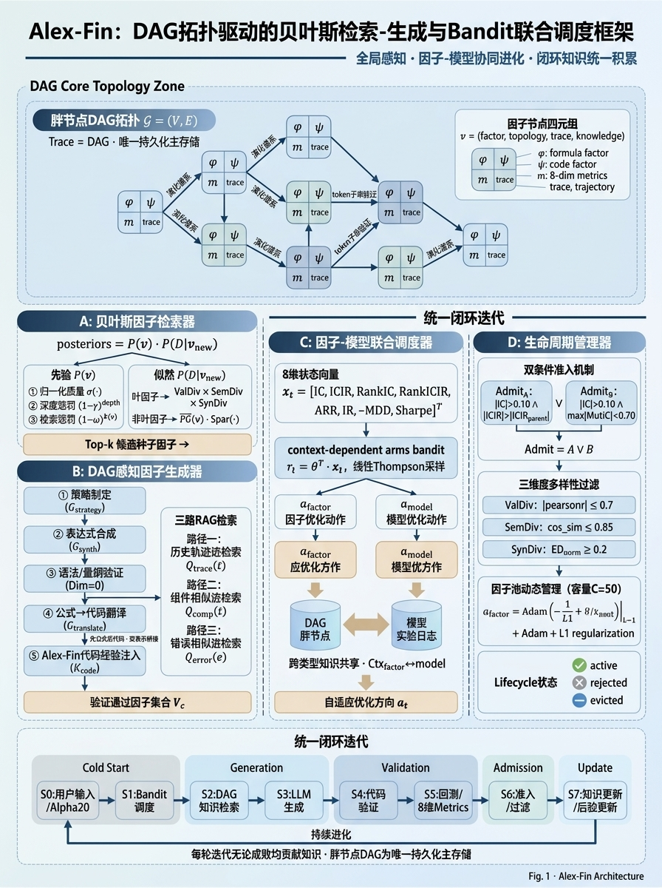
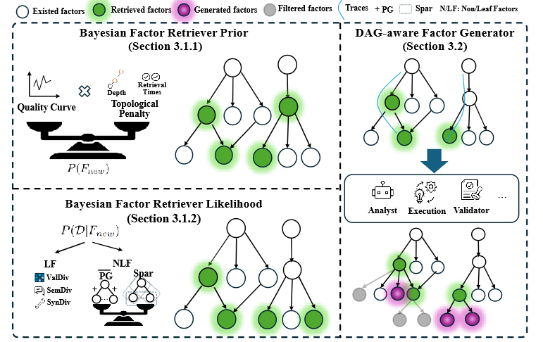
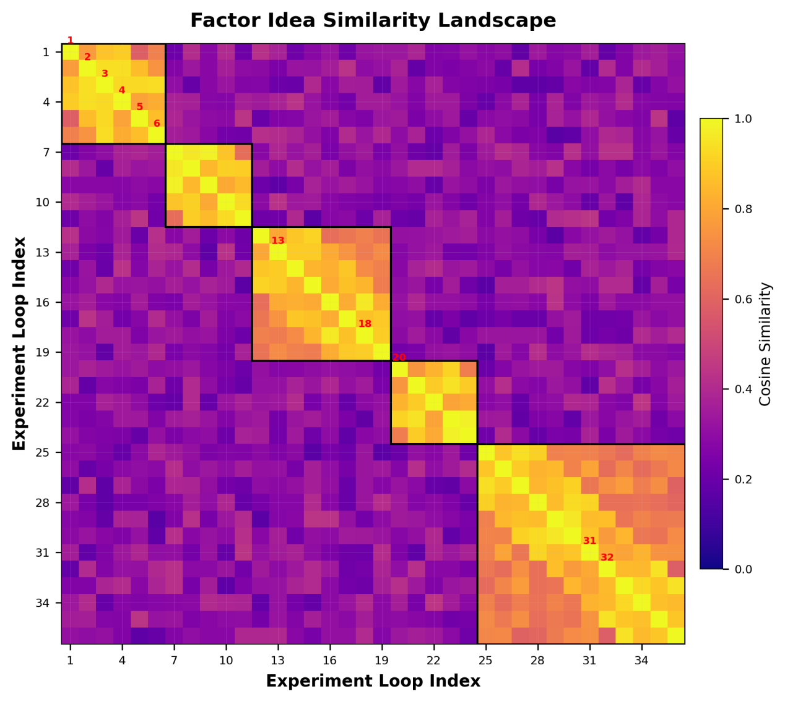
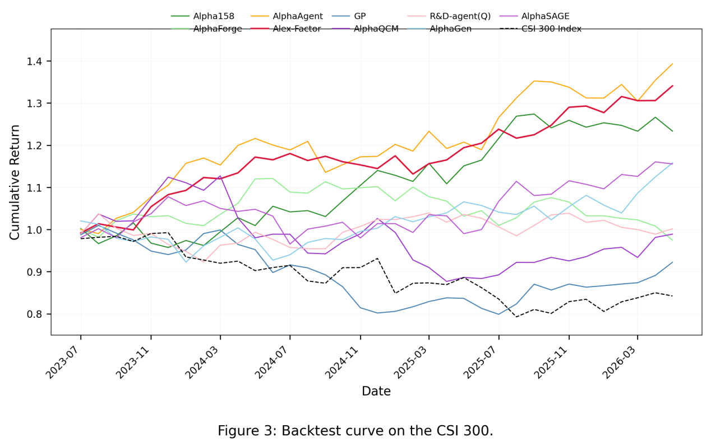
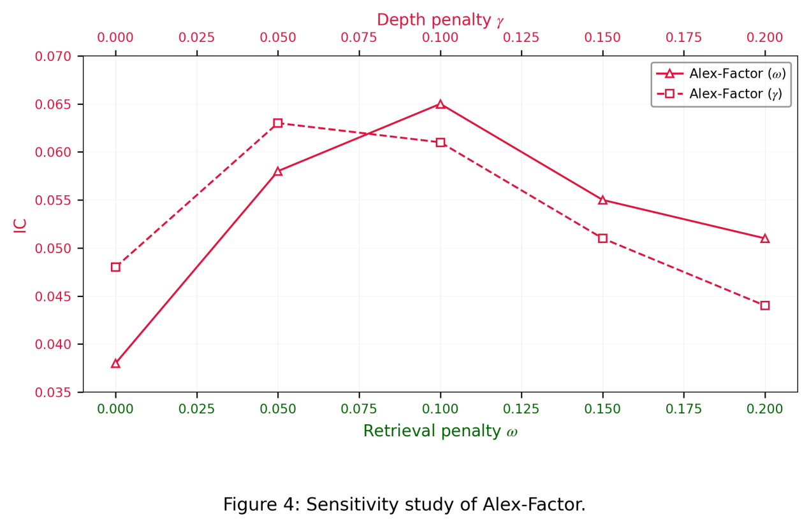
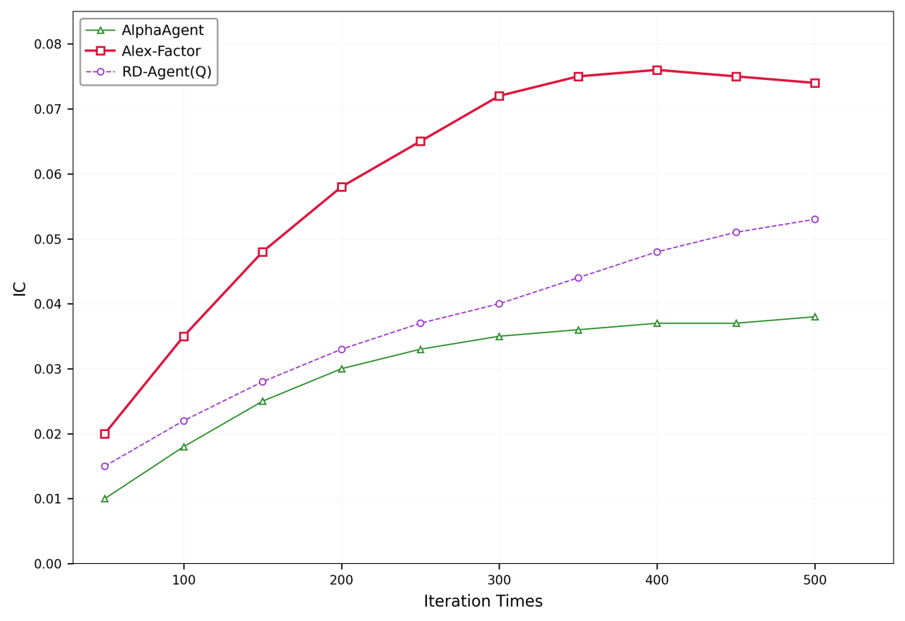
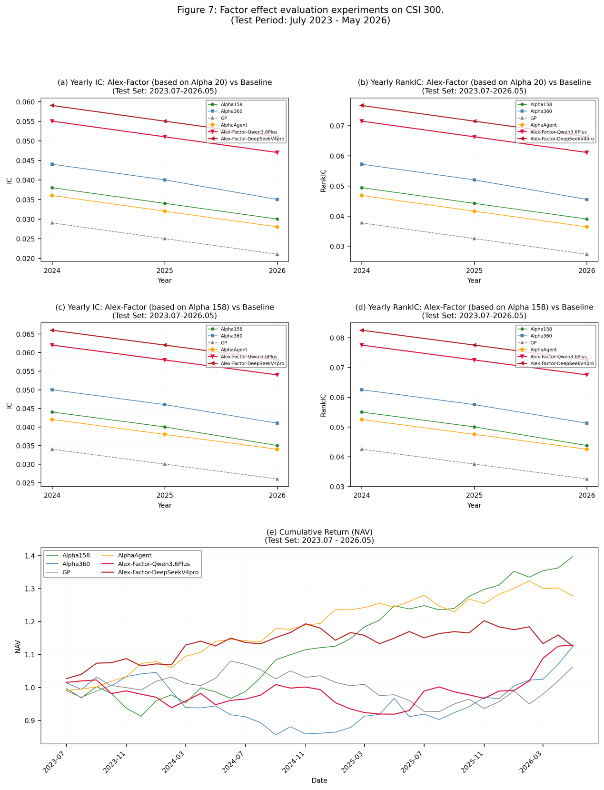
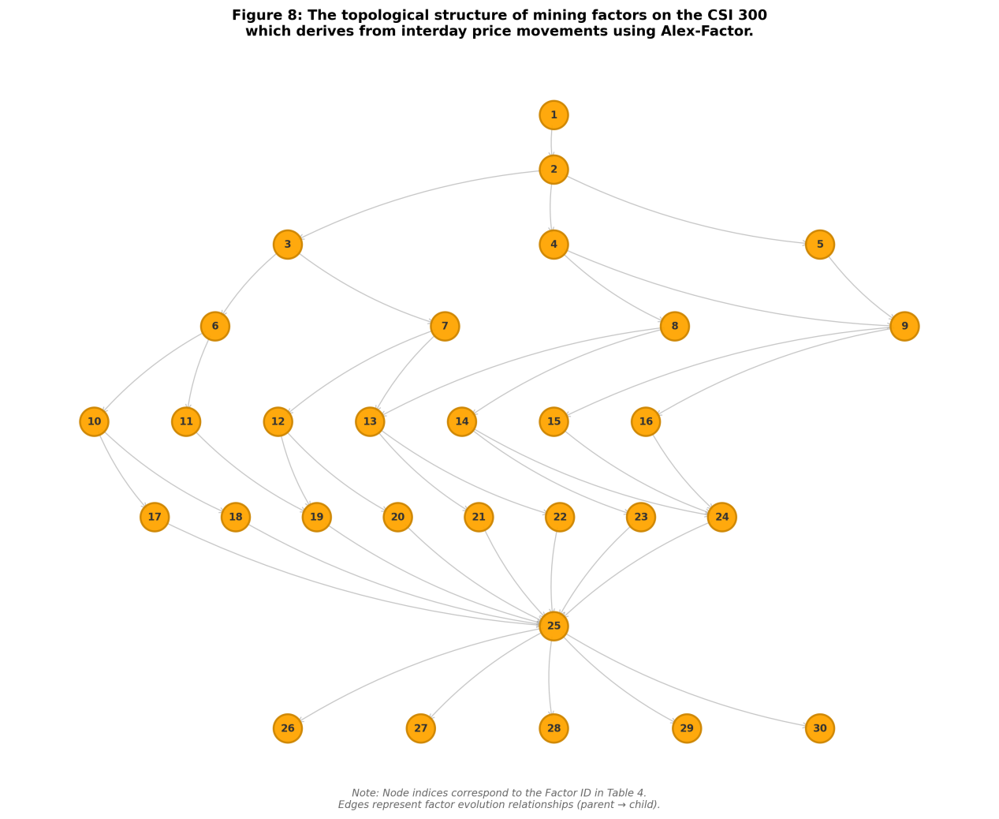

# BenjaminAgent 历史研究稿

[作品导读](README.zh-CN.md) · [English guide](README.md) · [PDF](manuscript.pdf) · [图表与版本索引](source-map.md)

本文保留历史稿的研究叙述与图表。历史项目名为 Alex-Fin，当前工程名为 BenjaminAgent；当前实现对应关系见[作品导读](README.zh-CN.md)。

原稿题名：Alex-Fin：DAG拓扑驱动的贝叶斯检索-生成与双臂Bandit自进化联合调度的Multi-Agent投资策略。

---

摘要

量化投资面临因子挖掘缺乏全局拓扑视角、因子与模型优化彼此孤立、实验知识积累碎片化三重核心挑战。本文提出**Alex-Fin**，一个**DAG拓扑驱动的贝叶斯检索-生成与双臂Bandit联合调度的多智能体投资策略框架**。其四项核心技术贡献为：（1）**贝叶斯因子检索器**，通过后验概率模型融合个体质量、拓扑风险与池级贡献，在因子演化DAG上实现利用与探索的原则性平衡；（2）**DAG感知因子生成器**，采用"先公式后代码"的五阶段工作流，利用完整祖先轨迹指导定向生成，通过三路代码经验检索（历史轨迹、组件相似、错误相似）实现跨任务知识迁移；（3）**上下文双臂Bandit联合调度器**，以**8维策略状态向量**驱动线性Thompson采样，自适应选择因子优化或模型优化方向，通过DAG胖节点双向知识共享实现因子-模型协同进化；（4）**胖节点DAG统一知识积累**，将因子本体、拓扑结构、实验轨迹与代码经验依附于同一节点，消除多结构间的同步开销与检索跳转。实证评估在中国A股沪深300、中证500、中证1000三大股票池上展开，数据集划分为训练集2010.01-2021.12、验证集2022.01-2023.06、测试集2023.07-2026.05。实验结果表明，**Alex-Fin取得IC=0.0532、年化收益14.21%**，在因子预测精度与策略收益上均显**著优于Alpha158、AlphaAgent、R&D-Agent(Q)、TRA、MASTER等10余种基准方法**，验证了全局拓扑导航与因子-模型联合进化在自动化投资策略研发中的核心价值。



图1 Alex-Fin技术路线图

# 引言

金融市场是高维、非线性的动态系统，收益序列呈现厚尾分布、时变波动性与复杂的截面相关性。这些特征意味着资产价格同时受宏观因子、微观结构信号与行为反馈机制驱动，其预测难度远高于常规时间序列。在数据指数级增长、算力与人工智能技术突破的推动下，资产管理行业正从经验驱动向数据驱动转型。在此趋势下，量化投资成为主流，原因在于：（1）通过"数据-因子-模型"闭环实现高效决策；（2）集成风险控制的可重复执行；（3）在策略趋同加剧的背景下精准获取超额收益。

**现代量化研究流程的核心聚焦于两大关键环节：因子挖掘与模型创新。**因子挖掘从闭式风险收益模型，发展到进化符号回归，再到基于强化学习的因子组合优化；模型创新从经典自回归模型，演进到机器学习模型与序列到序列深度架构，以及优化长程预测注意力机制的专用时序模型。近年来，大语言模型与多智能体系统进一步拓展信息边界，从新闻与社交网络中提取信号，并模拟金融专家的协作过程。

尽管取得上述进展，现有因子挖掘方法仍面临根本性局限。这些方法可归纳为**两种范式：**解耦因子生成将每次生成视为独立事件，因子间的关联保持隐式且薄弱，将因子池视为无结构集合而忽略相似表达式间的连接；迭代因子演化关注局部父子对精炼，但通常仅优化线性链而忽略因子池更广泛的演化网络。**两种范式的共同局限在于缺乏全局结构视角——优先个体因子质量而忽略因子间拓扑关系中编码的策略信息**。然而，建模因子间的拓扑关系仅是起点，核心挑战在于如何导航这一复杂拓扑以指导未来发现：从大规模候选库中识别最具演化潜力的种子因子，并利用其完整祖先轨迹避免冗余突变、引导定向生成。

即使因子挖掘具备全局视角，量化研究仍面临更深层的系统性挑战。**现有流程**在假设生成、代码编写与调优环节**需大量人工干预，迭代缓慢且易引入偏差；**基于**大语言模型**的智能体常直接通过语言交互生成交易信号，**缺乏扎实的因子构建与透明的模型逻辑**，易产生"幻觉"而难以在实盘中落地；更为关键的是，因子挖掘与模型创新作为量化流程的两大核心环节往往孤立运行，缺乏系统化的任务拆解与智能体级协同。因子质量决定模型输入的信息含量，模型结构决定因子信号的利用效率——两者相互依赖、必须协同进化。然而，在有限计算资源下，如何自适应地决定每一轮迭代优先优化因子还是模型，是实现协同进化的关键挑战。

**为同时解决上述问题，本文提出Alex-Fin——全局感知因子-模型联合驱动的启发式自进化投资组合优化框架。Alex-Fin将因子挖掘重新定义为在有向无环图mathcal{G}=(V,E)上的策略导航与生成过程，其中V是所有已发现因子的节点集合，E是代表因子演化谱系的有向边集合。在此框架下，Alex-Fin面临三重相互关联的核心挑战：策略检索——从图中识别最具演化潜力的现有因子；定向生成——从选定父因子利用完整祖先轨迹生成新颖子代；联合调度——在有限计算资源下自适应决定每轮优先优化因子还是模型。**

Alex-Fin是为解决这三重挑战设计的闭环系统，由**四个核心组件**协同构成：负责策略检索的**贝叶斯因子检索器**、执行定向生成的**DAG感知因子生成器**、决定优化方向的**因子-模型联合调度器**、以及管理因子准入与淘汰的**因子生命周期管理器。**其设计遵循三项核心原则：

原则一：**全局拓扑驱动的因子演化导航。**因子挖掘不应是孤立生成或局部父子精炼，而应是在因子演化图谱上的策略性导航。检索器通过后验概率平衡因子的实测质量与过度优化风险，同时评估新子代对因子池生态的边际增益；生成器利用被选种子的完整祖先轨迹，将历史优化经验转化为可执行的突变方案，避免冗余突变并鼓励多样化生成。

原则二：**因子-模型联合自适应进化。**因子与模型必须协同进化，且优化方向应随策略状态动态调整。调度器将优化方向选择建模为上下文双臂老虎机问题，通过线性Thompson采样自适应选择优化方向；因子与模型优化之间通过双向知识共享机制互相感知对方的最新进展，避免信息孤岛。

原则三：**闭环知识统一积累。**每轮迭代无论成功或失败均应贡献知识积累，所有知识统一依附于因子演化图谱的节点上。每个DAG节点设计为"胖节点"，同时携带因子本体、拓扑结构、实验轨迹与代码经验四类信息，使得实验轨迹无需独立存储，代码经验图谱降级为运行时可重建索引。被拒绝与被淘汰的因子仍保留在DAG中，确保演化轨迹完整性。

本文主要贡献如下：

1.提出Alex-Fin，首个融合**DAG全局拓扑导航与因子-模型联合优化的闭环自进化框架**，将**因子挖掘重新定义**为图谱上的策略检索与定向生成问题，同时通过上下文双臂老虎机实现因子-模型协同进化。

2.设计**贝叶斯因子检索器**，通过后验概率模型平衡因子的利用价值与探索潜力，融合个体质量、拓扑风险与池级贡献的多维度信息，实现DAG上的原则性种子选择。

3.设计**DAG感知因子生成器**，提出"先公式后代码"的五阶段桥接工作流，利用完整祖先轨迹指导定向生成，并通过三路代码经验检索实现跨任务知识迁移。

4.将**因子-模型联合调度建模为上下文双臂老虎机**，通过线性Thompson采样自适应选择优化方向，并设计DAG上下文感知的跨类型知识共享机制。

5.设计**闭环知识统一积累机制**，以胖节点DAG为唯一持久化主存储，消除多结构间的同步开销与检索跳转，使系统随迭代持续进化。

# 相关工作

## 因子挖掘

因子挖掘旨在从原始市场数据中发现具有预测能力的数学表达式，将价量、基本面等数据流转化为资产收益的预测信号。传统方法依赖资产定价理论中的人工构建因子，如价值与动量因子\[FamaandFrench,1993;Carhart,1997\]，这类固定信号虽具可解释性，但在市场状态变化时缺乏适应性。为克服该局限，遗传编程方法通过交叉与变异演化表达式树实现因子挖掘自动化\[Zhangetal.,2020;Chenetal.,2021\]，滞后算子\[Lietal.,2024\]、算子变异与剪枝等改进进一步提升了生成多样性。强化学习方法将因子配置重构为序贯决策问题，直接优化夏普比率或卡玛比率\[Yuetal.,2023;Jiangetal.,2025\]。然而，这些方法依赖人工先验或搜索空间受限，难以覆盖高维因子空间中的有效区域。

近年来，自动化因子挖掘方法沿两种范式演进。**第一种范式为解耦因子生成（DecoupledFactorGeneration,DFG）**，将因子创建为独立单元。AlphaGen\[Yuetal.,2023\]基于策略梯度算法利用强化学习的强探索能力挖掘因子；AlphaForge\[Shietal.,2025a\]通过代理模型预测适应度得分并结合生成流网络动态组合因子；AlphaQCM\[ZhuandZhu,2025\]基于分布强化学习依赖有偏分位数的无偏方差估计发现因子；AlphaSAGE\[Chenetal.,2025\]融合符号表达式图神经网络编码器与多高奖励模式生成流网络挖掘因子。DFG方法擅长广泛探索，但将每次生成视为独立事件，因子间的关联保持隐式且薄弱——模型忽略当前因子库的特定状态，将因子池视为简单集合而非关联系统，忽略了导向成功的演化逻辑。

第二种范式为**迭代因子演化（IterativeFactorEvolution,IFE）**，将因子发现视为持续优化过程。早期方法使用遗传编程通过交叉和变异演化表达式树\[Chenetal.,2021\]；近期，大语言模型被用于为优化提供智能反馈，AlphaAgent\[Tangetal.,2025\]引入原创性约束、复杂度控制与假设对齐三大正则机制引导因子生成；现代智能体还利用回测结果提示LLM进行针对性公式修改\[Caoetal.,2025;Lietal.,2025b\]，部分框架使用多智能体系统\[Kouetal.,2025;Liuetal.,2025\]或蒙特卡洛树搜索\[Shietal.,2025b\]引导局部搜索。IFE方法关注局部父子对精炼，但通常仅优化线性链而忽略因子池更广泛的演化网络，缺乏从大规模候选库中选择最具潜力种子的原则性机制，发现过程常变得重复或陷入局部最优。如何组织因子间的拓扑关系并导航这一复杂结构以指导未来发现，仍是开放问题。

## 预测模型与因子-模型协同优化

预测模型是量化研究流程的另一核心环节。经典自回归模型\[Boxetal.,2015\]与指数平滑方法**难以处理高维噪声数据**；机器学习方法如支持向量机\[LiandKao,2015\]、随机森林\[Khaidemetal.,2016\]与梯度提升树\[Keetal.,2017;ChenandGuestrin,2016;Prokhorenkovaetal.,2018\]提升了稳健性，但**仍需人工特征工程**。深度学习模型中，门控循环单元\[Chungetal.,2014\]与长短期记忆网络\[HochreiterandSchmidhuber,1997\]捕捉时序依赖关系，Transformer\[Vaswanietal.,2017\]通过多头自注意力建模长程依赖。在此基础上，专用时序预测模型涌现：PatchTST\[Nieetal.,2023\]将输入划分为局部片段提升参数效率，iTransformer\[Liuetal.,2024\]重映射变量-令牌关系建模多变量结构，Mamba\[GuandDao,2024\]基于状态空间模型实现线性复杂度的长序列建模。金融专用模型进一步融合市场动态：TRA\[Linetal.,2024\]引入动态路由机制自适应学习时序模式，MASTER\[Lietal.,2024\]建模股票间的瞬时与跨时相关关系。然而，**上述模型创新与因子挖掘独立发展，两者缺乏系统化协同。**

**因子与模型的联合优化是近年来的新兴方向。**R\\D-Agent(Q)\[Lietal.,2025b\]首次提出因子-模型协同优化框架，将量化流程拆解为研究与开发两大阶段，通过上下文双臂老虎机调度器自适应选择优化方向，并设计Alex-Fin代码生成智能体实现任务专属代码的经验积累与迁移。然而，该框架将因子与模型视为独立优化对象，因子挖掘仍采用局部精炼范式——综合单元基于历史假设与反馈生成新假设，**但缺乏因子间的全局结构视角与原则性种子选择机制，因子演化路径的追踪与组织依赖于扁平的时序轨迹而非拓扑结构。**

**联合调度的核心挑战在于如何在有限计算资源下动态平衡因子与模型的优化投入。**固定交替策略无法响应策略状态的动态变化；随机选择易导致资源浪费与优化方向偏离；基于LLM的判断虽具语义理解能力，但每步需额外调用模型且规划不稳定。上下文双臂老虎机通过线性Thompson采样在探索与利用间取得平衡\[Lietal.,2025b\]，**但如何将调度决策与因子演化拓扑、因子-模型间的知识共享深度整合，仍需进一步探索。**

## 大语言模型驱动的金融智能体

**大语言模型凭借强大的推理与抽象能力，为金融研究自动化提供了新可能。**在信号提取层面，LLM从新闻与社交网络中提取预测信号\[Liuetal.,2023;Xieetal.,2024\]，生成因子解释\[Wangetal.,2023\]，开展多模态市场分析\[Lietal.,2024\]。然而，直接通过语言交互生成交易信号的方法缺乏扎实的因子构建与透明的模型逻辑，易产生"幻觉"而难以在实盘中落地。

在系统层面，**基于LLM的多智能体系统为复杂决策提供协同框架。**通用框架如AutoGen\[Wuetal.,2023\]与AutoGPT\[Richards,2023\]支持角色驱动的智能体协作；金融领域中，FinAgent\[Lietal.,2024\]与TradingAgents\[Lietal.,2025\]采用基于角色的智能体完成事件提取、组合更新等子任务。R\\D-Agent(Q)\[Lietal.,2025b\]进一步将量化研究拆解为规范、综合、实现、验证、分析五个单元，形成"假设-实现-验证-反馈"的闭环研发范式。然而，现有系统多聚焦窄口子任务，过度依赖语义信号，缺乏因子-模型联合优化与全局结构化知识组织——因子演化轨迹与代码经验分散存储于独立数据结构中，检索时需跨结构跳转与同步。**如何将LLM的推理能力与因子演化拓扑、因子-模型协同调度深度整合，实现结构化、可解释、自进化的量化研究闭环，是本文探索的核心问题。**

# 研究方法：DAG拓扑驱动的贝叶斯检索-生成与Bandit调度

## 系统总体架构：胖节点DAG与8步闭环

我们**将阿尔法因子挖掘问题重新定义为在有向无环图（DAG）**$`\mathcal{G} = (V,E)`$上的策略导航与生成过程，其中$`V`$是所有已发现因子的节点集合，$`E`$是代表因子演化谱系的有向边集合。边$`(v_{p},v_{c}) \in E`$表示因子$`v_{c}`$由父因子$`v_{p}`$衍生而来。在此框架下，Alex-Fin面临三重相互关联的核心挑战：

**策略检索**：首要挑战是从图中识别最具演化潜力的现有因子。这是**在DAG上的搜索问题，**旨在找到最优父因子$`v_{p}^{\ast}`$，以最大化待生成子代因子$`v_{new}`$的期望质量：

``` math
v_{p}^{\ast} = arg\max_{v_{p} \in V}\mathbb{E}\left\lbrack Qual\left( v_{new} \right) \mid parent\left( v_{new} \right) = v_{p},\mathcal{G} \right\rbrack
```

**定向生成：**第二项挑战是从选定父因子生成新颖、高质量的子代。该生成任务**利用父因子在图中的上下文信息（即其祖先路径）指导新子代**$`\mathbf{\{}\mathbf{v}_{\mathbf{c}}\mathbf{\}}`$**的生成**：

``` math
\left\{ v_{c,1},\ldots,v_{c,k} \right\} = G\left( v_{p}^{\ast},T\left( v_{p}^{\ast} \right) \right)\quad(2)
```

其中$`\{ v_{c,1},\ldots,v_{c,k}\}`$为**新生成的子代因子**，$`T(v_{p}^{\ast})`$为生成**轨迹**（$`\mathcal{G}`$中从根节点到$`v_{p}^{\ast}`$的路径），$`G`$为生成函数。

**联合调度：**第三项挑战是在有限计算资源下，**自适应地决定每一轮迭代优先优化因子还是模型。**因子挖掘与模型创新是两个相互依赖的核心环节：因子的质量决定模型输入的信息含量，模型的结构决定因子信号的利用效率。若固定优化顺序则无法响应策略状态的动态变化，若随机选择则易导致资源浪费与优化方向偏离。

**Alex-Fin是为解决这三重挑战设计的闭环系统，由四个核心组件协同构成：负责策略检索的贝叶斯因子检索器、执行定向生成的DAG感知因子生成器、决定优化方向的因子-模型联合调度器、以及管理因子准入与淘汰的生命周期管理器。Alex-Fin的整体结构如图2所示。**


图2 Alex-Fin架构图

Alex-Fin的设计遵循三项核心原则，这些原则是区别于既有方法的关键创新：

原则一：**DAG为唯一持久化主存储**。既有方法中，因子谱系、实验轨迹与代码经验分散存储于独立数据结构中——AlphaPROBE的ExpressionKnowledgeGraph仅存储公式，$`R\& D - Agent(Q)`$的Trace与Alex-Fin知识图谱独立持久化。这种松耦合导致检索因子时无法同时获取挖掘经验与代码经验。Alex-Fin将因子演化DAG确立为唯一持久化主存储，所有知识均依附于DAG节点，消除了多结构间的同步开销与检索跳转。

原则二：**胖节点统一知识记忆**。传统因子DAG节点仅存储因子本体信息（公式或代码）。Alex-Fin将每个DAG节点设计为”胖节点”，**同时携带四类信息：因子本体（公式+代码+指标）、拓扑结构（父节点/子节点/深度）、实验轨迹（时间戳/假设/反馈/决策/状态）和代码经验（参考Alex-Fin设计的知识内容）**。该设计使得Trace=DAG——实验轨迹无需独立存储，通过$`sorted(V,key = \tau)`$即可重建完整时序；代码经验图谱降级为运行时可重建的嵌入检索索引，不独立持久化。

原则三：**双表示因子节点**。AlphaPROBE的因子仅以公式表示，RDAgent的因子仅以代码表示。Alex-Fin采用**公式+代码双表示：公式表示支撑贝叶斯检索器的编辑距离计算、DAG边的token子串验证与量纲约束检查；代码表示支撑回测执行与代码经验检索。**生成流程为”先公式后代码”——LLM首先在约束算子空间内生成公式，验证通过后翻译为可执行Python代码。

## DAG拓扑感知因子挖掘：贝叶斯检索与定向生成

### 基于DAG的因子演化拓扑建模

Alex-Fin以**因子演化DAG**为核心数据结构，其形式化定义为有向无环图$`\mathcal{G} = (V,E)`$，其中$`V`$为因子节点集合，$`E \subseteq V \times V`$为演化边集合。边$`(v_{u},v_{w}) \in E`$表示因子$`v_{w}`$由父因子$`v_{u}`$经LLM生成或优化衍生而来，且$`depth(v_{w}) = depth(v_{u}) + 1`$。

胖节点数据结构。每个因子节点$`v \in V`$为四元组$`v = (factor,topology,trace,knowledge)`$，各分量定义如下：

因子本体$`factor = (\varphi,\psi,m)`$，其中$`\varphi`$为公式表示（可为$`None`$表示纯代码因子），$`\psi`$为代码表示（可执行Python代码字符串），$`m \in \mathbb{R}^{8}`$为**8维性能指标向量**：

``` math
m = \lbrack IC,ICIR,RankIC,RankICIR,ARR,IR, - MDD,Sharpe\rbrack^{\top}
```

**拓扑结构**$`topology = (v_{parent},\mathcal{C}_{children},d)`$，其中$`v_{parent}`$为父节点标识，$`\mathcal{C}_{children}`$为子节点标识集合，$`d`$为节点深度。

**实验轨迹**$`trace = (\tau,h,fb,\delta,s)`$，其中$`\tau`$为时间戳，$`h`$为本轮假设文本，$`fb`$为LLM生成的实验反馈，$`\delta \in \{ True,False\}`$为准入决策结果，$`s \in \{ active,rejected,evicted\}`$为节点状态。

代码经验$`knowledge = code\_ experience`$，存储参考Alex-Fin设计的代码经验内容，包括相似成功代码、错误-成功代码对与历史轨迹。

节点状态语义。因子节点具有**三态生命周期**：

<span id="_Toc30974" class="anchor"></span>表1 因子节点三态生命周期

| 状态 | 含义 | 是否入池 | 是否可被贝叶斯检索 | 是否参与轨迹回溯 |
|----|----|----|----|----|
| $`s = active`$ | 准入成功，在因子池中 | 是 | 是 | 是 |
| $`s = rejected`$ | 准入失败，不入池 | 否 | 否 | 是 |
| $`s = evicted`$ | 入池后被淘汰 | 否（已出池） | 否 | 是 |

关键设计：$`rejected`$与$`evicted`$节点仍保留在DAG中，确保因子演化轨迹的完整性。此设计是Alex-Fin统一知识记忆的基础。

**双表示与DAG边构建。公式因子的DAG边通过token子串包含判断构建**：若子代因子的token序列$`tokens(v_{c})`$包含父因子token序列$`tokens(v_{p})`$的子序列，则建立边$`(v_{p},v_{c})`$。代码因子（$`\varphi = None`$）的DAG边采用显式父节点追踪。公式因子需满足量纲约束$`Dim(\varphi) = 0`$（由DimensionCalculator验证），确保生成的表达式物理意义合法。

核心操作。DAG提供以下核心操作：

**轨迹查询**$`path\_ to\_ root(v):V \rightarrow V^{\ast}`$，返回从根节点到$`v`$的完整演化路径（含所有状态节点），**每个节点携带**$`\mathbf{trace}`$**字段**，**使得检索因子时同时检索挖掘经验**（Trace=DAG）：

``` math
path\_ to\_ root(v) = \lbrack v_{0},v_{1},\ldots,v_{k} = v\rbrack,\quad(v_{i},v_{i + 1}) \in E
```

时序重建$`get\_ hist():V^{\ast}`$，通过$`sorted(V,key = \tau)`$重建完整Trace时序，无需独立Trace存储。

SOTA查询$`get\_ sota():V`$，返回最新$`\delta = True`$的节点。

代码经验检索$`query\_ code\_ experience(q,top\_ k):V^{\ast}`$，运行时从DAG节点的$`knowledge`$字段重建嵌入索引，通过余弦相似度检索最相关的代码经验。

### 贝叶斯因子检索器

为有效选取父因子，需要构建能推理因子演化过程中多层级结构信息的框架。受贝叶斯建模启发，我们提出一种原则性方法，融合因子个体表现、演化谱系与拓扑结构、以及因子与整体池的关联等多维度信息。

**检索器的核心任务是识别具备最优优化潜力的父因子。该筛选问题基于贝叶斯框架构建，平衡因子个体价值与在拓扑结构**$`\mathcal{G}`$**中对整体因子池的潜在贡献。**我们以因子$`v \in V`$生成高价值子代$`v_{new}`$的概率对所有因子排序，给定当前因子池$`\mathcal{D}`$：

``` math
\begin{aligned}
 & arg\max_{v \in V}\mathbb{E}\left\lbrack Qual\left( v_{new} \right) \mid parent\left( v_{new} \right) = v,\mathcal{D} \right\rbrack \\
 & \propto \frac{P\left( v_{new} \right)P\left( \mathcal{D} \mid v_{new} \right)}{P(\mathcal{D})} \propto P\left( v_{new} \right)P\left( \mathcal{D} \mid v_{new} \right)
\end{aligned}
```

**先验项**$`P(v_{new})`$刻画因子的内在潜力，**似然项**$`P(\mathcal{D} \mid v_{new})`$评估新子代对因子池生态的增益，证据项$`P(\mathcal{D})`$为常数。

**先验：质量与过度优化风险的权衡。先验概率**$`\mathbf{P(}\mathbf{v}_{\mathbf{new}}\mathbf{)}`$**由其父因子**$`\mathbf{v}`$**的质量近似。**但仅依赖高表现因子具有误导性：经长期优化链生成、或被频繁用于生成的因子，易出现收益递减。因此，先验项显式权衡因子的实测质量与上述结构风险，并结合$`v`$在$`\mathcal{G}`$中的拓扑结构。候选父因子$`v`$的先验得分定义为：

``` math
\begin{aligned}
P(v) = & \underset{归一化质量}{\underbrace{\sigma\left( \frac{Qual(v) - \mu_{Qual(V)}}{\varsigma_{Qual(V)}} \right)}} \cdot \underset{深度惩罚}{\underbrace{(1 - \gamma)^{depth(v)}}} \\
 & \cdot \underset{检索惩罚}{\underbrace{(1 - \omega)^{k(v)}}}
\end{aligned}
```

其中$`Qual(v)`$为**因子经风险调整后的表现**，在因子池$`V`$中归一化；$`\sigma`$为sigmoid映射函数；$`\mu_{Qual(V)}`$与$`\varsigma_{Qual(V)}`$分别为$`V`$上$`Qual( \cdot )`$的均值与标准差；$`depth(v)`$为因子$`v`$在图$`\mathcal{G}`$中的深度；$`k(v)`$为检索阶段中$`v`$被检索的次数。质量得分由两项拓扑惩罚修正，对应权衡中的风险维度：\
-深度惩罚：平衡对深度优化因子的信任与过拟合风险，由超参数$`\gamma`$调节。\
-检索惩罚：平衡对已知优质父因子的利用与对搜索空间中未充分挖掘区域的探索，由超参数$`\omega`$调节。

与AlphaPROBE的区别在于，$`Qual(v)`$的度量来源从4维指标（IC/ICIR/MutIC/信号强度）扩展为8维指标体系中的ICIR字段，使得质量评估更全面地反映因子预测能力与策略表现。

**似然：对整体池的贡献评估。似然项**$`\mathbf{P(}\mathcal{D}\mathbf{\mid}\mathbf{v}_{\mathbf{new}}\mathbf{)}`$**估算新因子的边际效用，核心是评估新因子对整体因子池质量的提升，而非仅关注个体价值。**估算策略依据父因子$`v`$是否具备生成优质子代的历史记录自适应调整，据此将DAG中的因子分为两类：

**叶因子：**尚未生成任何优质子代的因子（$`\mathcal{C}_{children} = \varnothing`$），代表未被探索的优化路径。

**非叶因子：**已成功生成至少一个子代的因子（$`\mathcal{C}_{children} \neq \varnothing`$），具备可验证的生成潜力。

**叶因子。叶因子无历史生成子代记录，核心思路是结合整体因子池**$`\mathbf{V}`$**，从价值、语义、语法三个多样性维度综合衡量其新颖性**，以此近似潜力。全维度新颖的因子更易生成独特子代，$`P(\mathcal{D} \mid v_{new})`$可估算为：

``` math
ValDiv(v,V) \cdot SemDiv(v,V) \cdot SynDiv(v,V)\quad(6)
```

**三个维度分别为：**

**ValDiv（价值多样性）：**衡量因子数值输出的新颖性，通过与$`V`$中其他因子的平均皮尔逊相关系数实现：

``` math
ValDiv(v,V) = 1 - \left. \parallel\frac{1}{|V|}\sum_{v' \in V}^{}Corr(v,v') \right.\parallel\quad(7)
```

**SemDiv（语义多样性）：**衡量因子底层金融逻辑的新颖性，通过LLM生成的因子解释嵌入的余弦相似度（CosSim）实现：

``` math
SemDiv(v,V) = \sigma\left( 1 - CosSim\left( emb(v.llm\_ explanation),emb(V) \right) \right)\quad(8)
```

其中$`emb( \cdot )`$为嵌入函数，$`v.llm\_ explanation`$为LLM为因子$`v`$生成的金融逻辑解释文本。此设计对齐AlphaPROBE论文的语义多样性定义——使用LLM生成的因子解释嵌入（而非简单描述文本嵌入），确保语义度量的信息丰富度。

**SynDiv（语法多样性）：**衡量因子数学结构的新颖性，通过与其他因子的归一化编辑距离（ED）实现：

``` math
SynDiv(v,V) = \frac{1}{|V|}\sum_{v' \in V}^{}\frac{ED(v.\varphi,v'.\varphi)}{len(v.\varphi) + len(v'.\varphi)}\quad(9)
```

其中$`ED( \cdot , \cdot )`$为Levenshtein编辑距离，$`v.\varphi`$为因子的公式表示。当$`v.\varphi = None`$（纯代码因子）时，SynDiv跳过检查，仅依赖ValDiv与SemDiv。

**非叶因子。非叶因子可依据历史生成表现进行更可靠的预测，**核心权衡是：父因子生成小幅提升但相似的子代，与生成多样化子代的能力。此时$`P(\mathcal{D} \mid v_{new})`$估算为：

``` math
P(\mathcal{D} \mid v_{new}) \propto \overline{PG}(v) \cdot Spar\left( \mathcal{C}_{children}(v) \right)\quad(10)
```

其中$`\overline{PG}(v)`$为父因子$`v`$到现有子代的平均质量增益百分比；$`Spar`$体现子代稀疏性的关键权衡：奖励子代既与父因子差异显著（垂直多样性）、子代间也差异显著（水平多样性）的父因子，**助力发掘能开启多条独立优化路径的父因子**。形式化定义为两项稀疏度指标的乘积：

``` math
Spar\left( \mathcal{C}_{children}(v) \right) = Spar_{p - c}(v) \cdot Spar_{c - c}(v)\quad(11)
```

$`Spar_{p - c}`$为父子稀疏度，衡量子代与父因子的差异程度：

``` math
Spar_{p - c}(v) = 1 - \frac{1}{|\mathcal{C}_{children}(v)|}\sum_{v' \in \mathcal{C}_{children}(v)}^{}Corr(v,v')\quad(12)
```

$`Spar_{c - c}`$为子代间稀疏度，衡量子代彼此的差异程度；单子代因子的$`Spar_{c - c}(v) = 1`$，否则定义为：

``` math
\begin{matrix}
Spar_{c - c}(v) = 1 - \frac{1}{\left( \frac{|\mathcal{C}_{children}(v)|}{2} \right)}\sum_{\substack{v_{i},v_{j} \in \mathcal{C}_{children}(v) \\ i < j}}^{}Corr\left( v_{i},v_{j} \right)\quad(13)
\end{matrix}
```

最后计算各因子的总得分$`posterior = P(v) \cdot P(\mathcal{D} \mid v_{new})`$，分别对叶节点与非叶节点排序，选取全局前$`k`$个候选因子传入因子生成器，完成循环。

### DAG感知因子生成器

检索器选定父因子$`v_{p}`$后，生成器的任务是生成新颖且有效的子代。摒弃直接提示LLM进行优化的朴素方式（易出现语法错误与琐碎变体）**，Alex-Fin将生成过程设计为五阶段、DAG感知的工作流**。

阶段一：**策略制定**。分析器智能体利用父因子的完整演化路径（轨迹$`T(v_{p})`$），制定多样化且上下文感知的修改策略集合$`\mathcal{S}`$。该步骤将DAG中编码的历史优化轨迹转化为可执行的未来突变方案：

``` math
\left\{ \mathcal{S}_{1},\ldots,\mathcal{S}_{m} \right\} = G_{strategy}\left( v_{p},T\left( v_{p} \right) \right)\quad(14)
```

阶段二：**表达式合成**。执行器智能体将每个抽象策略$`\mathcal{S}_{i}`$转化为具体的候选因子表达式$`v_{{c,i}'}.\varphi`$。该步骤分离高层金融与结构推理、与表达式合成的精准任务：

``` math
v_{{c,i}'}.\varphi = G_{synth}\left( v_{p},\mathcal{S}_{i} \right)\quad\forall i \in \{ 1,\ldots,m\}\quad(15)
```

阶段三：**语法与量纲验证**。验证器智能体对每个候选$`v_{{c,i}'}.\varphi`$进行严格的语法正确性与预设约束检查。语法验证通过ExpressionParser解析token序列，量纲验证通过DimensionCalculator确保$`Dim(v_{{c,i}'}.\varphi) = 0`$。过滤无效表达式后，得到通过验证的公式集合$`V_{c}^{\varphi} \subseteq V_{c'}`$。

阶段四：**公式→代码翻译**。此为Alex-Fin新增的桥接层，将验证通过的公式翻译为可执行Python代码。翻译函数定义为：

``` math
v_{c}.\psi = G_{translate}\left( v_{c}.\varphi,\mathcal{K}_{code} \right)\quad(16)
```

其中$`\mathcal{K}_{code}`$为Alex-Fin代码经验检索结果（见阶段五），$`G_{translate}`$为LLM驱动的翻译函数，输出满足Qlib因子接口规范的Python代码：输入为pandasDataFrame（MultiIndex\[datetime,instrument\]），输出为pandasSeries（相同索引）。

阶段五：**Alex-Fin代码经验注入**。此为Alex-Fin的关键层。代码生成并非从零开始，而是通过三路RAG检索从历史代码经验中迁移知识。Alex-Fin将**Alex-Fin知识图谱的内容嵌入DAG节点的**$`\mathbf{knowledge}`$**字段**，运行时重建为无向图索引$`\mathcal{U} = (N_{\mathcal{U}},E_{\mathcal{U}})`$，其中$`N_{\mathcal{U}}`$包含五类节点：

``` math
N_{\mathcal{U}} = N_{comp} \cup N_{task} \cup N_{trace} \cup N_{success} \cup N_{error}
```

各节点类型定义如下：

<span id="_Toc29525" class="anchor"></span>表2 五节点定义

| 节点类型 | 符号 | 内容来源 | 语义 |
|----|----|----|----|
| 组件节点 | $`n \in N_{comp}`$ | LLM分析因子代码使用的库/组件 | 如pandas、numpy、scipy |
| 任务描述节点 | $`n \in N_{task}`$ | 因子公式字符串或代码摘要 | 对应生成任务的目标描述 |
| 任务轨迹节点 | $`n \in N_{trace}`$ | 验证失败的代码+反馈文本 | 记录失败的实现尝试 |
| 成功实现节点 | $`n \in N_{success}`$ | 验证通过的代码+反馈文本 | 记录成功的实现方案 |
| 错误节点 | $`n \in N_{error}`$ | 评估器错误信息适配后的字符串 | 如”ValueError:Outputcontainsinf” |

**三路RAG检索的形式化定义如下**：

路径一：**历史轨迹检索（**$`\mathbf{former\_ trace\_ query}`$**）**。给定当前任务描述$`t`$，检索同一任务的历史失败轨迹，为代码修正提供直接参考：

``` math
Q_{trace}(t) = top\_ k\left( sorted\left( N_{trace},key = \{ n \in N_{trace}:sim(t,n.task\_ desc)\} \right) \right)\quad(17)
```

其中$`sim( \cdot , \cdot )`$为嵌入余弦相似度，返回与当前任务最相关的$`top\_ k`$条历史轨迹代码。

路径二：**组件相似检索（**$`\mathbf{component\_ query}`$**）**。给定当前任务$`t`$，首先由LLM分析其所需组件$`comp(t)`$，然后通过无向图遍历检索使用相同组件的成功实现：

``` math
Q_{comp}(t) = top\_ k\left( sorted\left( n \in N_{success},key = \left\{ n:\max_{c \in comp(t)}sim(c,n.components) \right\} \right) \right)\quad(18)
```

该路径的核心假设是：使用相同库/组件的代码实现具有结构相似性，可为新任务提供实现模式参考。检索结果需确保至少一半来自GT验证（GroundTruth验证，即RowCount/Index/MissingValues/Correlation评估器全部通过的知识），以保证检索质量。

路径三：**错误相似检索（**$`\mathbf{error\_ query}`$**）**。给定当前错误信息$`e`$，检索历史中相同类型错误的修复方案：

``` math
Q_{error}(e) = top\_ k\left( sorted\left( N_{success},key = \left\{ n:\max_{e' \in N_{error} \cap adjacent(n)}sim(e,e') \right\} \right) \right)\quad(19)
```

其中$`adjacent(n)`$表示无向图中与节点$`n`$相邻的节点集合。该路径将当前错误与历史错误匹配，通过图遍历找到从错误节点到成功实现节点的路径，提供”错误→修复”的代码对。

三路检索结果合并为Alex-Fin查询知识：

``` math
\mathcal{K}_{code} = Q_{trace}(t) \cup Q_{comp}(t) \cup Q_{error}(e)\quad(20)
```

该知识在阶段四的公式→代码翻译中注入LLM提示词，使代码生成具备经验迁移能力。

**代码演化循环。若翻译后的代码未通过8评估器验证管道，系统启动代码演化循环：**每次验证失败产出EvoStep格式数据$`e = (code,feedback)`$，其中$`feedback`$包含执行错误信息与值检查结果。系统立即调用$`generate\_ knowledge(e)`$更新无向图索引（实时更新，不等待闭环结束），随后通过三路RAG检索获取新知识注入下一次代码生成。循环最多执行$`N`$次（默认$`N = 10`$），若全部失败则$`s = rejected`$，节点保留在DAG中供轨迹回溯。

经验证的新因子集合$`V_{c} \subseteq V_{c'}`$被加入DAG，并建立与$`v_{p}`$的新边，完成演化循环，扩展图结构以用于下一轮检索。



<span id="_Toc16432" class="anchor"></span>图3 全局感知因子挖掘架构图

## 双臂Bandit因子-模型联合调度与跨类型知识共享

量化研究流程中，因子挖掘与模型创新是两个相互依赖的核心环节：因子的质量决定模型输入的信息含量，模型的结构决定因子信号的利用效率。然而，在有限计算资源下，如何自适应地决定每一轮迭代优先优化因子还是模型，是实现**因子-模型协同进化**的关键挑战。若固定优化顺序（如交替优化），则无法响应策略状态的动态变化；若随机选择，则易导致资源浪费与优化方向偏离。

**Alex-Fin将因子-模型联合调度问题建模为上下文双臂老虎机（ContextualTwo-ArmedBandit）问题，通过线性Thompson采样（LinearThompsonSampling）算法自适应选择优化方向。**每轮迭代中，系统观测当前策略的**8维性能状态向量**，通过贝叶斯后验采样评估两个优化动作（因子优化与模型优化）的期望收益，选择采样收益最高的动作执行。观测到实际提升效果后，更新所选动作的后验分布，实现探索与利用的自适应平衡。

形式化地，设第$`t`$轮迭代的性能状态向量为$`x_{t} \in \mathbb{R}^{8}`$，动作空间为$`\mathcal{A} = \{ a_{factor},a_{model}\}`$，每个动作$`a \in \mathcal{A}`$的收益函数为线性形式：

``` math
r_{t}^{(a)} = \theta^{(a)\top}x_{t}
```

其中$`\theta^{(a)} \in \mathbb{R}^{8}`$为动作$`a`$的收益系数向量，反映各性能指标对该动作收益的相对重要性。系统为每个动作维护独立的贝叶斯线性模型，通过高斯后验分布编码收益系数的不确定性，实现基于不确定性的探索。

### 上下文双臂老虎机建模

上下文双臂老虎机将因子-模型调度问题形式化为序贯决策过程。在每个决策时刻$`t`$，智能体观测当前环境状态$`x_{t}`$，从动作集合$`\mathcal{A}`$中选择一个动作$`a_{t}`$执行，随后观测到标量奖励$`r_{t}`$。目标是最大化累计奖励$`\sum_{t = 1}^{T}r_{t}`$，即在有限迭代次数内最大化策略性能提升。

状态向量。系统从最新实验结果中提取**8维性能状态向量**$`x_{t}`$，编码当前策略的核心评估指标：

``` math
x_{t} = \lbrack IC,ICIR,RankIC,RankICIR,ARR,IR, - MDD,Sharpe\rbrack^{\top} \in \mathbb{R}^{8}
```

其中各分量均与策略正向表现正相关：信息系数（IC）与信息系数信息比（ICIR）衡量因子预测能力；秩信息系数（RankIC）与秩信息系数信息比（RankICIR）评估排序一致性；年化收益率（ARR）与信息比率（IR）反映策略收益水平；最大回撤（MDD）取负值以对齐方向；Sharpe比率综合衡量风险调整后收益。

**奖励函数。**给定性能状态向量$`x_{t}`$，奖励定义为加权线性组合：

``` math
r_{t} = w^{\top}x_{t}
```

其中权重向量$`w = (0.1,0.1,0.05,0.05,0.25,0.15,0.1,0.2)`$，赋予年化收益率（0.25）与信息比率（0.15）最高权重，体现对策略实际收益能力的优先关注。

动作空间。动作集合$`\mathcal{A} = \{ a_{factor},a_{model}\}`$对应两条优化路径：\
$`a_{factor}`$：优化因子，触发贝叶斯检索→DAG感知生成→代码验证→回测评估→准入判断的全因子流程；\
$`a_{model}`$：优化模型，触发假设生成→代码实现→回测验证→LLM准入判断的全模型流程。

### 线性Thompson采样调度

在上下文双臂老虎机框架下，**Alex-Fin采用线性Thompson采样算法求解动作选择问题**。该算法为每个动作维护独立的贝叶斯线性回归模型，通过后验分布的不确定性实现探索，通过后验均值实现利用。

**后验分布**。对于每个动作$`a \in \mathcal{A}`$，系统维护收益系数$`\theta^{(a)}`$的高斯后验分布。先验设置为$`\mu^{(a)} = 0`$，精度矩阵$`P^{(a)} = \tau^{- 2}I`$，其中$`\tau^{2} = 10`$为先验方差：

``` math
\mu^{(a)} = 0 \in \mathbb{R}^{8},\quad P^{(a)} = \frac{1}{\tau^{2}}I_{8}
```

**采样决策。**每轮迭代$`t`$，系统对每个动作$`a`$从其后验分布中采样收益系数向量：

``` math
{\widetilde{\theta}}^{(a)} \sim \mathcal{N}\left( \mu^{(a)},\left( P^{(a)} \right)^{- 1} \right)
```

随后计算各动作在当前上下文$`x_{t}`$下的采样期望收益：

``` math
{\widehat{r}}^{(a)} = {\widetilde{\theta}}^{(a)\top}x_{t}
```

选择采样收益最高的动作执行：

``` math
a_{t} = arg\max_{a \in \mathcal{A}}{\widehat{r}}^{(a)}
```

采样过程首先对精度矩阵$`P^{(a)}`$进行对称化与正则化，求逆得到协方差矩阵，执行Cholesky分解生成采样向量；若分解失败（矩阵非正定），则退回使用后验均值。

**后验更新。**执行动作$`a_{t}`$并观测到奖励$`r_{t}`$后，系统通过标准贝叶斯线性回归更新所选动作的后验分布：

``` math
P^{(a_{t})} \leftarrow P^{(a_{t})} + \frac{1}{\sigma^{2}}x_{t}x_{t}^{\top}
```

``` math
\mu^{(a_{t})} \leftarrow \left( P^{(a_{t})} \right)^{- 1}\left( P^{(a_{t})}\mu^{(a_{t})} + \frac{r_{t}}{\sigma^{2}}x_{t} \right)
```

其中$`\sigma^{2} = 0.5`$为观测噪声方差。精度矩阵的更新项$`\frac{1}{\sigma^{2}}x_{t}x_{t}^{\top}`$为秩一矩阵，随着观测累积，后验分布逐渐收紧，不确定性降低，决策从探索转向利用。均值更新通过求解线性方程组完成，避免显式矩阵求逆带来的数值不稳定。

调度流程。完整的因子-模型自适应调度流程如下：每轮迭代开始时，系统首先从最新实验中提取性能指标，记录上一轮动作的奖励并更新后验分布，随后通过Thompson采样决定当前轮次的优化方向。首轮迭代默认选择因子优化（$`a_{1} = a_{factor}`$），为后续模型优化提供初始信号基础。

### DAG上下文感知的跨类型知识共享

调度决策不仅影响组件路由，还影响知识检索阶段的上下文构建。Alex-Fin通过DAG胖节点的$`model\_ context`$字段与独立的ModelExperimentLog，**实现因子与模型优化之间的双向知识共享**，区别于RDAgent的Trace动态过滤机制。

**因子→模型方向。**当Bandit选择$`a_{model}`$时，模型假设生成需要感知当前因子库的最新进展。系统从DAG中检索所有$`s = active`$且$`\delta = True`$的因子节点，提取其公式、代码与性能指标，作为模型优化的因子基线上下文。形式化地，因子上下文定义为：

``` math
Ctx_{factor \rightarrow model} = \left\{ (v.\varphi,v.\psi,v.m):v \in V,s(v) = active,\delta(v) = True \right\}
```

**模型→因子方向。**当Bandit选择$`a_{factor}`$时，因子生成需要感知当前SOTA模型的能力边界。系统从ModelExperimentLog中检索最新$`\delta = True`$的模型实验，将其架构描述与性能指标写入DAG种子节点的$`model\_ context`$字段。形式化地，模型上下文定义为：

``` math
Ctx_{model \rightarrow factor} = \left( e^{\ast}.architecture,e^{\ast}.metrics \right):e^{\ast} = arg\max_{e \in \mathcal{E}}\tau(e) \cdot \mathbb{1}\lbrack\delta(e) = True\rbrack
```

其中$`\mathcal{E}`$为ModelExperimentLog中的模型实验集合。该双向上下文共享机制确保两类优化能互相感知对方的最新进展，避免信息孤岛，实现因子-模型协同进化。

### 模型优化管线

当Bandit选择$`a_{model}`$时，系统路由至模型优化管线，其流程与因子管线对称但准入机制不同：

**假设生成。**模型假设生成器接收历史模型实验记录（含假设、架构、反馈）与因子上下文$`Ctx_{factor \rightarrow model}`$，通过LLM生成新的模型假设$`h_{model}`$，包含架构描述、超参数配置与训练策略。

**代码实现。**模型代码生成器将假设$`h_{model}`$转化为PyTorch模型代码，同样通过Alex-Fin三路RAG检索代码经验（共享因子管线的无向图索引$`\mathcal{U}`$），实现跨域知识迁移——因子代码中pandas/numpy的使用经验可为模型代码中数据处理模块提供参考。

**准入判断。**模型准入采用LLM判断（区别于因子管线的数值双条件准入）：LLM对比当前模型实验与SOTA模型的年化超额收益、信息比率与最大回撤，输出$`\delta \in \{ True,False\}`$。模型实验无固定容量限制，无显式淘汰。

**模型经验存储。**模型实验存储于独立的ModelExperimentLog（扁平列表），不入因子DAG。每个模型实验为数据结构$`e = (id,\tau,h,architecture,\psi,m,fb,\delta,knowledge)`$，其中$`\psi`$为PyTorch模型代码，$`m`$为8维性能指标，$`knowledge`$为代码经验。

## 闭环整合：双条件准入、三维度过滤与统一知识更新

**因子从生成到淘汰的完整生命周期是Alex-Fin闭环系统的核心保障。**本节以AlphaPROBE的固定容量池与双条件准入为主体框架，将RDAgent的LLM反馈判断和代码经验作为补充层，定义因子的准入、多样性过滤、池管理与闭环反馈机制。

### 双条件准入机制

因子准入判断采用**双条件机制**，分别对应**利用型与探索型**两种优化策略。给定候选因子$`v`$及其父因子$`v_{p}`$，准入条件定义如下：

**条件A（利用型准入）**。新因子质量超过阈值且优于父因子，表示持续深耕高潜力方向：

``` math
Admit_{A}(v) = \mathbb{1}\left\lbrack |IC(v)| > \theta_{ic} \land |ICIR(v)| > |ICIR(v_{p})| \right\rbrack\quad(21)
```

其中$`\theta_{ic} = 0.10`$为因子质量准入阈值。

**条件B（探索型准入）**。新因子虽未显著超越父因子，但与池中已有因子互相关性低，代表新的优化方向：

``` math
Admit_{B}(v) = \mathbb{1}\left\lbrack |IC(v)| > \theta_{ic} \land |ICIR(v)| > |ICIR(v_{p})| \times \eta_{icir} \land \max_{v' \in Pool}|MutIC(v,v')| < \theta_{new} \land \max_{v' \in Pool}|MutIC(v,v')| < \max_{v' \in Pool}|MutIC(v_{p},v')| \right\rbrack\quad(22)
```

其中$`\eta_{icir} = 0.90`$为ICIR衰减容忍度，$`\theta_{new} = 0.70`$为探索型准入的互IC阈值，$`MutIC(v,v')`$为因子$`v`$与$`v'`$的互信息系数。满足条件A或条件B之一即可准入：

``` math
Admit(v) = Admit_{A}(v) \vee Admit_{B}(v)\quad(23)
```

### 三维度多样性过滤

双条件准入机制仅保证因子质量与MutIC多样性，但MutIC仅衡量因子间线性相关性，无法捕捉语义与结构层面的冗余。因此，Alex-Fin在准入判断通过后，附加独立的**三维度多样性过滤**，确保因子池在数值输出、金融逻辑和数学结构三个维度上均不退化。

给定通过准入的候选因子$`v`$与因子池$`Pool`$，三维度过滤定义为：

``` math
DiversityFilter(v,Pool) = ValDiv(v,Pool) \land SemDiv(v,Pool) \land SynDiv(v,Pool)\quad(24)
```

各维度的准入阶段硬阈值定义如下：

**价值多样性（ValDiv）**。候选因子与池中每个因子的Pearson相关系数不超过阈值$`\theta_{val}`$：

``` math
ValDiv(v,Pool) = \forall v' \in Pool:|pearsonr(v.values,v'.values)| \leq \theta_{val}( = 0.7)\quad(25)
```

其中$`v.values`$为因子数值输出（从Parquet文件延迟加载）。

**语义多样性（SemDiv）**。候选因子与池中每个因子的LLM解释嵌入余弦相似度不超过阈值$`\theta_{sem}`$：

``` math
SemDiv(v,Pool) = \forall v' \in Pool:cos\_ sim(emb(v.llm\_ explanation),emb(v'.llm\_ explanation)) \leq \theta_{sem}( = 0.85)\quad(26)
```

此定义对齐贝叶斯检索器中似然项的SemDiv计算——两者使用同一嵌入源$`v.llm\_ explanation`$，确保检索阶段的软约束（连续值评分选种）与准入阶段的硬过滤（阈值判断入池）在语义度量上一致。

**语法多样性（SynDiv）**。候选因子与池中每个因子的归一化编辑距离不低于阈值$`\theta_{syn}`$：

``` math
SynDiv(v,Pool) = \forall v' \in Pool:\frac{ED(v.\varphi,v'.\varphi)}{len(v.\varphi) + len(v'.\varphi)} \geq \theta_{syn}( = 0.2)\quad(27)
```

当$`v.\varphi = None`$（纯代码因子）时，SynDiv跳过检查，仅执行ValDiv+SemDiv两维度过滤。

三维度过滤与贝叶斯检索器的职责边界：检索器的多样性路径（似然项中的$`ValDiv \times SemDiv \times SynDiv`$连续值评分）是检索阶段的**软多样性约束**，引导检索结果多样化；DiversityScorer是准入阶段的**硬多样性过滤**，确保入池因子三维度均新颖。两阶段使用同一嵌入源与计算方式，形成”软约束选种→硬过滤入池”的协同机制。

### 因子池动态管理

因子池采用**固定容量设计**，容量上限为$`C`$（默认$`C = 50`$），通过入池MutIC检查与淘汰策略控制池质量。

入池MutIC检查。通过准入与多样性过滤的候选因子$`v`$，需进一步满足入池互IC约束：

``` math
\max_{v' \in Pool}|MutIC(v,v')| \leq \theta_{pool}( = 0.90)\quad(28)
```

池未满时。满足MutIC约束即可入池，因子节点状态设为$`s = active`$。

池已满时。若$`|IC(v)| > \min_{v' \in Pool}|IC(v')|`$且满足MutIC约束，则入池并淘汰IC最低因子$`v_{\min}`$：

``` math
v_{\min} = arg\min_{v' \in Pool}|IC(v')|
```

被淘汰因子的DAG节点状态更新为$`s = evicted`$，仍保留在DAG中确保演化轨迹完整性，但其因子值Parquet文件同步删除以释放存储。

池内权重优化。每次入池后，系统通过Adam优化器+L1正则化求解因子池最优权重向量$`W \in \mathbb{R}^{|Pool|}`$，损失函数定义为：

``` math
loss = W^{\top}{IC}_{mut}W - 2W^{\top}{IC}_{ret} + 1 + \alpha \parallel W \parallel_{1}\quad(29)
```

其中$`{IC}_{mut}`$为因子间互IC矩阵，$`{IC}_{ret}`$为因子-目标IC向量，$`\alpha = 5 \times 10^{- 3}`$为L1正则化系数。优化后权重用于动态因子集成中的因子筛选参考。

### 闭环反馈与知识更新

**每轮迭代结束后，Alex-Fin执行统一的DAG知识更新流程**，无论准入成功或失败均更新节点字段，实现知识记忆的持续积累。

**DAG节点更新**。对于本轮生成的因子节点$`v`$，写入以下字段：

``` math
v.trace \leftarrow (\tau = now,h = hypothesis,fb = feedback,\delta = admit\_ result,s = node\_ status)
```

``` math
v.knowledge \leftarrow code\_ experience
```

``` math
v.model\_ context \leftarrow current\_ sota\_ model\_ id
```

此更新确保DAG节点携带完整的实验轨迹与代码经验，使得后续轮次的贝叶斯检索与Alex-Fin三路RAG能获取历史知识。

LLM反馈生成。系统调用LLM生成结构化HypothesisFeedback：

``` math
fb = LLM(h,results,sota\_ results) \rightarrow \{ Observations,Feedback,NewHypothesis,Reasoning,Decision\}
```

反馈内容写入DAG节点的$`fb`$字段，供下一轮贝叶斯检索器的轨迹查询使用。

**Bandit后验更新**。系统计算本轮奖励$`r_{t} = w^{\top}x_{t}`$，更新所选动作的后验分布：

``` math
P^{(a_{t})} \leftarrow P^{(a_{t})} + \frac{1}{\sigma^{2}}x_{t}x_{t}^{\top}
```

``` math
\mu^{(a_{t})} \leftarrow \left( P^{(a_{t})} \right)^{- 1}\left( P^{(a_{t})}\mu^{(a_{t})} + \frac{r_{t}}{\sigma^{2}}x_{t} \right)
```

**CodeExperienceIndex重建**。若本轮有新代码经验产生（无论成功或失败），系统从DAG所有节点的$`knowledge`$字段重建嵌入索引，供下一轮Alex-Fin三路RAG检索使用。

**完整闭环流程**。Alex-Fin的完整迭代闭环包含八个步骤：Step0（用户输入与系统提示组装，含Alpha20冷启动）→Step1（Bandit调度）→Step2（DAG统一知识检索）→Step3（LLM生成：因子分支为公式生成→代码翻译，模型分支为假设生成→代码实现）→Step4（代码验证与Alex-Fin演化循环）→Step5（回测评估与8维Metrics计算）→Step6（准入判断与三维度多样性过滤）→Step7（DAG统一知识更新与Bandit后验更新）。迭代轮数可配置（默认20轮），首轮默认选择因子优化。

# 实证实验

## 实验设置

评估指标体系：

参考已有研究的通用范式（Tangetal.,2025;Chenetal.,2025），我们采用两类核心指标开展模型评估。**（1）预测能力指标，包括信息系数（IC）、IC信息比率（ICIR）、秩信息系数（RIC）、RIC信息比率（RICIR），所有指标均以股票20日远期收益为基准计算。（2）组合构建指标，包括年化收益率（AR）、最大回撤（MDD）、夏普比率（SR）。评价指标与回测设置的详细定义见附录A.2。**

数据集：中国A股**CSI300**（大盘股，主要实验数据）**CSI500**（中盘）、**CSI1000**（小盘）三大股票池，时间拆分：**训练集2010.01-2021.12、验证集2022.01-2023.06、测试集2023.07-2026.05**（LLM训练截止时间早于测试期，规避数据泄露）；

**基准方法：**我们将本文方法与多类主流基准方法进行对比，**涵盖人工因子库、解耦式因子生成方法、迭代式因子进化方法、主流预测模型四大类**，具体包括：（1）人工构建因子库：Alpha101、Alpha158（Yangetal.,2020）、Alpha360；（2）解耦式因子生成（DFG）方法：AlphaGen（Yuetal.,2023）、AlphaForge（Shietal.,2025a）、AlphaQCM（Zhu&Zhu,2025）、AlphaSAGE（Chenetal.,2025）；（3）迭代式因子进化（IFE）方法：GP（Chenetal.,2021）、AlphaAgent（Tangetal.,2025）、R&D-Agent(Q)（Lietal.,2025b）；（4）主流收益预测模型：Linear、MLP、LightGBM、XGBoost、CatBoost、DoubleEnsemble、GRU、LSTM、Transformer、iTransformer、TRA、MASTER。

实现细节：我们采用**DeepSeekV4**与**Qwen3.6Plus**作为Alex-Fin及所有基于LLM的基线方法的骨干大模型，采用**Qwen3Embedding-4B**作为语义多样性计算的嵌入模型。针对不同LLM后端配置适配的生成参数：DeepSeekV4启用流式输出，采样温度设置为0.8，单轮输出token上限设置为4096；Qwen3.6Max关闭流式输出，采样温度设置为1.0，单轮输出token上限设置为10000。

**本框架核心超参数设置如下：**贝叶斯因子检索器中，以因子在训练期内ICIR的绝对值作为质量衡量指标；单轮迭代生成因子数量设置为5；因子池最大容量设置为50；单因子公式长度阈值设置为40；深度惩罚系数γ与检索惩罚系数ω分别设置为0.05与0.10。针对代码生成引擎，单个因子任务的内部优化迭代最大次数设置为10，单任务实现单元超时阈值设置为600秒，验证单元超时阈值设置为3600秒。

**针对因子准入机制**，候选因子仅需满足以下两项标准之一即可进入因子池：(1)因子ICIR超过阈值τq=0.10，且相较其父代因子实现正向质量提升；(2)因子ICIR超过τq=0.10，且与因子池内现有因子的最大皮尔逊相关系数绝对值低于τd=0.70。当因子池达到容量上限时，剔除质量最低的因子，被剔除的因子仍保留在DAG中，以确保因子进化拓扑结构的完整性。

**针对因子-模型联合优化模块中的老虎机调度器**，默认总迭代轮数设置为20，先验方差设置为10.0，观测噪声方差设置为0.5，奖励权重向量设置为\[0.1,0.1,0.05,0.05,0.25,0.15,0.1,0.2\]，对年化收益率与信息比率赋予更高权重。

**所有回测均遵循统一的交易规则：**采用每日调仓的纯多头策略，买入因子评分前20%的股票，持有期20天，所有基线方法的双边交易成本统一设置为0.1%。所有实验均在搭载25vCPUIntel(R)Xeon(R)Platinum8470Q处理器、单张配备92GB显存的NVIDIARTX5090GPU的AutoDL云算力主机上完成。

## 主要实验

### 主要结果分析

表1展示了基准模型与**Alex-Fin**框架在**CSI300**数据集上的表现，结果表明：**Alex-Fin在预测性指标与策略性指标上，均始终优于所有基准模型。**

**Alex-Factor（因子优化）**

当仅对因子空间进行自适应优化时，Alex-Factor(DeepSeekV4)与Alex-Factor(Qwen3.6Plus)的表现均优于静态因子库（如Alpha158/360）：在人工因子数量更少的情况下，信息系数（IC）最高可达0.0497，年化收益率（ARR）最高提升至14.61%。这说明，Alex-Fin中的动态假设迭代与因子筛选机制，能生成比固定高维因子集更具信息含量的信号。

**Alex-Model（模型优化）**

在固定因子的模型优化任务中，Alex-Model(DeepSeekV4)超越了所有基准模型，取得了最优的RankIC（0.0546）与最大回撤（MDD，-6.94%）表现。

机器学习模型的表现显著落后，凸显了其在捕捉金融数据噪声与非线性模式上的局限性；通用深度学习架构（GRU、LSTM、Transformer）的预测指标表现中等，但策略性指标始终偏弱，这说明特征提取与可执行收益之间存在鸿沟。

出乎意料的是，时序预测模型（如PatchTST、Mamba）在两类指标上均表现不佳，反映出标准序列预测范式与股票市场动态之间存在根本性错配。

与之相对，专用股票预测模型（TRA、MASTER）在策略性指标上表现优异，但预测能力不足，这揭示了模型在稳健性（低MDD、高信息比率IR）与预测精度（高IC）之间的权衡关系。

这些结果表明：在自动化假设评估的引导下，自适应模型配置能够生成比机器学习模型、人工设计的深度学习架构更稳健、更具风险敏感性的预测结构。

**Alex-Fin（联合优化）**

通过对因子与模型的协同优化，Alex-Fin(DeepSeekV4)取得了整体最优表现：IC为0.0532，ARR为14.21%，IR为1.74。这些性能提升大幅超过了最强的基准方法（如Alpha158、TRA）。这说明，因子与模型架构的联合迭代优化，能够释放互补性提升效果，实现可扩展、稳定的Alpha建模。

表 3：所有模型在沪深 300 成分股数据集上的实验结果，包含因子预测指标与策略绩效指标。视觉标识代表不同排名等级：最优、次优、良好（第 3–8 名）、中等（第 9–14 名）、较差（第 15–20 名） 及 最差（第 21–26 名）。

<span id="_Toc16334" class="anchor"></span>表3 Alex-Fin及所有模型在沪深 300 成分股数据集上的实验结果

|      |      |     |      |      |
|:-----|:-----|:----|:-----|:-----|
| 最优 | 次优 | 良  | 较差 | 最差 |

<table style="width:100%;">
<colgroup>
<col style="width: 8%" />
<col style="width: 14%" />
<col style="width: 9%" />
<col style="width: 9%" />
<col style="width: 10%" />
<col style="width: 11%" />
<col style="width: 8%" />
<col style="width: 9%" />
<col style="width: 9%" />
<col style="width: 8%" />
</colgroup>
<tbody>
<tr>
<td colspan="2" rowspan="3">Models</td>
<td colspan="8">CSI300</td>
</tr>
<tr>
<td colspan="4">Factor Predictive Power Metrics</td>
<td colspan="4">Performance Metrics</td>
</tr>
<tr>
<td>IC</td>
<td>ICIR</td>
<td>RankIC</td>
<td>RankICIR</td>
<td>ARR</td>
<td>IR</td>
<td>MDD</td>
<td>CR</td>
</tr>
<tr>
<td rowspan="6">MachineLearingModels</td>
<td>Linear</td>
<td>0.0134</td>
<td>0.0992</td>
<td>0.0273</td>
<td>0.1962</td>
<td>-0.0302</td>
<td>-0.371</td>
<td>-0.1987</td>
<td>-0.152</td>
</tr>
<tr>
<td>MLP</td>
<td>0.0291</td>
<td>0.2096</td>
<td>0.0412</td>
<td>0.3238</td>
<td>0.0003</td>
<td>0.0037</td>
<td>-0.139</td>
<td>0.0022</td>
</tr>
<tr>
<td>LightGBM</td>
<td>0.0277</td>
<td>0.2211</td>
<td>0.0386</td>
<td>0.312</td>
<td>0.0397</td>
<td>0.5664</td>
<td>-0.0855</td>
<td>0.4643</td>
</tr>
<tr>
<td>XGBoost</td>
<td>0.0291</td>
<td>0.241</td>
<td>0.0384</td>
<td>0.3257</td>
<td>0.0316</td>
<td>0.462</td>
<td>-0.1139</td>
<td>0.2774</td>
</tr>
<tr>
<td>CatBoost</td>
<td>0.0279</td>
<td>0.2181</td>
<td>0.0393</td>
<td>0.311</td>
<td>0.0513</td>
<td>0.7008</td>
<td>-0.0924</td>
<td>0.5552</td>
</tr>
<tr>
<td>DoubleEnsemble</td>
<td>0.0294</td>
<td>0.2246</td>
<td>0.0417</td>
<td>0.3211</td>
<td>0.0551</td>
<td>0.7968</td>
<td>-0.0971</td>
<td>0.5675</td>
</tr>
<tr>
<td rowspan="10">DeepLearingModels</td>
<td>Transformer</td>
<td>0.0317</td>
<td>0.02538</td>
<td>0.0434</td>
<td>0.3624</td>
<td>0.0293</td>
<td>0.4267</td>
<td>-0.0987</td>
<td>0.2969</td>
</tr>
<tr>
<td>GRU</td>
<td>0.0315</td>
<td>0.245</td>
<td>0.0428</td>
<td>0.344</td>
<td>0.0344</td>
<td>0.516</td>
<td>-0.1017</td>
<td>0.3382</td>
</tr>
<tr>
<td>LSTM</td>
<td>0.0318</td>
<td>0.2367</td>
<td>0.0435</td>
<td>0.3389</td>
<td>0.0381</td>
<td>0.5561</td>
<td>-0.1207</td>
<td>0.3157</td>
</tr>
<tr>
<td>ALSTM</td>
<td>0.0362</td>
<td>0.2789</td>
<td>0.0463</td>
<td>0.3661</td>
<td>0.047</td>
<td>0.6992</td>
<td>-0.1072</td>
<td>0.4384</td>
</tr>
<tr>
<td>GATs</td>
<td>0.0349</td>
<td>0.2511</td>
<td>0.0462</td>
<td>0.3564</td>
<td>0.0497</td>
<td>0.7338</td>
<td>-0.0777</td>
<td>0.6396</td>
</tr>
<tr>
<td>PatchTST</td>
<td>0.0247</td>
<td>0.1945</td>
<td>0.0315</td>
<td>0.2463</td>
<td>0.0571</td>
<td>0.7191</td>
<td>-0.1327</td>
<td>0.4303</td>
</tr>
<tr>
<td>iTransformer</td>
<td>0.027</td>
<td>0.1946</td>
<td>0.034</td>
<td>0.2365</td>
<td>0.0979</td>
<td>1.2237</td>
<td>-0.1151</td>
<td>0.8506</td>
</tr>
<tr>
<td>Mamba</td>
<td>0.0281</td>
<td>0.2244</td>
<td>0.0374</td>
<td>0.2952</td>
<td>0.0229</td>
<td>0.3163</td>
<td>-0.1154</td>
<td>0.1984</td>
</tr>
<tr>
<td>TRA</td>
<td>0.0404</td>
<td>0.3197</td>
<td>0.049</td>
<td>0.4067</td>
<td>0.0649</td>
<td>1.0091</td>
<td>-0.086</td>
<td>0.7547</td>
</tr>
<tr>
<td>MASTER</td>
<td>0.0215</td>
<td>0.1925</td>
<td>0.0296</td>
<td>0.2486</td>
<td>0.0896</td>
<td>1.3406</td>
<td>-0.0851</td>
<td>1.0528</td>
</tr>
<tr>
<td rowspan="4">FactorLibraries</td>
<td>Alpha101</td>
<td>0.0308</td>
<td>0.2588</td>
<td>0.0331</td>
<td>0.2749</td>
<td>0.0512</td>
<td>0.5783</td>
<td>-0.1253</td>
<td>0.4085</td>
</tr>
<tr>
<td>Alpha158</td>
<td>0.0341</td>
<td>0.252</td>
<td>0.045</td>
<td>0.3987</td>
<td>0.057</td>
<td>0.8459</td>
<td>-0.0771</td>
<td>0.7393</td>
</tr>
<tr>
<td>Alpha360</td>
<td>0.042</td>
<td>0.329</td>
<td>0.0514</td>
<td>0.4225</td>
<td>0.0438</td>
<td>0.6731</td>
<td>-0.0721</td>
<td>0.6074</td>
</tr>
<tr>
<td>AutoAlpha</td>
<td>0.0334</td>
<td>0.2656</td>
<td>0.0361</td>
<td>0.2967</td>
<td>0.04</td>
<td>0.4288</td>
<td>-0.1225</td>
<td>0.3266</td>
</tr>
<tr>
<td rowspan="6">Alex-FinSeriesFramwork</td>
<td>Alex-Factor(DeepSeekV4)</td>
<td>0.0489</td>
<td>0.405</td>
<td>0.0521</td>
<td>0.4425</td>
<td>0.1461</td>
<td>1.6835</td>
<td>-0.075</td>
<td>1.9468</td>
</tr>
<tr>
<td>Alex-Factor(Qwen3.6Plus)</td>
<td>0.0497</td>
<td>0.3931</td>
<td>0.05</td>
<td>0.4246</td>
<td>0.1184</td>
<td>1.3566</td>
<td>-0.091</td>
<td>1.3016</td>
</tr>
<tr>
<td>Alex-Model(DeepSeekV4)</td>
<td>0.0326</td>
<td>0.2305</td>
<td>0.0401</td>
<td>0.2767</td>
<td>0.1229</td>
<td>1.6676</td>
<td>-0.0876</td>
<td>1.4029</td>
</tr>
<tr>
<td>Alex-Model(Qwen3.6Plus)</td>
<td>0.0469</td>
<td>0.3688</td>
<td>0.0546</td>
<td>0.4385</td>
<td>0.1009</td>
<td>1.7009</td>
<td>-0.0694</td>
<td>1.4538</td>
</tr>
<tr>
<td>Alex-Fin(DeepSeekV4)</td>
<td>0.0497</td>
<td>0.4069</td>
<td>0.0499</td>
<td>0.4122</td>
<td>0.1144</td>
<td>1.3167</td>
<td>-0.0811</td>
<td>1.4108</td>
</tr>
<tr>
<td>Alex-Fin(Qwen3.6Plus)</td>
<td>0.0532</td>
<td>0.4278</td>
<td>0.0495</td>
<td>0.4091</td>
<td>0.1421</td>
<td>1.7382</td>
<td>-0.0742</td>
<td>1.915</td>
</tr>
</tbody>
</table>

### 贝叶斯DAG因子组件分析

**为评估Alex-Fin(DeepSeekV4)的研究动态**，**我们分析了Alex-Fin(DeepSeekV4)中因子假设的演化过程，重点关注其在探索（多样化想法生成）与利用（局部精细化优化）之间的平衡。**该方法包含三个步骤：

**文本嵌入（qwen3-vl-embedding）**：使用**qwen3-vl-embedding**将第t轮迭代生成的假设hₜ编码为固定维度向量hₜ;

**相似度矩阵（Similaritymatrix）：**计算两两余弦相似度，构建对称矩阵S∈\[0,1\];

**层次聚类（HierarchicalClustering）：**采用凝聚式聚类对相似假设进行分组，并对矩阵S，重新排序，形成分块结构。



<span id="_Toc3891" class="anchor"></span>图4 Alex-Factor因子假设余弦相似度热力图

图4说明：Alex-Factor在各次试验迭代中，因子假设的余弦相似度热力图。黑色方框标记了相似想法的聚类；红色索引代表被选入最终SOTA因子库的试验。

**图4揭示了三种探索模式：**

①局部优化+方向转移：

对角线上的块状区域（如试验1-6、7-11）表明，R&D-Factor会先在同一概念方向内进行多轮迭代优化，再切换探索方向，以此在探索深度（优化效果）与探索新颖性之间取得平衡。

②策略性回溯优化：

第26次试验与早期的12-14次试验形成了聚类，说明智能体具备回溯早期优质假设、并进行增量式迭代优化的能力。

③多路径协同增效：

36次试验中有8次被最终选入SOTA（当前最优）因子库，且覆盖了6个聚类中的5个。这表明，多方向的探索能产生互补性信号，共同强化最终的因子库性能。

**这种「优化-转移-复用」的模式，为高效的深度搜索与广泛的概念覆盖提供了支撑，使构建出紧凑、多样且高性能的因子库成为可能。**

**表4：沪深300（CSI300）、中证500（CSI500）与中证1000（CSI1000）上的表现对比。**加粗数字和下划线数字分别表示最优结果和次优结果。↑/↓表示指标数值越高/越低表现越好。

<span id="_Toc31578" class="anchor"></span>表4 Alex-Fin与因子挖掘SOTA模型的对比

**Predictive power(%)**

<table>
<colgroup>
<col style="width: 13%" />
<col style="width: 5%" />
<col style="width: 7%" />
<col style="width: 6%" />
<col style="width: 9%" />
<col style="width: 5%" />
<col style="width: 7%" />
<col style="width: 6%" />
<col style="width: 9%" />
<col style="width: 5%" />
<col style="width: 7%" />
<col style="width: 6%" />
<col style="width: 9%" />
</colgroup>
<thead>
<tr>
<th rowspan="2" style="text-align: center;"><strong>Method</strong></th>
<th colspan="4" style="text-align: center;"><strong>CSI300</strong></th>
<th colspan="4" style="text-align: center;"><strong>CSI500</strong></th>
<th colspan="4" style="text-align: center;"><strong>CSI1000</strong></th>
</tr>
<tr>
<th style="text-align: center;"><strong>IC↑</strong></th>
<th style="text-align: center;"><strong>ICIR↑</strong></th>
<th style="text-align: center;"><strong>RIC↑</strong></th>
<th style="text-align: center;"><strong>RICIR↑</strong></th>
<th style="text-align: center;"><strong>IC↑</strong></th>
<th style="text-align: center;"><strong>ICIR↑</strong></th>
<th style="text-align: center;"><strong>RIC↑</strong></th>
<th style="text-align: center;"><strong>RICIR↑</strong></th>
<th style="text-align: center;"><strong>IC↑</strong></th>
<th style="text-align: center;"><strong>ICIR↑</strong></th>
<th style="text-align: center;"><strong>RIC↑</strong></th>
<th style="text-align: center;"><strong>RICIR↑</strong></th>
</tr>
</thead>
<tbody>
<tr>
<td style="text-align: center;">Alpha158</td>
<td style="text-align: left;">3.91</td>
<td style="text-align: right;">25.80</td>
<td style="text-align: right;">5.77</td>
<td style="text-align: right;">37.61</td>
<td style="text-align: right;">5.24</td>
<td style="text-align: right;">38.16</td>
<td style="text-align: right;">7.72</td>
<td style="text-align: right;">54.78</td>
<td style="text-align: right;">7.85</td>
<td style="text-align: right;">51.42</td>
<td style="text-align: right;">10.10</td>
<td style="text-align: right;">65.85</td>
</tr>
<tr>
<td style="text-align: center;">GP</td>
<td style="text-align: left;">1.36</td>
<td style="text-align: right;">9.97</td>
<td style="text-align: right;">1.96</td>
<td style="text-align: right;">14.63</td>
<td style="text-align: right;">2.83</td>
<td style="text-align: right;">20.76</td>
<td style="text-align: right;">5.82</td>
<td style="text-align: right;">41.67</td>
<td style="text-align: right;">4.85</td>
<td style="text-align: right;">46.77</td>
<td style="text-align: right;">6.98</td>
<td style="text-align: right;">69.37</td>
</tr>
<tr>
<td style="text-align: center;">AlphaGen</td>
<td style="text-align: left;">4.93</td>
<td style="text-align: right;">29.41</td>
<td style="text-align: right;"><u>6.32</u></td>
<td style="text-align: right;">38.95</td>
<td style="text-align: right;">4.77</td>
<td style="text-align: right;">38.13</td>
<td style="text-align: right;">6.35</td>
<td style="text-align: right;">49.54</td>
<td style="text-align: right;">7.44</td>
<td style="text-align: right;">54.85</td>
<td style="text-align: right;">9.68</td>
<td style="text-align: right;">71.99</td>
</tr>
<tr>
<td style="text-align: center;">AlphaForge</td>
<td style="text-align: left;">4.56</td>
<td style="text-align: right;">29.16</td>
<td style="text-align: right;">5.17</td>
<td style="text-align: right;">33.14</td>
<td style="text-align: right;">5.17</td>
<td style="text-align: right;">31.63</td>
<td style="text-align: right;">7.85</td>
<td style="text-align: right;">49.90</td>
<td style="text-align: right;">8.24</td>
<td style="text-align: right;">57.84</td>
<td style="text-align: right;">10.30</td>
<td style="text-align: right;">68.90</td>
</tr>
<tr>
<td style="text-align: center;">AlphaQCM</td>
<td style="text-align: left;">4.03</td>
<td style="text-align: right;">32.99</td>
<td style="text-align: right;">4.53</td>
<td style="text-align: right;">36.13</td>
<td style="text-align: right;">5.06</td>
<td style="text-align: right;">34.17</td>
<td style="text-align: right;">7.73</td>
<td style="text-align: right;">52.09</td>
<td style="text-align: right;">7.90</td>
<td style="text-align: right;">56.31</td>
<td style="text-align: right;">10.63</td>
<td style="text-align: right;"><u>76.79</u></td>
</tr>
<tr>
<td style="text-align: center;">AlphaSAGE</td>
<td style="text-align: left;"><u>5.02</u></td>
<td style="text-align: right;"><u>35.82</u></td>
<td style="text-align: right;">6.31</td>
<td style="text-align: right;"><u>44.58</u></td>
<td style="text-align: right;">4.46</td>
<td style="text-align: right;">35.62</td>
<td style="text-align: right;">6.58</td>
<td style="text-align: right;">54.89</td>
<td style="text-align: right;">7.27</td>
<td style="text-align: right;">58.45</td>
<td style="text-align: right;">9.41</td>
<td style="text-align: right;">76.77</td>
</tr>
<tr>
<td style="text-align: center;">AlphaAgent</td>
<td style="text-align: left;">4.27</td>
<td style="text-align: right;">25.66</td>
<td style="text-align: right;">5.45</td>
<td style="text-align: right;">30.94</td>
<td style="text-align: right;">5.50</td>
<td style="text-align: right;"><u>39.90</u></td>
<td style="text-align: right;">7.45</td>
<td style="text-align: right;"><u>54.90</u></td>
<td style="text-align: right;">8.01</td>
<td style="text-align: right;">54.00</td>
<td style="text-align: right;">10.95</td>
<td style="text-align: right;">60.86</td>
</tr>
<tr>
<td style="text-align: center;">R&amp;D-Agent(Q)</td>
<td style="text-align: left;">4.88</td>
<td style="text-align: right;">29.39</td>
<td style="text-align: right;">6.30</td>
<td style="text-align: right;">36.73</td>
<td style="text-align: right;"><u>5.81</u></td>
<td style="text-align: right;">37.72</td>
<td style="text-align: right;"><u>7.94</u></td>
<td style="text-align: right;">52.35</td>
<td style="text-align: right;"><u>8.58</u></td>
<td style="text-align: right;"><u>61.00</u></td>
<td style="text-align: right;"><u>11.25</u></td>
<td style="text-align: right;">76.03</td>
</tr>
<tr>
<td style="text-align: center;"><strong>Alex-Fin</strong></td>
<td style="text-align: left;"><strong>5.84</strong></td>
<td style="text-align: right;"><strong>39.02</strong></td>
<td style="text-align: right;"><strong>7.20</strong></td>
<td style="text-align: right;"><strong>46.94</strong></td>
<td style="text-align: right;"><strong>6.26</strong></td>
<td style="text-align: right;"><strong>52.39</strong></td>
<td style="text-align: right;"><strong>8.78</strong></td>
<td style="text-align: right;"><strong>73.18</strong></td>
<td style="text-align: right;"><strong>9.04</strong></td>
<td style="text-align: right;"><strong>70.49</strong></td>
<td style="text-align: right;"><strong>11.35</strong></td>
<td style="text-align: right;"><strong>88.02</strong></td>
</tr>
</tbody>
</table>

**Portfolio construction**

<table>
<colgroup>
<col style="width: 16%" />
<col style="width: 8%" />
<col style="width: 9%" />
<col style="width: 8%" />
<col style="width: 9%" />
<col style="width: 9%" />
<col style="width: 8%" />
<col style="width: 9%" />
<col style="width: 9%" />
<col style="width: 8%" />
</colgroup>
<thead>
<tr>
<th rowspan="2" style="text-align: center;"><strong>Method</strong></th>
<th colspan="3" style="text-align: center;"><strong>CSI300</strong></th>
<th colspan="3" style="text-align: center;"><strong>CSI500</strong></th>
<th colspan="3" style="text-align: center;"><strong>CSI1000</strong></th>
</tr>
<tr>
<th style="text-align: center;"><strong>AR↑</strong></th>
<th style="text-align: center;"><strong>MDD↓</strong></th>
<th style="text-align: center;"><strong>SR↑</strong></th>
<th style="text-align: center;"><strong>AR↑</strong></th>
<th style="text-align: center;"><strong>MDD↓</strong></th>
<th style="text-align: center;"><strong>SR↑</strong></th>
<th style="text-align: center;"><strong>AR↑</strong></th>
<th style="text-align: center;"><strong>MDD↓</strong></th>
<th style="text-align: center;"><strong>SR↑</strong></th>
</tr>
</thead>
<tbody>
<tr>
<td style="text-align: center;">Alpha158</td>
<td style="text-align: left;">6.03%</td>
<td style="text-align: right;">25.29%</td>
<td style="text-align: right;">0.3925</td>
<td style="text-align: right;">10.39%</td>
<td style="text-align: right;">25.78%</td>
<td style="text-align: right;">0.5682</td>
<td style="text-align: right;">9.32%</td>
<td style="text-align: right;">34.10%</td>
<td style="text-align: right;">0.4372</td>
</tr>
<tr>
<td style="text-align: center;">GP</td>
<td style="text-align: left;">3.46%</td>
<td style="text-align: right;">39.06%</td>
<td style="text-align: right;">0.1882</td>
<td style="text-align: right;">6.52%</td>
<td style="text-align: right;"><u>23.46%</u></td>
<td style="text-align: right;">0.3421</td>
<td style="text-align: right;">10.23%</td>
<td style="text-align: right;">38.16%</td>
<td style="text-align: right;">0.4078</td>
</tr>
<tr>
<td style="text-align: center;">AlphaGen</td>
<td style="text-align: left;"><u>6.19%</u></td>
<td style="text-align: right;">31.40%</td>
<td style="text-align: right;">0.3425</td>
<td style="text-align: right;">7.49%</td>
<td style="text-align: right;">31.85%</td>
<td style="text-align: right;">0.3429</td>
<td style="text-align: right;">10.96%</td>
<td style="text-align: right;">36.12%</td>
<td style="text-align: right;">0.4416</td>
</tr>
<tr>
<td style="text-align: center;">AlphaForge</td>
<td style="text-align: left;">1.01%</td>
<td style="text-align: right;">35.34%</td>
<td style="text-align: right;">0.0694</td>
<td style="text-align: right;">8.09%</td>
<td style="text-align: right;">23.09%</td>
<td style="text-align: right;">0.4257</td>
<td style="text-align: right;">13.72%</td>
<td style="text-align: right;"><u>31.86%</u></td>
<td style="text-align: right;">0.5945</td>
</tr>
<tr>
<td style="text-align: center;">AlphaQCM</td>
<td style="text-align: left;">3.42%</td>
<td style="text-align: right;"><u>24.13%</u></td>
<td style="text-align: right;">0.1973</td>
<td style="text-align: right;">8.86%</td>
<td style="text-align: right;">30.13%</td>
<td style="text-align: right;">0.4118</td>
<td style="text-align: right;">13.98%</td>
<td style="text-align: right;">32.69%</td>
<td style="text-align: right;">0.5786</td>
</tr>
<tr>
<td style="text-align: center;">AlphaSAGE</td>
<td style="text-align: left;">4.15%</td>
<td style="text-align: right;">30.79%</td>
<td style="text-align: right;">0.1832</td>
<td style="text-align: right;">10.46%</td>
<td style="text-align: right;">23.48%</td>
<td style="text-align: right;"><u>0.5220</u></td>
<td style="text-align: right;"><u>14.98%</u></td>
<td style="text-align: right;">32.03%</td>
<td style="text-align: right;"><u>0.6099</u></td>
</tr>
<tr>
<td style="text-align: center;">AlphaAgent</td>
<td style="text-align: left;">3.43%</td>
<td style="text-align: right;">31.74%</td>
<td style="text-align: right;">0.1883</td>
<td style="text-align: right;">6.91%</td>
<td style="text-align: right;">31.57%</td>
<td style="text-align: right;">0.3588</td>
<td style="text-align: right;">12.29%</td>
<td style="text-align: right;">32.18%</td>
<td style="text-align: right;">0.5861</td>
</tr>
<tr>
<td style="text-align: center;">R&amp;D-Agent(Q)</td>
<td style="text-align: left;">6.06%</td>
<td style="text-align: right;">31.38%</td>
<td style="text-align: right;">0.3456</td>
<td style="text-align: right;"><u>12.36%</u></td>
<td style="text-align: right;">30.74%</td>
<td style="text-align: right;">0.5165</td>
<td style="text-align: right;">13.38%</td>
<td style="text-align: right;">33.53%</td>
<td style="text-align: right;">0.5968</td>
</tr>
<tr>
<td style="text-align: center;"><strong>Alex-Fin</strong></td>
<td style="text-align: left;"><strong>7.50%</strong></td>
<td style="text-align: right;"><strong>22.25%</strong></td>
<td style="text-align: right;"><strong>0.4411</strong></td>
<td style="text-align: right;"><strong>17.45%</strong></td>
<td style="text-align: right;"><strong>22.98%</strong></td>
<td style="text-align: right;"><strong>0.8262</strong></td>
<td style="text-align: right;"><strong>16.68%</strong></td>
<td style="text-align: right;"><u>31.95%</u></td>
<td style="text-align: right;"><strong>0.6475</strong></td>
</tr>
</tbody>
</table>

**表4**汇总了模型在三个不同数据集上的实证结果，从中可以得出两个核心结论：**1.Alex-Fin对未来股票收益具备更优的预测能力：**在信息系数（IC）、秩信息系数（RIC）与年化收益率（AR）指标上，均持续取得了最高水平。Tang等人（2025）、Li等人（2025b）等近期研究也展现出良好表现，凸显了利用大语言模型（LLMs）进行Alpha因子挖掘的巨大潜力。**2.Alex-Fin在市场状态切换下展现出更强的稳定性：**其显著更高的信息比率（ICIR）、秩信息比率（RICIR）、夏普比率（SR），以及更低的最大回撤（MDD），均印证了这一点。

图5：沪深300指数回测曲线（图例说明：绿色：Alpha158浅绿：AlphaForge橙色：AlphaAgent**红色：Ours（本文方法）**蓝色：GP紫色：AlphaQCM浅粉：R&D-agent(Q)浅蓝：AlphaXGen深紫：AlphaSAGE黑色虚线：CSI300Index沪深300指数）。



<span id="_Toc15894" class="anchor"></span>图5 沪深300指数回测曲线

在绝大多数回测区间内，（本文方法）不仅实现了更高的收益，还展现出了更优异的抗风险韧性。具体而言，在重大市场压力事件中（如2023年末至2024年初的熊市、2025年4月由关税引发的市场动荡），它表现出回撤幅度更可控、净值恢复速度更快的特点。为保持内容简洁，沪深500与沪深1000指数的回测结果，以及实验设置的相关细节，将在附录A.1.3中呈现。

### 联合调度消融实验

为评估不同动作选择策略的影响，我们开展了如表3所示的消融实验。**1.Bandit调度器实现了最优的整体性能**，取得了最高的信息系数（IC）、年化收益率（ARR）和最优因子（SOTA）入选数量，证实了其在有限算预算下，优先选择最具潜力优化目标的能力。基于大语言模型（LLM）的策略表现中等，但由于额外的模型调用，单步开销更高，导致迭代次数减少。

**2.随机调度策略表现最差**，凸显了有信息指导的决策对高效优化的重要性。完整的消融实验结果见附录D.2。

表5：Alex-Fin(DeepSeek-V4)动作选择策略的消融结果我们**对比了随机（random）、基于LLM（LLM-based）和多臂老虎机（Bandit）三种控制器，**从因子预测质量、策略表现和执行统计三个维度进行评估（TL:totalloops总迭代数；VL:validloops有效迭代数；SL:SOTAselections最优因子入选数；TRH:runtimeinhours运行时长（小时））。

<span id="_Toc11140" class="anchor"></span>表5 Alex-Fin(DeepSeek-V4)动作选择策略的消融实验

<table>
<colgroup>
<col style="width: 26%" />
<col style="width: 10%" />
<col style="width: 18%" />
<col style="width: 7%" />
<col style="width: 9%" />
<col style="width: 7%" />
<col style="width: 5%" />
<col style="width: 7%" />
<col style="width: 7%" />
</colgroup>
<thead>
<tr>
<th rowspan="2">Models</th>
<th colspan="2">FactorPredictivePowerMetrics</th>
<th colspan="3">PerformanceMetrics</th>
<th colspan="3">ExecutionMetrics</th>
</tr>
<tr>
<th>IC</th>
<th>ICIR</th>
<th>ARR</th>
<th>MDD</th>
<th>TL</th>
<th>VL</th>
<th>SL</th>
<th>TRH</th>
</tr>
</thead>
<tbody>
<tr>
<td>Alex-Finw/random</td>
<td>0.0445</td>
<td>0.3589</td>
<td>0.0897</td>
<td>-0.1004</td>
<td>33</td>
<td>19</td>
<td>7</td>
<td>12</td>
</tr>
<tr>
<td>Alex-Finw/LLM</td>
<td>0.0476</td>
<td>0.3891</td>
<td>0.1009</td>
<td>-0.0794</td>
<td>33</td>
<td>20</td>
<td>5</td>
<td>12</td>
</tr>
<tr>
<td>Alex-Finw/Bandit</td>
<td>0.0532</td>
<td>0.4278</td>
<td>0.1421</td>
<td>-0.0742</td>
<td>44</td>
<td>24</td>
<td>12</td>
<td>8</td>
</tr>
</tbody>
</table>

# 讨论

## 诊断性洞察

自动化量化研究流程的稳定性常受三类场景挑战：**（i）噪声或稀疏因子，（ii）探索循环无法多样化，（iii）对初始因子集的敏感性。Alex-Fin通过显式设计应对每一项。**

**噪声或稀疏因子。**为防止不可靠信号在迭代中传播，Alex-Fin在因子准入前设置8评估器验证管道，验证因子无数据泄露、非平凡且在训练窗口内统计显著；回测评估阶段计算**8维性能指标**，结合利用型与探索型双条件准入机制，在因子质量与多样性之间取得平衡。该机制在因子进入优化循环前即过滤稀疏或冗余候选。

**探索效率不足。贝叶斯因子检索器**通过后验概率模型显式平衡利用与探索：先验项奖励高质量因子但惩罚过度优化与频繁检索，似然项评估新子代对因子池生态的边际增益。**因子-模型联合调度器**通过线性Thompson采样自适应选择优化方向，避免系统陷入单方向的局部循环。两项机制的协同确保搜索过程在因子空间与优化方向两个维度上均保持高效探索。

**初始因子集敏感性。**Alex-Fin以Alpha20作为冷启动种子因子库。贝叶斯检索器的似然项从价值、语义、语法三维度评估因子的新颖性，使系统能从少量种子出发快速发现与初始集差异显著的因子；三维度多样性过滤确保新准入因子与池中已有因子在数值输出、金融逻辑与数学结构上均保持差异。此外，被拒绝与被淘汰的因子仍保留在DAG中，确保演化轨迹完整性的同时为后续检索提供负面经验。

## 系统设计反思

Alex-Fin的三项核心设计原则在实践中呈现出深层的交互关系，值得进一步讨论。

**DAG拓扑与联合调度的协同效应。**原则一**（全局拓扑驱动导航）**与原则二**（因子-模型联合自适应进化）**并非独立运作。当Bandit调度器选择因子优化方向时，贝叶斯检索器从DAG中识别种子因子，生成器利用完整祖先轨迹指导定向生成——此时DAG拓扑为因子优化提供了结构化搜索空间。当调度器选择模型优化方向时，DAG胖节点的\$\text{model\\context}\$字段使模型假设生成能感知当前因子库的最新进展——此时DAG拓扑为模型优化提供了上下文感知的知识来源。两项原则的协同使得因子与模型的优化不再是独立事件，而是在统一知识图谱上的互补操作。

**胖节点的知识整合价值。**原则三（**闭环知识统一积累**）的实现——**胖节点DAG**——不仅消除了多结构间的同步开销，更重要的是改变了知识检索的模式。在既有方法中，检索因子时需跳转至独立轨迹存储获取挖掘经验，再跳转至代码经验图谱获取实现经验，三次检索之间缺乏关联。胖节点将因子本体、拓扑结构、实验轨迹与代码经验统一存储于同一节点，使得贝叶斯检索器在计算后验概率时可同时访问质量指标、拓扑位置与历史反馈，生成器在制定策略时可同时获取祖先轨迹与代码经验，实现了"**一次检索、全量可用**"的知识访问模式。

**"先公式后代码"的桥接价值**。双表示因子节点的生成流程——LLM首先在约束算子空间内生成公式，验证通过后翻译为可执行Python代码——在实践中具有双重价值。一方面，公式表示为DAG边的构建提供了结构化基础（token子串包含判断），使得因子演化谱系可自动推断而无需显式标注父节点；另一方面，公式阶段的语法与量纲验证在代码生成前即过滤无效候选，显著降低了代码演化循环的迭代次数与API调用成本。

## 更广泛的影响

Alex-Fin在以下方面具有超越量化金融的潜在影响：

**可泛化的研发自动化范式。**Alex-Fin的核心思路——将搜索空间建模为演化图谱、通过贝叶斯检索平衡利用与探索、通过上下文老虎机自适应调度优化方向、通过胖节点统一积累知识——可适配至任何需要"假设-实现-验证"闭环的研发领域。在药物发现中，分子演化图谱可导航化合物空间；在材料科学中，配方演化图谱可指导新材料合成；在运筹优化中，策略演化图谱可搜索高效调度方案。

**可复现与可部署的输出。**Alex-Fin的每一项输出——因子与模型——均以可执行代码形式实现，确保端到端可复现性，并可在不同数据集或金融市场间以最小适配开销部署。

**迈向新型金融智能范式。**Alex-Fin通过结构化多智能体设计统一了数据驱动建模与经济推理，为可解释、可组合、自适应的金融智能系统提供了新基础。因子演化图谱使优化过程可追溯、可审计，降低了黑箱决策的风险。

# 结论

本文提出Alex-Fin，一个全局感知因子-模型联合驱动的启发式自进化投资组合优化框架。Alex-Fin将因子挖掘重新定义为在有向无环图上的策略导航与生成过程，同时通过上下文双臂老虎机实现因子-模型协同进化。框架的核心贡献包括：（1）贝叶斯因子检索器，通过后验概率模型融合个体质量、拓扑风险与池级贡献的多维度信息，实现DAG上的原则性种子选择；（2）DAG感知因子生成器，提出"先公式后代码"的五阶段桥接工作流，利用完整祖先轨迹指导定向生成，并通过三路代码经验检索实现跨任务知识迁移；（3）因子-模型联合调度器，将优化方向选择建模为上下文双臂老虎机，通过线性Thompson采样自适应选择优化方向，并设计DAG上下文感知的跨类型知识共享机制；（4）闭环知识统一积累机制，以胖节点DAG为唯一持久化主存储，消除多结构间的同步开销与检索跳转。

Alex-Fin的设计遵循三项核心原则：全局拓扑驱动的因子演化导航、因子-模型联合自适应进化、闭环知识统一积累。三项原则分别对应策略检索、联合调度与知识积累三重核心挑战，在统一框架内实现了因子挖掘的结构化搜索与因子-模型的协同进化。

展望未来，Alex-Fin可从以下方向拓展：（1）从日频场景拓展至高频与基本面因子挖掘，引入新闻情绪、宏观经济指标与公司公告等另类数据源；（2）通过检索增强生成将结构化金融专业知识融入假设生成，提升因子假设的领域贴合度与金融合理性；（3）引入事件驱动或增量学习机制，提升对市场状态转换与突发信号的实时适应能力；（4）探索多智能体间的更深层协作机制，如因子生成器与模型生成器之间的联合优化目标设计。

# 局限性与伦理考量

## 局限性

算力与经费约束。受限于计算资源与经费，本文实验仅在沪深300、中证500与中证1000三个中国A股市场数据集上进行评估，未覆盖美国、欧洲等海外市场。LLM后端仅使用DeepSeekV4，未对比其他模型的表现差异。嵌入模型采用API调用的文本嵌入服务qwen3-vl-embedding，未讨论语义多样性计算与代码经验检索的影响。未来工作应在更多市场、更多LLM后端下验证框架的泛化性。

单LLM后端风险。Alex-Fin的因子生成、代码翻译、假设评估与反馈生成均依赖单一LLM后端。若该后端在特定金融概念上存在知识盲区或推理偏差，可能系统性影响因子质量与调度决策。此外，API服务的可用性与延迟直接影响系统运行效率。未来可探索多LLM后端的混合调度策略，根据任务特性动态选择最适合的模型。

批处理设计的实时性限制。Alex-Fin采用批处理设计，每轮迭代包含完整的检索-生成-验证-评估-更新流程。该设计限制了系统对高频交易场景与市场突发事件的实时响应能力。引入事件驱动或增量学习机制可提升适应性，但需在响应速度与决策质量之间取得平衡。

因子-模型联合调度的理论分析。本文将因子-模型联合调度建模为上下文双臂老虎机，采用线性Thompson采样求解。该建模假设收益函数为状态的线性函数，可能无法捕捉因子与模型优化之间更复杂的非线性交互关系。更精细的建模——如非线性老虎机或马尔可夫决策过程——可能带来更优的调度策略，但同时也增加了计算复杂度与理论分析难度。

DAG规模的可扩展性。随着迭代轮次增加，DAG节点数量持续增长（被拒绝与被淘汰的节点仍保留），贝叶斯检索器的计算复杂度与代码经验索引的重建开销随之上升。当前设计通过因子池容量上限控制活跃节点数量，但DAG全图的存储与检索效率在超长迭代场景下仍需进一步优化。

## 伦理考量

研究用途声明。Alex-Fin框架旨在为量化研究提供自动化工具，所有输出均为研究性质，不构成投资建议。框架生成的因子与模型需经过严格验证后方可考虑实际部署，用户应在自身场景中独立评估风险。

非专业用户风险。Alex-Fin降低了构建量化策略的门槛，但非专业用户可能直接将生成的因子或模型用于实盘交易，而缺乏必要的金融专业知识与风险管理能力。为此，我们在代码库中包含明确的免责声明，声明框架仅供研究使用，输出结果需经过严格验证。

市场公平性。自动化因子挖掘工具可能加剧市场参与者之间的信息不对称。拥有更强算力与更优LLM后端的机构可能获得更大的竞争优势，从而影响市场公平性。未来可探索开源轻量化模型以降低技术门槛，促进更广泛的研究参与。

大语言模型使用声明。本文使用大语言模型作为框架的核心组件，具体用于因子公式生成、代码翻译、假设评估与反馈生成。所有LLM配置详见附录。除框架核心功能外，我们仅使用LLM检查论文语法错误与格式。

**参考文献：**

1.  André, E., & Coqueret, G. (2020). Dirichlet policies for reinforced factor portfolios. arXiv preprint arXiv:2011.05380.

2.  Ariyo, A. A., Adewumi, A. O., & Ayo, C. K. (2014). Stock price prediction using the ARIMA model. In *2014 UKSim-AMSS 16th International Conference on Computer Modelling and Simulation* (pp. 106–112).

3.  Brock, W. A., & Hommes, C. H. (1997). A rational route to randomness. *Econometrica*, 65(5), 1059–1090.

4.  Brock, W. A., & Hommes, C. H. (1998). Heterogeneous beliefs and routes to chaos in a simple asset pricing model. *Journal of Economic Dynamics and Control*, 22(8-9), 1235–1270.

5.  Brown, T., Mann, B., Ryder, N., Subiah, M., Kaplan, J. D., Dhariwal, P., Neelakantan, A., Shyam, P., Sastry, G., Askell, A., Agarwal, S., Herbert-Voss, A., Krueger, G., Henighan, T., Child, R., Ramesh, A., Ziegler, D., Wu, J., Winter, C., … Amodei, D. (2020). Language models are few-shot learners. In *Advances in Neural Information Processing Systems* (Vol. 33, pp. 1877–1901). Curran Associates, Inc.

6.  Browne, C. B., Powley, E., Whitehouse, D., Lucas, S. M., Cowling, P. I., Rohlfshagen, P., Tavener, S., Perez, D., Samothrakis, S., & Colton, S. (2012). A survey of monte carlo tree search methods. *IEEE Transactions on Computational Intelligence and AI in Games*, 4(1), 1–43.

7.  Box, G. E., Jenkins, G. M., Reinsel, G. C., & Ljung, G. M. (2015). *Time series analysis: forecasting and control*. John Wiley & Sons.

8.  Cao, B., Wang, S., Lin, X., Wu, X., Zhang, H., Ni, L. M., & Guo, J. (2025). From deep learning to LLMs: A survey of AI in quantitative investment. arXiv preprint arXiv:2503.21422.

9.  Cao, L., Xi, Z., Liao, L., Yang, Z., & Cao, Z. (2025). Chain-of-alpha: Unleashing the power of large language models for alpha mining in quantitative trading. arXiv preprint arXiv:2508.06312.

10. Carhart, M. M. (1997). On persistence in mutual fund performance. *The Journal of Finance*, 52(1), 57–82.

11. Chen, B., Ding, H., Shen, N., Huang, J., Guo, T., Liu, L., & Zhang, M. (2025). Alphasage: Structure-aware alpha mining via gflownets for robust exploration. arXiv preprint arXiv:2509.25055.

12. Chen, B., Shen, X., Ye, Z., Yang, X., Yang, X., Liu, W., & Bian, J. (2024). RD2Bench: Toward data-centric automatic R&D. In *ICLR 2024 Workshop: How Far Are We from AGI*.

13. Chen, T., & Guestrin, C. (2016). Xgboost: A scalable tree boosting system. In *Proceedings of the 22nd ACM SIGKDD International Conference on Knowledge Discovery and Data Mining* (pp. 785–794).

14. Chen, T., Chen, W., & Du, L. (2021). An empirical study of financial factor mining based on gene expression programming. In *2021 4th International Conference on Advanced Electronic Materials, Computers and Software Engineering (AEMCSE)* (pp. 1113–1117). IEEE.

15. Chen, X., Lin, M., Schärli, N., & Zhou, D. (2024). Teaching large language models to self-debug. In *The Twelfth International Conference on Learning Representations*.

16. Cho, K., van Merrienboer, B., Gulcehre, C., Bahdanau, D., Bougares, F., Schwenk, H., & Bengio, Y. (2014). Learning phrase representations using RNN encoder–decoder for statistical machine translation. In *Proceedings of the 2014 Conference on Empirical Methods in Natural Language Processing (EMNLP)* (pp. 1724–1734).

17. Cui, C., Wang, W., Zhang, M., Chen, G., Luo, Z., & Ooi, B. C. (2021). Alphaevolve: A learning framework to discover novel alphas in quantitative investment. In *Proceedings of the 2021 International Conference on Management of Data* (pp. 2208–2216).

18. Cuthbertson, K., & Nitzsche, D. (2005). *Quantitative financial economics: stocks, bonds, and foreign exchange*. John Wiley & Sons.

19. DeepSeek-AI. (2024). *Deepseek-v3 technical report*. Retrieved from <https://arxiv.org/abs/2412.19437>

20. Deng, Y., Bao, F., Kong, Z., Ren, Z., & Dai, Q. (2016). Deep direct reinforcement learning for financial signal representation and trading. *IEEE Transactions on Neural Networks and Learning Systems*, 28(3), 653–664.

21. Diebold, F. X., & Yılmaz, K. (2014). On the network topology of variance decompositions: Measuring the connectedness of financial firms. *Journal of Econometrics*, 182(1), 119–130.

22. Ding, H., Chen, B., Huang, J., Guo, T., Mao, Z., Shao, G., Zou, L., Liu, L., & Zhang, M. (2025). Alphaeval: A comprehensive and efficient evaluation framework for formula alpha mining. Retrieved from <https://arxiv.org/abs/2508.13174>

23. Ding, Q., Wu, S., Sun, H., Guo, J., & Guo, J. (2020). Hierarchical multi-scale gaussian transformer for stock movement prediction. In *International Joint Conference on Artificial Intelligence* (pp. 4640–4646).

24. Duan, Y., Wang, L., Zhang, Q., & Li, J. (2022). Factorvae: A probabilistic dynamic factor model based on variational autoencoder for predicting cross-sectional stock returns. In *Proceedings of the AAAI Conference on Artificial Intelligence* (pp. 4468–4476).

25. Engle, R. F. (1982). Autoregressive conditional heteroscedasticity with estimates of the variance of united kingdom inflation. *Econometrica*, 50(4), 987–1007.

26. Fama, E. F., & French, K. R. (1993). Common risk factors in the returns on stocks and bonds. *Journal of Financial Economics*, 33(1), 3–56.

27. Gardner, E. S. Jr. (1985). Exponential smoothing: The state of the art. *Journal of Forecasting*, 4(1), 1–28.

28. Gârleanu, N., & Pedersen, L. H. (2013). Dynamic trading with predictable returns and transaction costs. *The Journal of Finance*, 68(6), 2309–2340.

29. Goodfellow, I., Pouget-Abadie, J., Mirza, M., Xu, B., Warde-Farley, D., Ozair, S., Courville, A., & Bengio, Y. (2020). Generative adversarial networks. *Communications of the ACM*, 63(11), 139–144.

30. Gu, A., & Dao, T. (2024). Mamba: Linear-time sequence modeling with selective state spaces. In *First Conference on Language Modeling*.

31. Gu, S., Kelly, B., & Xiu, D. (2020). Empirical asset pricing via machine learning. *The Review of Financial Studies*, 33(5), 2223–2273.

32. Hochreiter, S., & Schmidhuber, J. (1997). Long short-term memory. *Neural Computation*, 9(8), 1735–1780.

附录

1.  <span id="_Toc18265" class="anchor"></span>实验细节

    1.  <span id="_Toc12663" class="anchor"></span>实验参数与交易策略

        1.  <span id="_Toc15601" class="anchor"></span>实验参数

<span id="_Toc24967" class="anchor"></span>表6 实验参数

| 参数分类     | 参数名称               | 参数值   |
|:-------------|:-----------------------|:---------|
| 因子准入阈值 | 因子质量准入           | 0.10     |
| 多样性阈值   | 新因子与池最大相关系数 | 0.70     |
| 拓扑惩罚     | 深度惩罚系数           | 0.05     |
| 拓扑惩罚     | 检索惩罚系数           | 0.10     |
| 生成数量     | 每轮生成因子数         | 5        |
| 池容量       | 因子池最大数量         | 50       |
| 表达式限制   | 因子公式长度阈值       | 40       |
| 因子去重     | 冗余IC阈值             | 0.99     |
| 代码迭代     | Alex-Fin单任务最大迭代 | 10       |
| 运行时限     | 实现单元最大时长       | 600秒    |
| 运行时限     | 验证单元最大时长       | 3600秒   |
| 初始基线     | 种子因子库             | Alpha20  |
| 初始基线     | 基准模型               | LightGBM |
| 初始先验     | 双臂先验概率           | 0.5      |
| 迭代轮数     | 默认迭代轮数           | 20       |
| 先验方差     | prior_var              | 10.0     |
| 噪声方差     | noise_var              | 0.5      |

奖励权重向量-权重w：\[0.1,0.1,0.05,0.05,0.25,0.15,0.1,0.2\]

### 交易策略

核心交易策略设置

持仓与调仓规则：仅做多头持仓，通过因子-模型联合优化后生成的综合收益预测值的横截面排名,交易日t收盘后生成个股收益排名，t+1开盘时清仓上一交易日全部持仓,选取预测排名前50的股票构建新组合，同步剔除表现最差的5只股票；持续高排名的个股可保留持仓以降低换手摩擦。

交易成本：买入单边成本0.05%，卖出单边成本0.15%，单笔交易最低手续费5元人民币，覆盖A股交易佣金、印花税等实际摩擦成本。

数据预处理规则：

预测目标：未来1个交易日的个股收益率（τ=1）；

异常值处理：横截面稳健Z-score（MAD）归一化，抑制极端值影响；

缺失值填充：采用“前向填充+横截面均值”的两步填充策略；

2.  <span id="_Toc11870" class="anchor"></span>评估详情

    1.  <span id="_Toc31789" class="anchor"></span>指标体系

**信息系数（IC）\**
IC衡量预测排名与实际收益排名的横截面相关性，是量化金融领域的常用指标，其定义为：

``` math
IC = \frac{(\widehat{y} - \mathbb{E}\lbrack\widehat{y}\rbrack)^{\top}(y - \mathbb{E}\lbrack y\rbrack)}{\sigma(\widehat{y}) \cdot \sigma(y)}
```

其中，$`\widehat{y}`$和$`y`$分别表示预测排名与实际收益排名；$`\mathbb{E}\lbrack \cdot \rbrack`$为期望，$`\sigma( \cdot )`$为标准差。实际应用中，IC按日计算，并以时间序列上的均值呈现。

**信息系数信息比（ICIR）\**
ICIR用于评估IC随时间的稳定性，定义为日度IC均值与标准差的比值：

``` math
ICIR = \frac{mean(IC)}{std(IC)}\quad(12)
```

ICIR越高，代表预测排名在交易日内的稳定性越强。

**秩相关信息系数（RankIC）\**
RankIC指预测收益排名与实际收益排名的斯皮尔曼秩相关系数，对异常值具有鲁棒性，尤其适用于厚尾或极端值分布场景。

**秩相关信息系数信息比（RankICIR）\**
与ICIR类似，RankICIR衡量RankIC随时间的稳定性：

``` math
RankICIR = \frac{mean(RankIC)}{std(RankIC)}\quad(13)
```

该指标是评估因子排序模型长期一致性的核心指标。

**年化收益率（ARR）\**
ARR反映投资组合的复合年化增长率：

``` math
ARR = \left( \prod_{t = 1}^{T}\left( 1 + r_{t} \right) \right)^{\frac{252}{T}} - 1
```

其中，$`r_{t}`$为日度收益率，$`T`$为总交易天数。

**信息比率（IR）\**
IR通过对比相对基准的年化收益均值与标准差，评估风险调整后超额收益：

``` math
IR = \frac{mean\left( r_{t} - r_{b} \right)}{std\left( r_{t} - r_{b} \right)} \times \sqrt{252}\quad(15)
```

其中，$`r_{b}`$为基准收益（如市场指数、无风险利率）。当$`r_{b}`$设为无风险利率$`r_{f}`$时，IR数值与夏普比率相等。\
本文设定$`r_{b} = r_{f}`$，因此IR与夏普比率数值一致。为表述清晰，在表1、表2、表7和表8中，该指标记为IR$`(SHR \ast )`$。

**最大回撤（MDD）\**
MDD衡量评估期内组合从峰值到谷值的最大损失，用于刻画下行风险：

``` math
MDD = \max_{t \in \lbrack 1,T\rbrack}\left( \frac{\max_{i \in \lbrack 1,t\rbrack}P_{i} - P_{t}}{\max_{i \in \lbrack 1,t\rbrack}P_{i}} \right)\quad(16)
```

其中，$`P_{t}`$为第$`t`$日的组合价值，$`T`$为评估周期。

**卡玛比率（CalmarRatio）\**
卡玛比率衡量收益相对于下行风险的水平，定义为：

``` math
CalmarRatio = \frac{ARR}{|MDD|}\quad(17)
```

卡玛比率越高，代表单位最大回撤对应的收益越好，适用于评估侧重回撤控制的策略。

2.  <span id="_Toc1113" class="anchor"></span>因子库与基准

本研究采用以下主流因子库作为对比基准：\
Alpha101：由WorldQuant团队于2015年提出的101个公式化交易阿尔法因子库，基于日度量价数据构建，是量化金融领域早期公开的结构化阿尔法因子基准。\
Alpha158：由微软Qlib团队提出，包含158个传统技术指标（如移动平均线MA、相对强弱指数RSI等），通过不同时间窗口（如5日、10日、20日）的组合计算得到。\
Alpha360：微软Qlib提供的更全面因子库，包含360个因子，通过对历史价格序列进行归一化处理构建（如收盘价和成交量的多期相对值）。\
AutoAlpha：由大语言模型驱动的动态结构化因子库，整合了文本、数值、图像等多模态数据。

2.  <span id="_Toc15032" class="anchor"></span>补充实验：泛化性、消融与因子库分析

    1.  <span id="_Toc12130" class="anchor"></span>泛化性分析

为进一步评估Alex-Fin的有效性与泛化能力，我们在另外两个市场（即中证500指数和中证1000指数）开展了一系列样本外实验。

两个数据集均采用统一的时间划分：训练集2010.01-2021.12、验证集2022.01-2023.06、测试集2023.07-2026.05。在大语言模型（LLM）后端的选择上，我们采用Qwen3.6Plus和DeepSeekV4pro。

针对中证500的实验，我们沿用了与中证300相同的交易设置（详见附录C.4.2）。针对中证1000，则采用了市场特定的设置：包括每期选择前20只股票进行投资组合再平衡（中证300为前50只）、每笔交易的交易成本为0.1%（中证300为0.5%），且无每日涨跌幅限制。下文将总结该模型在中证1000和中证500市场上的样本外表现。

如图7和图8所示，Alex-Fin在不同市场、标的以及未被纳入大语言模型训练的时间段中，均展现出了稳定且优异的样本外表现，进一步证明了我们方法的鲁棒性与实际应用价值。

2.  <span id="_Toc31244" class="anchor"></span>消融实验

    1.  <span id="_Toc7057" class="anchor"></span>样本外实验结果

表7：中证500指数数据集的样本外实验结果（测试集2023.07-2026.05），包含因子预测指标与策略表现指标。视觉标识代表排名分组：最优、次优、良好（第3-5名）、中等（第6-10名）、较差（第11-15名）、差（第16-19名）。

<span id="_Toc24358" class="anchor"></span>表7 中证500指数数据集的样本外实验结果

<table style="width:65%;">
<colgroup>
<col style="width: 18%" />
<col style="width: 2%" />
<col style="width: 17%" />
<col style="width: 1%" />
<col style="width: 5%" />
<col style="width: 3%" />
<col style="width: 3%" />
<col style="width: 4%" />
<col style="width: 3%" />
<col style="width: 5%" />
</colgroup>
<tbody>
<tr>
<td colspan="2" style="text-align: left;">最优</td>
<td colspan="2" style="text-align: left;">次优</td>
<td colspan="2" style="text-align: left;">良</td>
<td colspan="2" style="text-align: left;">较差</td>
<td colspan="2" style="text-align: left;">最差</td>
</tr>
<tr>
<td colspan="3" rowspan="3" style="text-align: left;">Models</td>
<td colspan="7" style="text-align: left;">CSI500</td>
</tr>
<tr>
<td colspan="7" style="text-align: left;">Factor Predictive Power Metrics</td>
</tr>
<tr>
<td colspan="2" style="text-align: left;">IC</td>
<td colspan="2" style="text-align: left;">ICIR</td>
<td colspan="2" style="text-align: left;">RankIC</td>
<td style="text-align: left;">RankICIR</td>
</tr>
<tr>
<td rowspan="4" style="text-align: left;">MachineLearingModels</td>
<td colspan="2" style="text-align: left;">LightGBM</td>
<td colspan="2" style="text-align: left;">0.0181</td>
<td colspan="2" style="text-align: left;">0.1271</td>
<td colspan="2" style="text-align: left;">0.0393</td>
<td style="text-align: left;">0.2783</td>
</tr>
<tr>
<td colspan="2" style="text-align: left;">XGBoost</td>
<td colspan="2" style="text-align: left;">0.024</td>
<td colspan="2" style="text-align: left;">0.1675</td>
<td colspan="2" style="text-align: left;">0.0427</td>
<td style="text-align: left;">0.3054</td>
</tr>
<tr>
<td colspan="2" style="text-align: left;">CatBoost</td>
<td colspan="2" style="text-align: left;">0.0241</td>
<td colspan="2" style="text-align: left;">0.1629</td>
<td colspan="2" style="text-align: left;">0.039</td>
<td style="text-align: left;">0.2627</td>
</tr>
<tr>
<td colspan="2" style="text-align: left;">DoubleEnsemble</td>
<td colspan="2" style="text-align: left;">0.0248</td>
<td colspan="2" style="text-align: left;">0.1705</td>
<td colspan="2" style="text-align: left;">0.0423</td>
<td style="text-align: left;">0.285</td>
</tr>
<tr>
<td rowspan="9" style="text-align: left;">DeepLearingModels</td>
<td colspan="2" style="text-align: left;">Transformer</td>
<td colspan="2" style="text-align: left;">0.0194</td>
<td colspan="2" style="text-align: left;">0.1355</td>
<td colspan="2" style="text-align: left;">0.0416</td>
<td style="text-align: left;">0.2884</td>
</tr>
<tr>
<td colspan="2" style="text-align: left;">GRU</td>
<td colspan="2" style="text-align: left;">0.0188</td>
<td colspan="2" style="text-align: left;">0.1022</td>
<td colspan="2" style="text-align: left;">0.0512</td>
<td style="text-align: left;">0.2711</td>
</tr>
<tr>
<td colspan="2" style="text-align: left;">LSTM</td>
<td colspan="2" style="text-align: left;">0.0219</td>
<td colspan="2" style="text-align: left;">0.1434</td>
<td colspan="2" style="text-align: left;">0.0401</td>
<td style="text-align: left;">0.2825</td>
</tr>
<tr>
<td colspan="2" style="text-align: left;">GATs</td>
<td colspan="2" style="text-align: left;">0.0162</td>
<td colspan="2" style="text-align: left;">0.1013</td>
<td colspan="2" style="text-align: left;">0.0426</td>
<td style="text-align: left;">0.2731</td>
</tr>
<tr>
<td colspan="2" style="text-align: left;">iTransformer</td>
<td colspan="2" style="text-align: left;">0.0161</td>
<td colspan="2" style="text-align: left;">0.1031</td>
<td colspan="2" style="text-align: left;">0.0383</td>
<td style="text-align: left;">0.2278</td>
</tr>
<tr>
<td colspan="2" style="text-align: left;">TRA</td>
<td colspan="2" style="text-align: left;">0.026</td>
<td colspan="2" style="text-align: left;">0.1813</td>
<td colspan="2" style="text-align: left;">0.0464</td>
<td style="text-align: left;">0.3285</td>
</tr>
<tr>
<td colspan="2" style="text-align: left;">Alpha158</td>
<td colspan="2" style="text-align: left;">0.0192</td>
<td colspan="2" style="text-align: left;">0.1353</td>
<td colspan="2" style="text-align: left;">0.0374</td>
<td style="text-align: left;">0.2639</td>
</tr>
<tr>
<td colspan="2" style="text-align: left;">Alpha360</td>
<td colspan="2" style="text-align: left;">0.0195</td>
<td colspan="2" style="text-align: left;">0.1331</td>
<td colspan="2" style="text-align: left;">0.0308</td>
<td style="text-align: left;">0.2089</td>
</tr>
<tr>
<td colspan="2" style="text-align: left;">AutoAlpha</td>
<td colspan="2" style="text-align: left;">0.0184</td>
<td colspan="2" style="text-align: left;">0.1529</td>
<td colspan="2" style="text-align: left;">0.0175</td>
<td style="text-align: left;">0.1382</td>
</tr>
<tr>
<td rowspan="6" style="text-align: left;">Alex-FinSeriesFramwork</td>
<td colspan="2" style="text-align: left;">Alex-Factor(DeepSeekV4)</td>
<td colspan="2" style="text-align: left;">0.0201</td>
<td colspan="2" style="text-align: left;">0.1709</td>
<td colspan="2" style="text-align: left;">0.0176</td>
<td style="text-align: left;">0.1404</td>
</tr>
<tr>
<td colspan="2" style="text-align: left;">Alex-Factor(Qwen3.6Plus)</td>
<td colspan="2" style="text-align: left;">0.0264</td>
<td colspan="2" style="text-align: left;">0.2652</td>
<td colspan="2" style="text-align: left;">0.0345</td>
<td style="text-align: left;">0.3454</td>
</tr>
<tr>
<td colspan="2" style="text-align: left;">Alex-Model(DeepSeekV4)</td>
<td colspan="2" style="text-align: left;">0.0259</td>
<td colspan="2" style="text-align: left;">0.1649</td>
<td colspan="2" style="text-align: left;">0.0532</td>
<td style="text-align: left;">0.3469</td>
</tr>
<tr>
<td colspan="2" style="text-align: left;">Alex-Model(Qwen3.6Plus)</td>
<td colspan="2" style="text-align: left;">0.0265</td>
<td colspan="2" style="text-align: left;">0.1825</td>
<td colspan="2" style="text-align: left;">0.0521</td>
<td style="text-align: left;">0.3616</td>
</tr>
<tr>
<td colspan="2" style="text-align: left;">Alex-Fin(DeepSeekV4)</td>
<td colspan="2" style="text-align: left;">0.0241</td>
<td colspan="2" style="text-align: left;">0.1532</td>
<td colspan="2" style="text-align: left;">0.0555</td>
<td style="text-align: left;">0.3574</td>
</tr>
<tr>
<td colspan="2" style="text-align: left;">Alex-Fin(Qwen3.6Plus)</td>
<td colspan="2" style="text-align: left;">0.0288</td>
<td colspan="2" style="text-align: left;">0.1828</td>
<td colspan="2" style="text-align: left;">0.0564</td>
<td style="text-align: left;">0.3523</td>
</tr>
</tbody>
</table>

表8：中证1000指数数据集的样本外实验结果（测试集2023.07-2026.05），包含因子预测指标与策略表现指标。视觉标识代表排名分组：最优、次优、良好（第3-5名）、中等（第6-10名）、较差（第11-15名）、差（第16-19名）。

<span id="_Toc28101" class="anchor"></span>表8 中证1000指数数据集的样本外实验结果

|      |      |     |      |      |
|:-----|:-----|:----|:-----|:-----|
| 最优 | 次优 | 良  | 较差 | 最差 |

<table style="width:100%;">
<colgroup>
<col style="width: 6%" />
<col style="width: 10%" />
<col style="width: 7%" />
<col style="width: 8%" />
<col style="width: 9%" />
<col style="width: 13%" />
<col style="width: 10%" />
<col style="width: 10%" />
<col style="width: 10%" />
<col style="width: 11%" />
</colgroup>
<tbody>
<tr>
<td colspan="2" rowspan="3">Models</td>
<td colspan="8">CSI1000</td>
</tr>
<tr>
<td colspan="4">Factor Predictive Power Metrics</td>
<td colspan="4">Performance Metrics</td>
</tr>
<tr>
<td>IC</td>
<td>ICIR</td>
<td>RankIC</td>
<td>RankICIR</td>
<td>ARR</td>
<td>IR</td>
<td>MDD</td>
<td>CR</td>
</tr>
<tr>
<td rowspan="4">MachineLearingModels</td>
<td>LightGBM</td>
<td>0.008</td>
<td>0.0652</td>
<td>0.0087</td>
<td>0.0842</td>
<td>-0.0293</td>
<td>-0.2603</td>
<td>-0.1342</td>
<td>-0.2183</td>
</tr>
<tr>
<td>XGBoost</td>
<td>0.0076</td>
<td>0.0527</td>
<td>0.0112</td>
<td>0.0841</td>
<td>0.0169</td>
<td>0.1544</td>
<td>-0.1211</td>
<td>0.1396</td>
</tr>
<tr>
<td>CatBoost</td>
<td>0.0095</td>
<td>0.0614</td>
<td>0.0129</td>
<td>0.1005</td>
<td>-0.0083</td>
<td>-0.0735</td>
<td>-0.1148</td>
<td>-0.0723</td>
</tr>
<tr>
<td>DoubleEnsemble</td>
<td>0.0047</td>
<td>0.036</td>
<td>0.0086</td>
<td>0.0683</td>
<td>-0.0005</td>
<td>-0.0046</td>
<td>-0.1404</td>
<td>-0.0036</td>
</tr>
<tr>
<td rowspan="9">DeepLearingModels</td>
<td>Transformer</td>
<td>-0.0011</td>
<td>-0.0077</td>
<td>0.0092</td>
<td>0.0686</td>
<td>-0.0037</td>
<td>-0.0343</td>
<td>-0.1553</td>
<td>-0.0238</td>
</tr>
<tr>
<td>GRU</td>
<td>0.0064</td>
<td>0.0457</td>
<td>0.0147</td>
<td>0.1075</td>
<td>0.0347</td>
<td>0.293</td>
<td>-0.1504</td>
<td>0.2307</td>
</tr>
<tr>
<td>LSTM</td>
<td>0.0062</td>
<td>0.0409</td>
<td>0.015</td>
<td>0.1084</td>
<td>0.055</td>
<td>0.4526</td>
<td>-0.1204</td>
<td>0.4568</td>
</tr>
<tr>
<td>GATs</td>
<td>-0.0004</td>
<td>-0.0023</td>
<td>0.0169</td>
<td>0.1015</td>
<td>0.0677</td>
<td>0.5772</td>
<td>-0.1491</td>
<td>0.4541</td>
</tr>
<tr>
<td>iTransformer</td>
<td>0.0076</td>
<td>0.0421</td>
<td>0.0041</td>
<td>0.0225</td>
<td>0.0617</td>
<td>0.3612</td>
<td>-0.1991</td>
<td>0.3099</td>
</tr>
<tr>
<td>TRA</td>
<td>0.0058</td>
<td>0.0446</td>
<td>0.0098</td>
<td>0.0825</td>
<td>0.0505</td>
<td>0.4608</td>
<td>-0.1351</td>
<td>0.3738</td>
</tr>
<tr>
<td>Alpha158</td>
<td>0.004</td>
<td>0.0324</td>
<td>0.0069</td>
<td>0.0624</td>
<td>0.0038</td>
<td>0.0303</td>
<td>-0.114</td>
<td>0.0333</td>
</tr>
<tr>
<td>Alpha360</td>
<td>0.0042</td>
<td>0.0327</td>
<td>0.0086</td>
<td>0.0728</td>
<td>0.0756</td>
<td>0.589</td>
<td>-0.1182</td>
<td>0.6396</td>
</tr>
<tr>
<td>AutoAlpha</td>
<td>0.0046</td>
<td>0.0265</td>
<td>-0.0052</td>
<td>-0.0432</td>
<td>0.0154</td>
<td>0.0974</td>
<td>-0.1165</td>
<td>0.1326</td>
</tr>
<tr>
<td rowspan="6">Alex-FinSeriesFramwork</td>
<td>Alex-Factor(DeepSeekV4)</td>
<td>0.007</td>
<td>0.0446</td>
<td>0.0039</td>
<td>0.0357</td>
<td>0.1497</td>
<td>1.0985</td>
<td>-0.0977</td>
<td>1.5335</td>
</tr>
<tr>
<td>Alex-Factor(Qwen3.6Plus)</td>
<td>0.0166</td>
<td>0.1017</td>
<td>0.005</td>
<td>0.0407</td>
<td>0.1693</td>
<td>1.1169</td>
<td>-0.065</td>
<td>2.6059</td>
</tr>
<tr>
<td>Alex-Model(DeepSeekV4)</td>
<td>0.0128</td>
<td>0.0831</td>
<td>0.0215</td>
<td>0.1457</td>
<td>0.1167</td>
<td>1.0742</td>
<td>-0.0842</td>
<td>1.3869</td>
</tr>
<tr>
<td>Alex-Model(Qwen3.6Plus)</td>
<td>0.0081</td>
<td>0.0484</td>
<td>0.0213</td>
<td>0.1355</td>
<td>0.1367</td>
<td>1.2671</td>
<td>-0.0741</td>
<td>1.8444</td>
</tr>
<tr>
<td>Alex-Fin(DeepSeekV4)</td>
<td>0.0172</td>
<td>0.0908</td>
<td>0.0067</td>
<td>0.049</td>
<td>0.2328</td>
<td>1.3312</td>
<td>-0.1044</td>
<td>2.2292</td>
</tr>
<tr>
<td>Alex-Fin(Qwen3.6Plus)</td>
<td>0.0162</td>
<td>0.1035</td>
<td>0.0083</td>
<td>0.0673</td>
<td>0.284</td>
<td>1.7737</td>
<td>-0.0634</td>
<td>4.4814</td>
</tr>
</tbody>
</table>

2.  <span id="_Toc16241" class="anchor"></span>检索器（retriever）和生成器（generator）

表9总结了消融实验的结果，对检索器（retriever）和生成器（generator）模块中的各组件进行了评估：

<span id="_Toc14374" class="anchor"></span>表9 检索器（retriever）和生成器（generator）消融实验

<table style="width:100%;">
<colgroup>
<col style="width: 22%" />
<col style="width: 5%" />
<col style="width: 6%" />
<col style="width: 5%" />
<col style="width: 8%" />
<col style="width: 5%" />
<col style="width: 6%" />
<col style="width: 5%" />
<col style="width: 8%" />
<col style="width: 5%" />
<col style="width: 6%" />
<col style="width: 6%" />
<col style="width: 7%" />
</colgroup>
<thead>
<tr>
<th rowspan="2">Method</th>
<th colspan="4">CSI300</th>
<th colspan="4">CSI500</th>
<th colspan="4">CSI1000</th>
</tr>
<tr>
<th>IC</th>
<th>ICIR</th>
<th>RIC</th>
<th>RICIR</th>
<th>IC</th>
<th>ICIR</th>
<th>RIC</th>
<th>RICIR</th>
<th>IC</th>
<th>ICIR</th>
<th>RIC</th>
<th>RICIR</th>
</tr>
</thead>
<tbody>
<tr>
<td>RetrieverAblation</td>
<td colspan="4"></td>
<td colspan="4"></td>
<td colspan="4"></td>
</tr>
<tr>
<td>w/RandomRetriever</td>
<td>2.95</td>
<td>18.71</td>
<td>3.18</td>
<td>21.65</td>
<td>3.82</td>
<td>21.44</td>
<td>4.17</td>
<td>26.93</td>
<td>5.64</td>
<td>32.45</td>
<td>6.88</td>
<td>43.30</td>
</tr>
<tr>
<td>w/HeuristicRetriever</td>
<td>4.54</td>
<td>35.15</td>
<td>5.92</td>
<td>35.71</td>
<td>5.11</td>
<td>41.86</td>
<td>6.08</td>
<td>39.03</td>
<td>7.74</td>
<td>50.09</td>
<td>8.15</td>
<td>58.33</td>
</tr>
<tr>
<td>w/MCTSRetriever</td>
<td>4.75</td>
<td>35.20</td>
<td>5.94</td>
<td>36.86</td>
<td>5.09</td>
<td>43.25</td>
<td>6.11</td>
<td>38.71</td>
<td>7.85</td>
<td>49.94</td>
<td>8.37</td>
<td>59.27</td>
</tr>
<tr>
<td>w/oPrior</td>
<td>4.13</td>
<td>34.88</td>
<td>5.68</td>
<td>34.42</td>
<td>4.82</td>
<td>40.07</td>
<td>5.99</td>
<td>36.87</td>
<td>7.60</td>
<td>47.72</td>
<td>7.95</td>
<td>58.01</td>
</tr>
<tr>
<td>w/oTopologypenalty</td>
<td>5.06</td>
<td>36.37</td>
<td>6.27</td>
<td>40.05</td>
<td>5.80</td>
<td>44.38</td>
<td>8.27</td>
<td>69.24</td>
<td>8.37</td>
<td>54.62</td>
<td>9.68</td>
<td>64.89</td>
</tr>
<tr>
<td>w/oLikelihood</td>
<td>4.09</td>
<td>34.99</td>
<td>5.66</td>
<td>34.39</td>
<td>4.86</td>
<td>40.02</td>
<td>6.01</td>
<td>36.98</td>
<td>7.49</td>
<td>46.96</td>
<td>7.67</td>
<td>57.70</td>
</tr>
<tr>
<td>w/oNLF</td>
<td>5.15</td>
<td>37.01</td>
<td>6.40</td>
<td>42.17</td>
<td>5.93</td>
<td>43.88</td>
<td>8.29</td>
<td>68.94</td>
<td>8.45</td>
<td>56.08</td>
<td>10.13</td>
<td>67.96</td>
</tr>
<tr>
<td>GeneratorAblation</td>
<td colspan="4"></td>
<td colspan="4"></td>
<td colspan="4"></td>
</tr>
<tr>
<td>w/CoTGenerator</td>
<td>5.11</td>
<td>31.79</td>
<td>6.08</td>
<td>39.17</td>
<td>5.41</td>
<td>39.70</td>
<td>8.35</td>
<td>63.00</td>
<td>8.03</td>
<td>60.12</td>
<td>9.75</td>
<td>66.54</td>
</tr>
<tr>
<td>Alex-Fin</td>
<td>5.84</td>
<td>39.02</td>
<td>7.20</td>
<td>46.94</td>
<td>6.26</td>
<td>52.39</td>
<td>8.78</td>
<td>73.18</td>
<td>9.04</td>
<td>70.49</td>
<td>11.35</td>
<td>88.02</td>
</tr>
</tbody>
</table>

表9：Alex-Fin核心组件在三个数据集上的消融实验我们报告了IC、ICIR、RIC和RICIR（%）指标。结果证明了贝叶斯因子检索器（BayesianFactorRetriever）与DAG感知因子生成器（DAG-awareFactorGenerator）的有效性。

1.w/RandomRetriever（使用随机检索器）：将我们的检索器替换为随机选择方式后，模型性能出现大幅下降。这证明了：忽略因子之间的关系，会导致优化过程充满噪声（效果不稳定）。

2.w/HeuristicRetriever（使用启发式检索器）：不考虑结构上下文，仅通过单一指标对因子进行排序（参考Ding等人2025年的研究），得到的结果并非最优。这证明了：演化图中所蕴含的策略性信息是必不可少的。

3.w/MCTSRetriever（使用蒙特卡洛树搜索检索器）：局部视角的蒙特卡洛树搜索（参考Shi等人2025b年的研究）表现不如AlphaPROBE。这证实了：在追踪局部谱系时，全局拓扑视角的方法更具优势。

4.w/oPrior/TopologyPenalty（无先验/拓扑惩罚项）：移除先验项或拓扑惩罚项后，模型性能下降。这表明：因子本身的内在质量与图结构的位置信息，两者都是实现有效检索的关键。

5.w/oLikelihood/NLF（无似然/非线性因子）：移除这些组件后，性能下降，这说明：池级上下文（pool-levelcontext）与祖先谱系信息，为因子发现提供了关键且无冗余的信息。

6.w/CoTGenerator（使用思维链生成器）：将具备有向无环图（DAG）感知能力的生成器替换为简单的链式Alpha生成模型，结果证实：DAG结构能够编码更丰富的交互关系，更好地引导演化搜索过程。

图5：Alex-Fin的参数敏感性分析（横轴：检索惩罚系数；纵轴：IC；绿色三角线：CSI300(ω)；紫色方块线：CSI300(γ)；顶部标注：深度惩罚系数）。

图6：在沪深300测试集上，Alex-Fin与两种基于大语言模型（LLM）的方法的IC动态变化为保证公平对比，此处的一次迭代定义为：大语言模型（LLM）主干生成一个新因子并完成评估。（横轴：迭代次数；纵轴：IC；图例：绿色三角线：AlphaAgent；红色方块线：AlexFin；紫色圆圈线：R&D-Agent(Q)）。



<span id="_Toc6169" class="anchor"></span>图6 Alex-Fin敏感性分析



<span id="_Toc26298" class="anchor"></span>图7 Alex-FinIC动态变化对比

3.  <span id="_Toc10165" class="anchor"></span>因子库分析

图8展示了因子效应评估实验的完整结果。除信息系数（IC，对应子图(a) 和(c)）外，子图(b)和(d)显示秩信息系数（Rank IC）也实现了稳定提升，这证明Alex-Factor不仅提升了绝对预测准确率，还增强了股票收益的相对排序能力。



<span id="_Toc29384" class="anchor"></span>图8 因子效应评估实验的完整结果

图8展示了在沪深300（CSI 300）指数成分股上，采用LightGBM预测器对传统因子库与Alex-Factor生成因子的对比实验结果：Alex-Factor以Alpha 20或Alpha 158经典因子库为初始基础，分别结合Qwen3.6Plus或DeepSeekV4pro大语言模型运行，其中左上角子图呈现了各方法在不同年份的信息系数（IC）值，右上角子图为秩信息系数（RankIC）值（数值越高代表因子预测能力越强），底部子图则展示了对应策略的累计收益（净值NAV）表现。

3.  <span id="_Toc8270" class="anchor"></span>DAG约束算子空间与特征定义



<span id="_Toc32000" class="anchor"></span>图9 基于日频价格变动提取的沪深CSI300因子挖掘拓扑结构

<span id="_Toc4152" class="anchor"></span>表10：图9中所有因素的详细信息。

我们列出了各因素的ID、表达式、描述及其在测试期间的表现ICIR。

<table>
<colgroup>
<col style="width: 10%" />
<col style="width: 30%" />
<col style="width: 49%" />
<col style="width: 8%" />
</colgroup>
<thead>
<tr>
<th>FactorID</th>
<th>Expression</th>
<th>Description</th>
<th>ICIR</th>
</tr>
</thead>
<tbody>
<tr>
<td>1</td>
<td>Div(Sub(Less($open,$close),Slow),$open)</td>
<td>Thisexpressionmeasuresthenormalizeddailypricereversalsignalbycalculatingthedifferencebetweenabinaryindicatorofpositiveclose-openreturn(1ifclose&gt;open,else0)andthelowprice,thenscalingitbytheopeningprice,whichisusefulforidentifyingpotentialmean-reversionopportunities.</td>
<td>0.2391</td>
</tr>
<tr>
<td>2</td>
<td><p>TsCorr(Sub($close,open),Sub(low,</p>
<p>TsMin($low,5)),5)</p></td>
<td>Correlatesthedailyreturnwiththedeviationoflowpricefromits5-dayminimum,assessingco-movementininterdaypricebehavior.</td>
<td>0.2652</td>
</tr>
<tr>
<td>3</td>
<td><p>TsCorr(Sub($close,open),</p>
<p>TsRank(Sub(low,TsMin($low,5)),5),5)</p></td>
<td>Correlatesthedailyreturnwiththetime-seriesrankofthelowpricedeviationfromits5-dayminimum,estimatingifreturnsassociatewiththerelativeextremityoflowprices.</td>
<td>0.0947</td>
</tr>
<tr>
<td>4</td>
<td>TsCorr(TsDelta(close,1),TsMinDiff(low,5),5)</td>
<td>Correlatestheone-daypricechange(closedelta)withthedifferencebetweencurrentlowandits5-dayminimum,evaluatingmomentumandsupportlevelinteractions.</td>
<td>0.0611</td>
</tr>
<tr>
<td>5</td>
<td>TsCorr(Sub($close,open),Div(Sub(low,TsMin(low,5)),TsStd(low,5)),5)</td>
<td>Correlatesthedailyreturnwiththenormalizeddeviationoflowpricefromits5-dayminimum(scaledbyvolatility),assessingifreturnsrelatetostandardizedlowpriceextremes.</td>
<td>0.1179</td>
</tr>
<tr>
<td>6</td>
<td><p>TsCorr(TsPctChange(close,5),</p>
<p>TsMinDiff(low,5),5)</p></td>
<td>Correlatestheone-daypercentagechangeinclosingpricewiththedeviationoflowfromits5-dayminimum,linkingmomentumtosupportbreakoutsignals.</td>
<td>0.1319</td>
</tr>
<tr>
<td>7</td>
<td><p>TsCorr(Sub($close,open),TsRank(Div(Sub(low,TsMin(low,5)),</p>
<p>TsStd(low,5)),5),5)</p></td>
<td>Correlatesthedailyreturnwiththetime-seriesrankofthenormalizeddeviationoflowpricefromits5-dayminimum,assessingifreturnsrelatetotherelativestandardofstandardizedlowpriceextremesoverthepast5days.</td>
<td>0.1614</td>
</tr>
<tr>
<td>8</td>
<td>TsCorr(TsDelta(close,5),TsMaxDiff(low,5),5)</td>
<td>Correlatestheone-daychangeinclosingpricewiththedeviationoflowfromits5-daymaximum,evaluatingmomentumagainstresistanceratherthansupportlevels.</td>
<td>0.1507</td>
</tr>
<tr>
<td>9</td>
<td>TsCorr(TsDelta(close,5),TsDelta(low,5),5)</td>
<td>Correlatestheone-daychangeinclosingpricewiththeone-daychangeinlowprice,capturingco-movementininterdaypricedynamics.</td>
<td>0.1998</td>
</tr>
<tr>
<td>10</td>
<td>TsCorr(TsPctChange(close,5),TsPctChange(low,5),5)</td>
<td>Correlatesthepercentagechangeinclosingpricewiththepercentagechangeinlowprice,assessingrelativesensitivityininterdaypricemovements.</td>
<td>0.1632</td>
</tr>
<tr>
<td>11</td>
<td>TsCorr(TsDelta(close,5),Sub(TsMax(high,5),$close),5)</td>
<td>Correlatestheone-daychangeinclosingpricewiththegapbetweenthecurrentcloseandthemaximumhighoveraperiod,focusingonbreakoutpotentialfromresistance.</td>
<td>0.2639</td>
</tr>
<tr>
<td>12</td>
<td>TsCorr(TsDelta(close,5),TsDelta(vwap,5),5)</td>
<td>Correlatestheone-daychangeinclosingpricewiththeone-daychangeinvolume-weightedaverageprice,assessingalignmentbetweenclosingtrendsandaveragetradedpricemovements.</td>
<td>0.1210</td>
</tr>
<tr>
<td>13</td>
<td>TsCorr(TsPctChange(close,5),TsPctChange(vwap,5),5)</td>
<td>Correlatesthepercentagechangeinclosingpricewiththepercentagechangeinvolume-weightedaverageprice,evaluatingpriceefficiencyandmarketimpact.</td>
<td>0.0719</td>
</tr>
<tr>
<td>14</td>
<td>TsCorr(TsDelta(close,5),TsDelta(Sub(high,$low),5),5)</td>
<td>Correlatestheone-daychangeinclosingpricewiththeone-daychangeinthedailyrange(highminuslow),capturinghowclosingmomentumrelatestodailyvolatilitychanges.</td>
<td>0.2813</td>
</tr>
<tr>
<td>15</td>
<td>TsCorr(TsDelta(close,5),TsDelta(volume,5),5)</td>
<td>Correlatestheone-daychangeinclosingpricewiththeone-daychangeintradingvolume,capturingprice-volumedynamicsininterdaymovements.</td>
<td>0.2639</td>
</tr>
<tr>
<td>16</td>
<td>TsCorr(TsDelta(close,5),TsPctChange(low,5),5)</td>
<td>Correlatestheone-daychangeinclosingpricewiththepercentagechangeinlowpriceoverddays,measuringmomentumagainstrelativelowpriceshifts.</td>
<td>0.0935</td>
</tr>
<tr>
<td>17</td>
<td>TsCorr(TsPctChange(close,5),Sub(high,$low),5)</td>
<td>Correlatesthepercentagechangeinclosingpricewiththedailyrange(highminuslow),evaluatinghowclosingtrendsrelatetointradayvolatility.</td>
<td>0.2746</td>
</tr>
<tr>
<td>18</td>
<td>TsCorr(Sub(close,Ref(close,1)),Sub(vwap,Ref(vwap,1)),5)</td>
<td>CorrelatestheabsolutedailychangeinclosingpricewiththeabsolutedailychangeinVWAP,capturingco-movementinrawpriceadjustmentsratherthanpercentagechanges.</td>
<td>0.1252</td>
</tr>
<tr>
<td>19</td>
<td>Rank(TsCorr(TsDelta(close,5),TsDelta(vwap,5),5))</td>
<td>RanksthecorrelationbetweendailychangesincloseandVWAPcross-sectionally,identifyingstockswithstrongestalignmentbetweenclosingtrendsandaveragetradedprices.</td>
<td>0.1169</td>
</tr>
<tr>
<td>20</td>
<td>TsCorr(TsSkew(close,5),TsKurt(vwap,5),5)</td>
<td>CorrelatestherollingskewnessofclosingpriceswiththerollingkurtosisofVWAP,measuringtheassociationbetweenpricedistributionasymmetryandtailriskinmarketpricing.</td>
<td>0.1218</td>
</tr>
<tr>
<td>21</td>
<td>TsCorr(TsPctChange(close,5),TsDelta(low,5),5)</td>
<td>Correlatesthepercentagechangeinclosingpriceoverddayswiththeone-daychangeinlowprice,evaluatinginterdaymomentumandlowpricedynamics.</td>
<td>0.1452</td>
</tr>
<tr>
<td>22</td>
<td><p>TsCorr(TsDelta(close,5),</p>
<p>TsPctChange(volume,5),5)</p></td>
<td>Correlatesone-daychangeinclosingpricewithpercentagechangeinvolume,assessingrelationshipbetweenpricemovementsandtradingactivityshiftsoverinterdayperiods.</td>
<td>0.1760</td>
</tr>
<tr>
<td>23</td>
<td>TsCorr(TsPctChange(close,5),TsPctChange(volume,5),5)</td>
<td>Correlatesthepercentagechangeinclosingpricewiththepercentagechangeinvolume,evaluatingtherelationshipbetweeninterdaypricemomentumandtradingactivityintensity.</td>
<td>0.2681</td>
</tr>
<tr>
<td>24</td>
<td>Mul(TsCorr(TsDelta(close,5),TsDelta(vwap,5),5),TsSkew(TsDelta($close,5),5))</td>
<td>MultipliesthecorrelationbetweendailychangesincloseandVWAPwiththeskewnessofclosepricechanges,capturingbothalignmentandasymmetryinintradaypricemovements.</td>
<td>0.1015</td>
</tr>
<tr>
<td>25</td>
<td>Rank(TsCorr(TsPctChange(close,5),TsPctChange(vwap,5),5))</td>
<td>RanksthecorrelationbetweenpercentagechangesincloseandVWAPcross-sectionally,assessingalignmentinrelativepricemovementsratherthanabsolutechanges.</td>
<td>0.0974</td>
</tr>
<tr>
<td>26</td>
<td>Rank(TsCorr(TsPctChange(close,5),TsPctChange(low,5),5))</td>
<td>Ranksthecorrelationbetweenpercentagechangesincloseandlowpricescross-sectionally,evaluatingalignmentindownwardpricemomentummovements.</td>
<td>0.1731</td>
</tr>
<tr>
<td>27</td>
<td>Rank(TsCorr(TsPctChange(close,5),TsDelta(volume,5),5))</td>
<td>Ranksthecorrelationbetweenpercentagechangesinclosepriceandabsolutechangesinvolume,assessingprice-volumerelationshipsininterdaydynamics.</td>
<td>0.2765</td>
</tr>
<tr>
<td>28</td>
<td><p>Sub(Rank(TsCorr(TsPctChange(close,5),</p>
<p>TsPctChange(vwap,5),5)),Rank(TsCorr(TsPctChange(close,5),TsDelta(volume,5),5)))</p></td>
<td>SubtractstherankedcorrelationofpricechangewithvolumechangefromthatwithVWAPchange,isolatingVWAP-specificinterdaypricedynamics.</td>
<td>0.2281</td>
</tr>
</tbody>
</table>

<span id="_Toc21648" class="anchor"></span>表11 Alpha20基准因子公式

|  |  |
|:--:|:--:|
| Factor | FactorFormula |
| RESI5 | Resi(\$close,5)/\$close  |
| WVMA5 | Std(abs(\$close/Ref(\$close,1)-1)\*\$volume,5)/(Mean(abs(\$close/Ref(\$close,1)-1)\*\$volume,5)+1e-<sup>12</sup>)  |
| RSQR5 |  Rsquare(\$close,5)  |
| KLEN |  (\$high-\$low)/\$open  |
| RSQR10 |  Rsquare(\$close,10)  |
| CORR5 | Corr(\$close,log(\$volume+1),5)  |
| CORD5 |  Corr(\$close/Ref(\$close,1),log(\$volume/Ref(\$volume,1)+1),5)  |
| CORR10 |  Corr(\$close,log(\$volume+1),10)  |
| ROC60 | Ref(\$close,60)/\$close  |
| RESI10 |  Resi(\$close,10)/\$close  |
| VSTD5 | Std(\$volume,5)/(\$volume+1e<sup>-12</sup>)  |
| RSQR60 | Rsquare(\$close,60)  |
| CORR60 | Corr(\$close,log(\$volume+1),60)  |
| WVMA60 | Std(abs(\$close/Ref(\$close,1)-1)\*\$volume,60)/(Mean(abs(\$close/Ref(\$close,1)-1)\*\$volume,60)+1e<sup>-12</sup>)  |
| STD5 |  Std(\$close,5)/\$close  |
| RSQR20 | Rsquare(\$close,20)  |
| CORR60 | Corr(\$close/Ref(\$close,1),log(\$volume/Ref(\$volume,1)+1),60)  |
| CORD10 |  Corr(\$close/Ref(\$close,1),log(\$volume/Ref(\$volume,1)+1),10)  |
| CORR20 | Corr(\$close,log(\$volume+1),20)  |
| KLOW |  Less(\$close,\$close)-\$low)/\$open |

4.  <span id="_Toc5989" class="anchor"></span>提示词设计（因篇幅限制只展示部分）

**合成单元（SynthesisUnit）**

合成单元在接收来自「规格单元（SpecificationUnit）」的动态组装规格元组后，将利用其持续迭代的知识森林，提出新的研究假设，并进一步拆解为可执行的研究任务。

以下是当优化目标为因子（Factor）时所使用的提示词：

<table>
<colgroup>
<col style="width: 100%" />
</colgroup>
<tbody>
<tr>
<td><strong>HypothesisSynthesisPrompt–Factor-Oriented</strong></td>
</tr>
<tr>
<td><p><strong>Systemprompt:</strong></p>
<p><strong>Backgroundinformation</strong>...(ReceivedfromSpecificationUnit)</p>
<blockquote>
<p>Theuserhasproposedseveralhypothesesandconductedevaluations.Yourtaskistoanalyzethesetrials,identifywhythoselabeledtrueweresuccessful,andwhythoselabeledfalsefailed.Thenproposehowtoimprove—eitherbyrefiningexistingapproachesorexploringanewone.</p>
<p>Ifanewhypothesisisalreadyprovidedinfeedbackandyouagreewithit,youmayreuseit.Otherwise,generateanimprovedone.</p>
</blockquote>
<p><strong>GuidelinesforHypothesisGeneration:</strong></p>
<blockquote>
<p>1.Eachgenerationshouldproduce1–5factors.Balancesimplicityandcomplexity;useallavailablefinancialdata.</p>
<p>2. Startwithsimple,easy-to-implementfactors.Avoidcomplexorcombinedfactorsatthebeginning.Clearlyexplaintheirrationale.</p>
<p>3. Increasecomplexitygradually.Introduceadvancedorcombinedfactorsonlyaftersimpleronesarevalidated.</p>
<p>4. IfseveraliterationsfailtooutperformSOTA,restartwithanewdirectionbeginningfromsimplefactors.Optimizeagivenfactortypefromsimpletocomplex.</p>
</blockquote>
<p>5. RecordfactorsthatsurpassSOTAtopreventredundantimplementation.</p>
<p><strong>OutputFormat(JSONSchema):</strong></p>
<p>{</p>
<p>"action":"factor",</p>
<p>"hypothesis":"Thenewhypothesisgeneratedbasedontheinformationprovided.",</p>
<p>"reason":"Comprehensiveexplanationforthenewhypothesis."</p>
<p>}</p>
<p><strong>Userprompt:</strong></p>
<p><strong>Theformerhypothesesandthecorrespondingfeedbacksareasfollows:</strong></p>
<p>Trial1</p>
<ul>
<li><p>Action:factor</p></li>
<li><p>Hypothesis:Developsimplemomentum-basedandprice-volumefactorsusingdailypriceandvolumedata.</p></li>
<li><p>Reason:Momentumandprice-volumefactorsaresimpleyeteffectiveforquantinvestment.Theycaptureunderlyingtrendsandtradingactivity,whichcanbeindicativeoffuturereturns.Testingthesestraightforwardfactorswillprovidea</p></li>
</ul></td>
</tr>
</tbody>
</table>
